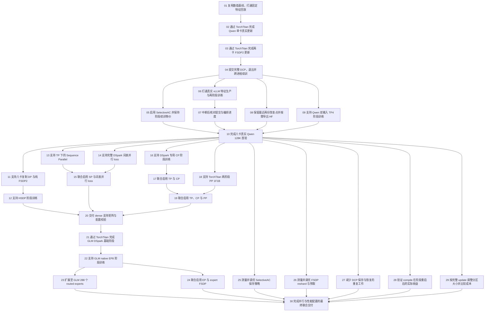

# TorchTitan 阶段训练 tickets 执行清单

状态：用户已确认拆分并授权实现；30 张 tickets 已发布。确认原文：“非常好，就按照这个来实现吧”。

来源：[DeepSpec 编排下的 TorchTitan DSpark draft 训练与阶段恢复](../dspark-draft-torchtitan/spec.md)。本草案使用母规格的 65 个用户故事和 ADR-0004 的最新职责划分；母规格仍保持原状态，本次不修改或关闭它。

本地 tracker 已由项目既有记录确定，无须重新配置。新任务集已发布到同一 tracker 的 `dspark-torchtitan-orchestration` 功能目录，每票一份文件、编号 01–30、状态 `ready-for-agent`。逐票执行状态以 issues 文件为准，draft-issues 保留已审阅的原始草稿。旧任务集的已完成证据与状态保持原样；下表提供新旧工作映射，新拆分是 ADR-0004 工作的建议执行清单。

共同测试边界为 DeepSpec 阶段入口 → 独立真实 TorchTitan draft 进程，固定 target features 用于数值对照；同时包含真实 vLLM 生产交接。该边界已随本次拆分确认，用户已授权按此实施。票 01 复用旧训练入口作为基线，票 02 起逐步交付新路径。

依赖既包含实际能力前置，也包含原规格明确要求的验收门槛：票 10 完成后进入后续 dense 交付，票 20 完成后进入 GLM MoE。两道门槛是既定交付次序，不声称它们是代码编译依赖。性能票 25–29 只依赖票 10，可与后续能力开发分支推进。除这些已声明门槛外，没有为了排列编号而添加串行依赖，也没有重复列出传递依赖。

本次没有需要全仓同时破坏调用点的机械迁移。票 01 先完成确有必要的局部预重构；新训练入口随后增量接通。每票限制一种主要行为或组合、先小规模再目标规模，验收沿用未受影响的 fixture 和证据，避免重复实现、重跑或把一整套并行轴扩展塞入一个窗口。

1. **[复用数值基线，打通固定特征回放](issues/01-reusable-training-baseline.md)**
   - **Blocked by:** 无，可立即开始。
   - **What it delivers:** 训练开发者能用固定 target features 驱动现有真实 Qwen DSpark 训练并得到可供新入口比较的完整更新结果；必要的局部预重构先在这一条可运行路径完成。

2. **[通过 TorchTitan 完成 Qwen 单卡真实更新](issues/02-native-qwen-training.md)**
   - **Blocked by:** 01。
   - **What it delivers:** DeepSpec 能启动独立 TorchTitan 进程，消费固定特征完成小规模 Qwen3.8 DSpark 训练；模型、训练配置、loss 和优化更新由 TorchTitan 拥有。

3. **[通过 TorchTitan 完成两卡 FSDP2 更新](issues/03-native-fsdp-updates.md)**
   - **Blocked by:** 02。
   - **What it delivers:** 同一新训练入口能够使用两卡 FSDP2 消费固定监督，得到与 DSpark 基线等价的完整更新。

4. **[提交完整 DCP，退出并跨进程续训](issues/04-phase-dcp-restart.md)**
   - **Blocked by:** 03。
   - **What it delivers:** DeepSpec 能连续调度两个固定特征分区：TorchTitan 在完整 update 后提交 DCP 并退出，下一进程恢复后继续原有训练轨迹。

5. **[启用 SelectiveAC 并保持阶段续训等价](issues/05-selective-ac-phases.md)**
   - **Blocked by:** 04。
   - **What it delivers:** 训练操作者能够在新的 TorchTitan Qwen FSDP2 阶段流程中启用 SelectiveAC，保持更新与跨进程恢复结果。

6. **[打通真实 vLLM 特征生产与两阶段训练](issues/06-vllm-feature-handoff.md)**
   - **Blocked by:** 04。
   - **What it delivers:** DeepSpec 能按分区调用训练侧数据准备，使用既有 vLLM 生产特征并交给 TorchTitan，在同一批 GPU 上连续完成两轮生产、训练和保存退出。

7. **[中断后核对提交与编排进度](issues/07-orchestration-failure-recovery.md)**
   - **Blocked by:** 06。
   - **What it delivers:** 训练或进程失败后，DeepSpec 能从有效提交恢复，识别已经完成的更新，避免消费不完整特征或错误推进阶段。

8. **[保留最近两份恢复点并按需导出 HF](issues/08-checkpoint-retention-export.md)**
   - **Blocked by:** 04。
   - **What it delivers:** 训练操作者能滚动保留最近两份完整阶段 checkpoint，并为评估或交付按需获取 HF 权重，保留的里程碑不受清理影响。

9. **[支持 Qwen 双输入 TP4 阶段训练](issues/09-qwen-dual-stream-tp.md)**
   - **Blocked by:** 04。
   - **What it delivers:** 新训练入口能在固定 target 特征上运行 Qwen 双输入 TP，并完成 DP shard2 × TP4 的短序列更新、保存退出和恢复，为八卡 128K 首验提供前置能力。

10. **[完成八卡真实 Qwen 128K 首验](issues/10-qwen-128k-first-acceptance.md)**
   - **Blocked by:** 05、07、08、09。
   - **What it delivers:** 训练操作者获得可复现的单机八卡 Qwen3.8 DSpark 128K 配方，包含 SelectiveAC、真实特征交接、完整保存退出恢复和 draft 全流程性能基线。

11. **[支持八卡复制 DP 与纯 FSDP2](issues/11-dense-dp-fsdp.md)**
   - **Blocked by:** 10。
   - **What it delivers:** 首阶段完成后，操作者能通过同一 TorchTitan 阶段入口分别选择八卡复制 DP 或纯 FSDP2，并在各自拓扑内保存退出和续训。

12. **[支持 HSDP 阶段训练](issues/12-dense-hsdp.md)**
   - **Blocked by:** 11。
   - **What it delivers:** 操作者能选择复制与参数分片组合的 HSDP，并通过真实阶段流程恢复后继续等价更新。

13. **[支持 TP 下的 Sequence Parallel](issues/13-sequence-parallel.md)**
   - **Blocked by:** 10。
   - **What it delivers:** 操作者能在已通过首验的 TP 布局中单独开启 SP，减少激活复制并保持完整阶段训练和恢复。

14. **[支持完整 DSpark 词表并行 loss](issues/14-vocabulary-parallel-loss.md)**
   - **Blocked by:** 10。
   - **What it delivers:** 操作者能在 TP 阶段训练中启用完整词表并行监督，保持 DSpark 更新并避免为 loss 收集完整词表 logits。

15. **[联合启用 SP 与词表并行 loss](issues/15-sp-loss-parallel.md)**
   - **Blocked by:** 13、14。
   - **What it delivers:** 操作者能同时启用 SP 和完整 DSpark loss parallel，得到与分别开启或关闭时一致的阶段更新和恢复结果。

16. **[支持 DSpark 专用 CP 阶段训练](issues/16-context-parallel.md)**
   - **Blocked by:** 10。
   - **What it delivers:** 操作者能将固定 target features 交给 DSpark context parallel 训练，在上下文分片下保留混合 attention 和完整阶段恢复。

17. **[联合启用 TP 与 CP](issues/17-tensor-context-parallel.md)**
   - **Blocked by:** 16。
   - **What it delivers:** 操作者能在 TP4 × CP2 的八卡布局中消费同一监督，完成双输入训练与同拓扑跨阶段续训。

18. **[支持 TorchTitan 两阶段 PP 1F1B](issues/18-pipeline-1f1b.md)**
   - **Blocked by:** 10。
   - **What it delivers:** 操作者能在 TorchTitan 内部使用两阶段 1F1B 流水线训练真实 DSpark，DeepSpec 调度完整特征分区并在保存退出后继续下一阶段。

19. **[联合启用 TP、CP 与 PP](issues/19-tensor-context-pipeline.md)**
   - **Blocked by:** 17、18。
   - **What it delivers:** 操作者能在一个合法的 TP/CP/PP 八卡布局中完成真实 DSpark 更新、所有 stage 的保存退出和新进程恢复。

20. **[交付 dense 支持矩阵与配置校验](issues/20-dense-support-matrix.md)**
   - **Blocked by:** 12、15、19。
   - **What it delivers:** 操作者能依据有真实更新及恢复证据的 dense 矩阵选择配置，并在昂贵训练启动前识别非法或未支持组合。

21. **[通过 TorchTitan 完成 GLM DSpark 基础阶段](issues/21-native-glm-training.md)**
   - **Blocked by:** 20。
   - **What it delivers:** MoE 训练开发者能在 TorchTitan 中使用小规模真实 GLM-5.3-Flash DSpark 模型完成无专家分片的训练和阶段恢复，为 EP 提供可比较基线。

22. **[支持 GLM native EP8 阶段训练](issues/22-native-glm-expert-parallel.md)**
   - **Blocked by:** 21。
   - **What it delivers:** 操作者能在八卡 native expert parallel 下训练真实 GLM DSpark，并完整保存、退出及恢复专家与 dense 状态。

23. **[扩展至 GLM 288 个 routed experts](issues/23-glm-expert-scale.md)**
   - **Blocked by:** 22。
   - **What it delivers:** 操作者能将已验证的 native EP 配方扩展到真实 288 个 routed experts，并得到实际规模的训练与阶段恢复证据。

24. **[联合启用 EP 与 expert FSDP](issues/24-expert-fsdp-combination.md)**
   - **Blocked by:** 22。
   - **What it delivers:** 操作者能选择至少一种 EP > 1 且 expert FSDP > 1 的合法布局，在专家分片与状态分片组合下完整续训。

25. **[测量并调优 SelectiveAC 保存策略](issues/25-selective-ac-performance.md)**
   - **Blocked by:** 10。
   - **What it delivers:** 性能工程师能在固定八卡 Qwen 工作负载上选择有实际收益的 SAC 保存策略，降低 draft 总成本并保留阶段恢复正确性。

26. **[测量并调优 FSDP reshard 与预取](issues/26-fsdp-execution-performance.md)**
   - **Blocked by:** 10。
   - **What it delivers:** 性能工程师能根据端到端计时选择 FSDP reshard 和预取设置，同时保持更新、保存退出与恢复语义。

27. **[减少 DCP 保存与恢复的重复工作](issues/27-checkpoint-io-performance.md)**
   - **Blocked by:** 10。
   - **What it delivers:** 操作者能减少阶段 DCP 数据路径和重复初始化的开销，同时保留独立可恢复的完整提交。

28. **[验证 compile 在阶段重启后的实际收益](issues/28-compile-restart-cache.md)**
   - **Blocked by:** 10。
   - **What it delivers:** 操作者能在合法 draft 布局中判断 compile 及跨进程缓存是否降低总耗时，而不是只改善热身后的 step 速度。

29. **[按完整 update 调整分区大小并比较成本](issues/29-partition-size-performance.md)**
   - **Blocked by:** 10。
   - **What it delivers:** 操作者能调整 DeepSpec 特征分区数量或大小，在保持原有更新序列的同时比较阶段交接次数带来的成本。

30. **[完成并行与性能配置的最终联合交付](issues/30-integrated-delivery.md)**
   - **Blocked by:** 23、24、25、26、27、28、29。
   - **What it delivers:** 维护者获得可复现的 Qwen dense 与 GLM MoE 训练交付，能够从支持矩阵选择实际验证过的并行和性能配置，完成完整阶段续训。

## 新旧工作映射

旧编号指原任务集，草案编号指本次新拆分；映射不修改旧票的内容或状态，旧票完成也不自动将新票标为完成。

| 旧票 | 草案票 | 处理方式 |
| --- | --- | --- |
| 01–05 | 01–09 | 保留已完成的旧路径证据；按当前工作树判断复用范围，补齐新训练所有权与生命周期的验收。 |
| 06 | 04、06、07 | 保存退出、真实两端资源交接与中断后的进度核对分别交付。 |
| 07 | 08 | 保留最近两份恢复点与按需 HF 导出。 |
| 08 | 10 | 首验显式依赖新 TP4 票 09，经完整正常与失败流程后验收。 |
| 09–10 | 03、11、12 | 先建立两卡新入口，再扩展八卡复制 DP/FSDP2 与 HSDP。 |
| 11 | 09 | TP4 提前到 128K 首验之前，消除原拆分的缺失前置。 |
| 12–13 | 13–14 | SP 与完整词表并行 loss 分别交付。 |
| 14–17 | 16–19 | CP、TP/CP、TorchTitan PP、TP/CP/PP 各自完成阶段恢复。 |
| 18 | 15、20 | SP/loss 联合能力与 dense 支持矩阵分开。 |
| 19–20 | 21–24 | 先建立真实 GLM EP1 基线，再 native EP、专家规模与 expert FSDP。 |
| 21 | 25–26 | SAC 策略与 FSDP reshard/预取分开测量。 |
| 22 | 27–29 | DCP 数据路径、compile 缓存与分区大小各自成票。 |
| 23 | 30 | 复用已有证据，验收最终实际交付的配置组合。 |

## 依赖图

图与逐票 Blocked by 一致。发布后按依赖全部完成的 frontier 工作；首个可开始的票是 01。票 04 完成后，05、06、08、09 没有互相阻塞；票 10 完成后，可分别推进 dense 分支与性能分支。

## 覆盖核对

每张草稿末尾记录覆盖的母规格 User Stories，合计覆盖 01–65；这些编号是追溯关系，不是额外依赖。完整验收条件在逐票文件中。

| 用户故事 | 草案票 |
| --- | --- |
| 1 | 02、21 |
| 2 | 02、21、30 |
| 3 | 01、30 |
| 4 | 02 |
| 5 | 02 |
| 6 | 02 |
| 7 | 02 |
| 8 | 03、09、22 |
| 9 | 02 |
| 10 | 05 |
| 11 | 10 |
| 12 | 10 |
| 13 | 04 |
| 14 | 04 |
| 15 | 06、29 |
| 16 | 06、29 |
| 17 | 04、27 |
| 18 | 04、27 |
| 19 | 04、05、27 |
| 20 | 04、08 |
| 21 | 08 |
| 22 | 08 |
| 23 | 08 |
| 24 | 07 |
| 25 | 07 |
| 26 | 04 |
| 27 | 03、06 |
| 28 | 06 |
| 29 | 06、09、16 |
| 30 | 06、07、16 |
| 31 | 03、11、12 |
| 32 | 09、13、15、17 |
| 33 | 14、15 |
| 34 | 16、17 |
| 35 | 18、19 |
| 36 | 18、19 |
| 37 | 21、22、23 |
| 38 | 21、22、23、24 |
| 39 | 10、20、23、24、30 |
| 40 | 05、09、10、11、12、13、14、15、16、17、18、19、20、22、23、24、30 |
| 41 | 01、03、21 |
| 42 | 01 |
| 43 | 10、25、26、27、28、29、30 |
| 44 | 10、25、26、27、28、29、30 |
| 45 | 10、28、30 |
| 46 | 25、26、27、28、29、30 |
| 47 | 01、10、20、30 |
| 48 | 01、20、30 |
| 49 | 04 |
| 50 | 07 |
| 51 | 02、21 |
| 52 | 06、29 |
| 53 | 06 |
| 54 | 06 |
| 55 | 06 |
| 56 | 06 |
| 57 | 04、06 |
| 58 | 04 |
| 59 | 04、06 |
| 60 | 04、07 |
| 61 | 06 |
| 62 | 07 |
| 63 | 07 |
| 64 | 06、07 |
| 65 | 01、30 |

## 执行授权

用户已确认粒度、依赖和测试边界，并明确要求实现。按依赖推进并记录实际验收证据；未通过验收的票不标记 completed。

