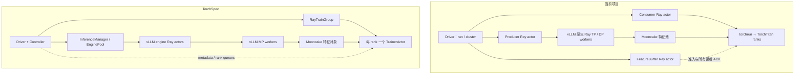

# TorchSpec 与当前项目的 Ray 集群管理：比较与修改建议

**结论：TorchSpec 的拓扑配置、推理组/训练组组织和控制层分工更通用，值得借鉴。当前项目的 vLLM 原生 Ray 接入、TorchTitan 训练语义与长序列特征内存契约值得保留。建议选择性改造管理层。**

这不是“换成 TorchSpec 就会更快”的结论。此次没有同硬件同数据的性能对照。Spec Kit 评估结果为 **go：进入方案 B 的规格阶段**，不是已实施迁移。[决策](decision.md)

## 版本和分析方式

- 日期：2026-09-20。上游固定在 [b68a7a0](https://github.com/lightseekorg/TorchSpec/tree/b68a7a0fc712523b6407082c9a423299b9ac1406/torchspec)，避免 main 后续变化影响结论。
- 本地审阅对象是当前工作区 `deepspec/pipeline/` 和 TorchTitan DSpark 接入；文件摘要记录于 [source-manifest.json](source-manifest.json)。
- 按已安装 `specify-cli v1.0.8` 内置 assess 的 intake → research → define → shape → decide 流程产出。本机有 CLI，开始时项目未生成 Spec Kit skills；本次直接应用其内置流程文件，没有声称已完成项目命令集成。
- 双方源码事实和置信度见 [research.md](research.md)，完整上游核查见 [torchspec-evidence.md](torchspec-evidence.md)。本次仅新增评估文档。

## 两套管理方式实际在做什么

当前项目由 Ray 管理 producer frontend、FeatureBuffer 和 Consumer launcher。vLLM 自己创建 Ray GPU workers，Consumer 则启动 torchrun，由 TorchTitan 管理 draft 的分布式训练。大张量经 Mooncake，Ray 主要协调元数据与执行状态。

TorchSpec 则有显式 controller、inference manager、engine group 和 train group。vLLM 每节点的 engine 外层是 Ray actor，内部使用 **MP executor**；draft 的每个 rank 是 Ray actor，调用 TorchSpec 自己的 trainer。两者都在用 Ray，但 Ray 管理的进程层级不同。[本地 actors.py](/mnt/afs_share/lezewei/DeepSpec_torchtitan_vllm/deepspec/pipeline/actors.py:81)、[上游 engine](https://github.com/lightseekorg/TorchSpec/blob/b68a7a0fc712523b6407082c9a423299b9ac1406/torchspec/inference/engine/vllm_engine.py#L252)、[上游训练组](https://github.com/lightseekorg/TorchSpec/blob/b68a7a0fc712523b6407082c9a423299b9ac1406/torchspec/ray/train_group.py#L72)

## 优缺点比较

| 维度 | TorchSpec 的优势与代价 | 当前项目的优势与代价 | 判断 |
|---|---|---|---|
| 资源拓扑 | 统一 PG、实际落点探测、角色排序、IP/label 自定义布局；启动时可分别配置角色规模。需要满足整个资源集合，不能等同于运行时弹性。 | 单机固定 4+4；集群固定两个角色节点，consumer_nodes=1。约束明确、容易核验，扩展需改入口。 | **上游的表达和扩展能力更好。**（T1、L1/L2） |
| vLLM 并行 | 多 engine 与跨节点副本组织较完整；使用自管 MP/headless workers，额外维护版本和进程关系。 | 原生 Ray TP/DP，复用 vLLM 自己的执行器；目前 producer DP 限 1/2、TP4，且 DP1/2 的 PG ownership 不同。 | **借鉴 group 接口，保留本地后端。**（T2、L3） |
| draft 集群 | 每 rank 一个 actor，训练组可跨节点发起 init/train/save；引入自己的 trainer 与进程组管理。 | 每节点 launcher + torchrun，复用原生 TorchTitan mesh、loss、优化器、DCP；现有入口没有开放跨节点 consumer。 | **补训练组管理，比迁移 trainer 更合适。**（T3、L4） |
| 控制流程 | controller、inference manager、train group 分工清晰，可独立发展多后端与评估接口；actor/RPC/队列状态更多。 | 链路较直接，但 run.py 与 cluster.py 重复处理部分启动、等待、检查和清理。 | **职责拆分值得借鉴；不必把每一层都变成 actor。** |
| 数据调度 | 多 engine round-robin、异步结果池、可变长度均衡有利于灵活调度；完成顺序、失败过滤和恢复尾部影响样本覆盖/顺序。 | 固定输入计划、position→DP 映射、严格身份检查；慢样本可能阻塞后续消费，当前并发也较保守。 | **先保确定性，再评估受控调度优化。**（T5/T6、L6） |
| 128K 内存 | 样本数门控及预取限制有作用；pool bytes 不含所有已入队/在途/待删除对象。 | 写前预留 bytes + window，所有所属 reader ACK 后删除、删除成功后退额度；预算保守，多 TP reader 复制成本较高。 | **本地严格预算更适合当前长序列要求。**（T4、L5） |
| 故障与恢复 | 有 checkpoint 和 best-effort resume；普通推理异常可跳过，actor 死亡中止，无已证明的流式无损恢复。 | fail-fast，故障样本不能静默略过；原生 checkpoint 可核验，但 streaming 本身不支持特征重放。 | **两者都不能称透明容错。**（T6/T7、L7/L8） |
| 生命周期 | 服务/组封装更统一；部分 cleanup 等待没有 timeout，follower 显式回收覆盖需审计。 | run namespace、进程归属、有限等待和残留核验较严格；逻辑分散、master 依附 driver。 | **借组织方式，保留并统一本地所有权检查。**（T8、L9） |
| 训练运营 | 周期保存、保留策略、eval 和训练指标在控制流程中更完整。 | TorchTitan 已有 checkpoint 基础；当前 pipeline 更集中于特征流接入和验证证据。 | **复用原生能力，在统一入口上暴露状态与策略。** |

表中 L/T 编号对应 [源码证据表](research.md)。这些评价基于实现边界；“更适合”是针对当前项目目标的判断，不是吞吐测量值。

## 不应直接照搬的四点

1. **不要把 vLLM 改为 MP 当作前置条件。** 上游多引擎封装有价值，但本地已经使用原生 Ray DP。替换后端会重新引入 GPU mask、子进程生命周期和版本适配工作。
2. **不要复制 fractional GPU 和连续设备编号约定。** 上游 PG 实际预留整卡，所以不能说它对外超卖 GPU；但内部 actor 申请 0.2/0.4 GPU 并不限制显存，vLLM 用 `base_gpu_id + i` 选择连续设备。碎片化设备情况下需额外验证，不能凭排序认为布局一定正确。[factory](https://github.com/lightseekorg/TorchSpec/blob/b68a7a0fc712523b6407082c9a423299b9ac1406/torchspec/inference/factory.py#L381)、[mask](https://github.com/lightseekorg/TorchSpec/blob/b68a7a0fc712523b6407082c9a423299b9ac1406/torchspec/inference/engine/vllm_engine.py#L261)
3. **不要以样本池数量替代全链路字节预算。** 128K 的一个样本与短序列不是同一内存量级。上游 dispatch 扣池账不能直接对应本地“源对象已可删除”。[上游背压](https://github.com/lightseekorg/TorchSpec/blob/b68a7a0fc712523b6407082c9a423299b9ac1406/torchspec/controller/inference_manager.py#L375)、[本地账本](/mnt/afs_share/lezewei/DeepSpec_torchtitan_vllm/deepspec/pipeline/buffer.py:116)
4. **不要把 colocate 或 actor restart 当成弹性/恢复。** 上游 colocate 共享 PG，没有已发现的推理与训练显存轮换协议；resume 明确为 best-effort。本地 ACK 也只代表读取完成，不代表 optimizer commit。[colocate](https://github.com/lightseekorg/TorchSpec/blob/b68a7a0fc712523b6407082c9a423299b9ac1406/torchspec/ray/placement_group.py#L551)、[resume](https://github.com/lightseekorg/TorchSpec/blob/b68a7a0fc712523b6407082c9a423299b9ac1406/torchspec/controller/loop.py#L229)

上游已经支持 DSpark，也有发布 flush、等待 key 可见等正确性措施；本报告的判断不是“上游没有正确性保障”。同名 DSpark trainer 仍不能证明与本项目 TorchTitan 的 loss、teacher feature 和 checkpoint 等价。

## 当前项目建议修改的点

以下 P0/P1/P2 是建议先后顺序，尚未修改运行代码。P0 针对已有布局的等价整理和下一种多节点布局；P1/P2 要在前序证据充分后开展。

### P0-1：将角色拓扑和支持边界集中定义

**涉及文件**：[schema.py](/mnt/afs_share/lezewei/DeepSpec_torchtitan_vllm/deepspec/pipeline/schema.py:15)、[topology.py](/mnt/afs_share/lezewei/DeepSpec_torchtitan_vllm/deepspec/pipeline/topology.py:4)、[run.py](/mnt/afs_share/lezewei/DeepSpec_torchtitan_vllm/deepspec/pipeline/run.py:725)、[cluster.py](/mnt/afs_share/lezewei/DeepSpec_torchtitan_vllm/deepspec/pipeline/cluster.py:422)、[recipe.py](/mnt/afs_share/lezewei/DeepSpec_torchtitan_vllm/deepspec/pipeline/recipe.py:14)。

把 producer 节点列表、推理 TP/DP、训练节点列表、每节点训练 GPU 数、consumer world/DP/TP、服务位置集中成一个经过校验的计划。由计划推导 resources、rank 分布、reader 归属和预算，避免在多个文件分别写 4、8、consumer_nodes=1。

参数化不代表已经支持所有并行度：首轮仍明确只接受已验证的 TP4、CP=PP=1；扩展某个维度必须一起扩展 feature contract 和训练验证。

**验收**：旧配置可升级；prepare/dry-run 能输出角色→节点→资源计划；资源数、rank 数、样本更新组不一致时在模型加载前失败；已有单机与两机布局保持行为。

### P0-2：统一运行生命周期和资源 ownership

**涉及文件**：[run.py:426](/mnt/afs_share/lezewei/DeepSpec_torchtitan_vllm/deepspec/pipeline/run.py:426)、[cluster.py:392](/mnt/afs_share/lezewei/DeepSpec_torchtitan_vllm/deepspec/pipeline/cluster.py:392)、[actors.py](/mnt/afs_share/lezewei/DeepSpec_torchtitan_vllm/deepspec/pipeline/actors.py:81)、[runtime.py](/mnt/afs_share/lezewei/DeepSpec_torchtitan_vllm/deepspec/pipeline/runtime.py:38)。

提取少量稳定的 InferenceGroup / TrainingGroup / StoreService 接口，覆盖 start、ready、status、stop。单机与多机共同使用一个运行控制流程；driver 上的普通对象即可承担首轮控制职责，不必为了形式统一全部创建新 Ray actors。

集中记录本 run 拥有的 actor、PG、子进程和服务；声明到底由项目还是 vLLM 创建和回收每一组 GPU 资源。**统一计划不等于强制统一 PG**：DP2 现由 vLLM 自己申请 PG，未经兼容性验证，外层再预留同一批 GPU 会让内部申请等不到资源。可先保留后端原有分配方式，统一启动顺序、超时和失败回滚；之后再决定哪些布局能原子预留。

还要尊重 Ray bundle 粒度：当前 Consumer 一次申请整组 GPU，不能放进只含 1 GPU 的 bundle 并期待跨 bundle 合并分配。若采用统一 PG，需提供能容纳每节点 Consumer 的 bundle，或另行改变 launcher 的资源申请方式。

**验收**：初始化任一阶段失败都回收本 run 已分配资源；无重复 GPU 预留；实际 GPU 集合与计划一致；清理幂等且有超时；既有独立 Ray/Mooncake 服务不被误清理。[Ray PG 语义](https://docs.ray.io/en/latest/ray-core/scheduling/placement-group.html)

### P0-3：训练组扩展采用“每节点 launcher + 原生 torchrun”

**涉及文件**：[cluster.py:432](/mnt/afs_share/lezewei/DeepSpec_torchtitan_vllm/deepspec/pipeline/cluster.py:432)、[cluster.py:560](/mnt/afs_share/lezewei/DeepSpec_torchtitan_vllm/deepspec/pipeline/cluster.py:560)、[actors.py:51](/mnt/afs_share/lezewei/DeepSpec_torchtitan_vllm/deepspec/pipeline/actors.py:51)、[actors.py:274](/mnt/afs_share/lezewei/DeepSpec_torchtitan_vllm/deepspec/pipeline/actors.py:274)、[data.py](/mnt/afs_share/lezewei/DeepSpec_torchtitan_vllm/deepspec/pipeline/data.py:23)、[topology.py](/mnt/afs_share/lezewei/DeepSpec_torchtitan_vllm/deepspec/pipeline/topology.py:23)。

将 consumer 单节点选择改为受验证的节点列表，启用已有 rendezvous 参数分支。每个 Consumer 申请本节点所需 GPU/CPU，而不是在每个节点都申请全局 world_size。集中生成 global/local rank、node_rank、master 地址与 TP/DP mesh 对应关系。

保留 TorchTitan 的梯度累积、loss、optimizer 和 DCP；上游“每 rank 一个 TrainerActor”只作为管理接口参考。没有必要为扩展 Ray 布局重写训练内核。

**验收**：训练所有 rank 完成 rendezvous，真实 mesh 与 reader 归属吻合；全局微批游标与 optimizer 更新一致；任一节点退出能中止全组。后续可用“1 个 TP4 producer 节点 + 2 个各 4 GPU 的 consumer 节点、训练 DP2×TP4”作示例验证，需至少 12 GPU/3 节点；这是验证建议，不是假设当前已有这些资源。

### P1-1：将现有内存与 ACK 契约推广到多训练节点

**涉及文件**：[buffer.py](/mnt/afs_share/lezewei/DeepSpec_torchtitan_vllm/deepspec/pipeline/buffer.py:12)、[memory.py](/mnt/afs_share/lezewei/DeepSpec_torchtitan_vllm/deepspec/pipeline/memory.py:1)、[data.py](/mnt/afs_share/lezewei/DeepSpec_torchtitan_vllm/deepspec/pipeline/data.py:23)、[prefetch.py](/mnt/afs_share/lezewei/DeepSpec_torchtitan_vllm/deepspec/pipeline/prefetch.py:1)、[cluster.py:480](/mnt/afs_share/lezewei/DeepSpec_torchtitan_vllm/deepspec/pipeline/cluster.py:480)。

现有账本已经有用，改造应扩展其节点维度。按实际 reader 所在节点核算接收/预取/校验副本；明确池位置、所有者与每个样本的读者集合。首轮可继续单池，只有测量证明需要时才分池。启动前仍必须证明整个 optimizer update 有空间完成。

**验收**：变长样本、慢 reader、删除重试、跨节点内存压力下不超 admitted-byte 上界、不提前删除、不提前退额度；node budget 与实际角色对应。该项虽然属于扩展工作，**是 P0-3 真正放开多节点训练前的必需验收项**。

### P1-2：借鉴调度指标，逐步开放受控推理并发

**涉及文件**：[actors.py:15](/mnt/afs_share/lezewei/DeepSpec_torchtitan_vllm/deepspec/pipeline/actors.py:15)、[actors.py:209](/mnt/afs_share/lezewei/DeepSpec_torchtitan_vllm/deepspec/pipeline/actors.py:209)、[buffer.py:227](/mnt/afs_share/lezewei/DeepSpec_torchtitan_vllm/deepspec/pipeline/buffer.py:227)、[trainer.py](/mnt/afs_share/lezewei/DeepSpec_torchtitan_vllm/deepspec/pipeline/trainer.py:41)、[run.py:240](/mnt/afs_share/lezewei/DeepSpec_torchtitan_vllm/deepspec/pipeline/run.py:240)。

先增加每推理组的在途请求数、feature tokens/s、byte credits、训练等数据时间、传输时间和 optimizer step 时间的汇总。依据实际空等原因，再调整 native AsyncLLM 每 DP 组并发与批量；保持全局准入顺序、错误取消和 writer 归属约束。

上游的长度均衡值得实验，但不能在运行中任意改写本地 position→DP 计划。若要采用，应在准备阶段生成并持久化新的确定性 batch plan，并确认 loss 归一化与更新组语义。

**验收**：对相同硬件、模型、token 序列、batch/update 定义比较稳态吞吐和等待占比；同时给出内存峰值。无数据时不宣称优化有效。

### P1-3：统一失败状态，恢复另设提交协议

**涉及文件**：[cluster.py:654](/mnt/afs_share/lezewei/DeepSpec_torchtitan_vllm/deepspec/pipeline/cluster.py:654)、[buffer.py:199](/mnt/afs_share/lezewei/DeepSpec_torchtitan_vllm/deepspec/pipeline/buffer.py:199)、[actors.py](/mnt/afs_share/lezewei/DeepSpec_torchtitan_vllm/deepspec/pipeline/actors.py:199)、[checkpoint.py](/mnt/afs_share/lezewei/DeepSpec_torchtitan_vllm/torchtitan/torchtitan/models/dspark_draft/checkpoint.py:103)。

先统一 initializing / ready / running / draining / succeeded / failed 状态、超时原因和失败证据，保留 fail-fast。若增加自动恢复，先定义 durable optimizer commit 对应的样本游标、teacher identity、计划 hash 和 attempt 标识；整组恢复时从已提交更新边界重建未提交特征，不能只重启一个失去内存账本的 actor。

源对象在读完后删除可以继续，但恢复必须依靠可复现的重新生成或另一个明确的持久化策略。不得将 READ_ACK 误当 TRAIN_COMMIT。

**验收**：人为中断 producer、consumer rank、master 和删除流程，验证有限失败与清理；只有证明不会遗漏样本或重复提交 optimizer update 后，才声称支持恢复。上游的 best-effort resume 不满足这个目标。

### P2：将长期训练运营接到现有 TorchTitan 能力

**涉及位置**：上述统一控制流程、现有原生 checkpoint/metrics、当前训练脚本入口。

借鉴 TorchSpec 的周期保存、评估调度和运行指标展示，把 checkpoint 路径、已提交更新、样本进度、角色健康与资源布局汇总为一份运行状态。复用 TorchTitan 已有机制，避免另写一套保存器。评估使用的 GPU 也须出现在资源计划中。

**验收**：运行状态与磁盘 commit 相符；保存/评估不会偷偷占用训练未分配的 GPU；长跑能诊断推理慢、传输慢、训练慢或 pool 压力，短程 smoke 不能代替这项验证。

## 建议的实施顺序和边界

1. **先整理已有布局**：完成拓扑计划与生命周期统一，原样保留后端和训练算法，重跑已有 4K/128K 正确性基线。
2. **再扩展一种多 consumer 布局**：同时完成节点预算、reader/rank 映射、rendezvous 和全组退出验证。拓扑参数能填写不算支持完成。
3. **最后选择专项优化**：依据测量决定推理并发、特征读取去重、分池或 RDMA；依据训练需求决定恢复和评估。不要把所有改变装进一次迁移。

本地已验证的 4K/128K 运行各仅 3 次更新，证明链路与 checkpoint 可用；不证明长期稳定性。上游此次只读源码，没有在当前 H800 环境运行。两者之间的实际吞吐、显存和容错时间优劣仍待同条件实验。

当前建议可概括为：**学习 TorchSpec 如何组织资源与职责，在当前项目内保留已经建立的训练和特征契约。**
