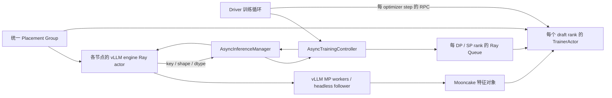

# TorchSpec Ray 源码证据

研究日期：2026-09-20。固定提交：`b68a7a0fc712523b6407082c9a423299b9ac1406`，提交日期 2026-09-19。源码 checkout：`/tmp/torchspec-ray-research-20260920`。本报告只分析上游，不运行 GPU 任务、不安装依赖，不把上游测试文件的存在当作本机测试通过。

置信度：**高**表示调用链直接可见；**中**表示由调用链推导的条件性风险，尚未复现；**未知**表示没有运行或证据不足。所有链接固定到上述提交。

## 核心判断

TorchSpec 值得借鉴的是统一的角色拓扑入口、显式 engine/train group、控制器与执行器分工、多节点配置及训练运营功能。不能由这些优点推出其 vLLM 执行后端、数据正确性、自动恢复或长序列内存控制全面更好。

特别需要纠正：它的 vLLM 路径实际是 **Ray 分配外层 engine actor，vLLM 内部使用 multiprocessing**；多 engine 副本由 TorchSpec 的 round-robin 池调度。它不是直接采用 vLLM Ray executor/native DP 的同一种架构。draft 训练则由每 rank 的 Ray actor 在进程内初始化分布式训练。两类 worker 的所有权和故障边界并不相同。[vLLM 后端](https://github.com/lightseekorg/TorchSpec/blob/b68a7a0fc712523b6407082c9a423299b9ac1406/torchspec/inference/engine/vllm_engine.py#L261-L295)、[engine pool](https://github.com/lightseekorg/TorchSpec/blob/b68a7a0fc712523b6407082c9a423299b9ac1406/torchspec/controller/inference_manager.py#L56-L82)、[trainer actor](https://github.com/lightseekorg/TorchSpec/blob/b68a7a0fc712523b6407082c9a423299b9ac1406/torchspec/training/trainer_actor.py#L54-L109)。置信度：高。

## 能力与收益的直接证据

| 项目 | 已实现行为及价值 | 置信度 / 源码 |
|---|---|---|
| 统一拓扑入口 | 在线训练在一个 PG 内预留训练与推理的总 GPU，探测实际节点/GPU 后排序并切分角色；可选择 training-first、inference-first。减少多个角色各自抢资源的协调问题，但不证明物理 GPU 在不同集群状态下永远相同。 | 高：[placement_group.py:248–299](https://github.com/lightseekorg/TorchSpec/blob/b68a7a0fc712523b6407082c9a423299b9ac1406/torchspec/ray/placement_group.py#L248-L299)、[565–603](https://github.com/lightseekorg/TorchSpec/blob/b68a7a0fc712523b6407082c9a423299b9ac1406/torchspec/ray/placement_group.py#L565-L603) |
| 指定节点与角色布局 | custom 模式按角色 IP 或 Ray label selector 构造 bundles，保留用户节点顺序，再按实际 GPU 排序。适合固定多节点拓扑和按角色指定硬件；这不是自动识别异构显存/吞吐并调整工作量。 | 高：[placement_group.py:120–204](https://github.com/lightseekorg/TorchSpec/blob/b68a7a0fc712523b6407082c9a423299b9ac1406/torchspec/ray/placement_group.py#L120-L204)、[353–412](https://github.com/lightseekorg/TorchSpec/blob/b68a7a0fc712523b6407082c9a423299b9ac1406/torchspec/ray/placement_group.py#L353-L412) |
| 推理副本与跨节点模型 | factory 支持单节点多 engine、跨节点单副本、跨节点多副本。每副本有一个接收请求的 head，其他节点为 follower。更通用的角色配置是其明显优势。 | 高：[factory.py:338–460](https://github.com/lightseekorg/TorchSpec/blob/b68a7a0fc712523b6407082c9a423299b9ac1406/torchspec/inference/factory.py#L338-L460) |
| draft 多节点组 | `training_num_nodes × training_num_gpus_per_node` 个 actor，共享 rendezvous 地址，以 rank/world_size 初始化进程组；group 提供初始化、训练、保存、设置队列等入口。GPU 数不局限于 4/8，但实际布局仍依赖 PG。 | 高：[train_group.py:72–159](https://github.com/lightseekorg/TorchSpec/blob/b68a7a0fc712523b6407082c9a423299b9ac1406/torchspec/ray/train_group.py#L72-L159)、[trainer_actor.py:54–109](https://github.com/lightseekorg/TorchSpec/blob/b68a7a0fc712523b6407082c9a423299b9ac1406/torchspec/training/trainer_actor.py#L54-L109) |
| 控制与张量传输分离 | 控制器管理 prompt、特征 metadata、训练/评估队列；大张量由 Mooncake 传输。推理可与训练重叠；训练侧还有有界后台预取队列。 | 高：[setup.py:38–87](https://github.com/lightseekorg/TorchSpec/blob/b68a7a0fc712523b6407082c9a423299b9ac1406/torchspec/controller/setup.py#L38-L87)、[training_controller.py:112–169](https://github.com/lightseekorg/TorchSpec/blob/b68a7a0fc712523b6407082c9a423299b9ac1406/torchspec/controller/training_controller.py#L112-L169)、[data_fetcher.py:652–725](https://github.com/lightseekorg/TorchSpec/blob/b68a7a0fc712523b6407082c9a423299b9ac1406/torchspec/training/data_fetcher.py#L652-L725) |
| 减少可变长度负载倾斜 | 每 rank 多样本时，按长度从大到小做有容量上限的分配；可减轻同步训练时的长样本拖尾。不是按 GPU 实测速度的自适应负载均衡，也不能直接代替需要固定样本序列的训练计划。 | 高：[training_controller.py:512–565](https://github.com/lightseekorg/TorchSpec/blob/b68a7a0fc712523b6407082c9a423299b9ac1406/torchspec/controller/training_controller.py#L512-L565) |
| 启动重叠 | 数据加载与资源/模型初始化交错推进，train 初始化与 inference 初始化共同等待。可减少串行启动等待，但没有本项目同硬件启动时间对照。 | 高（实现）/ 未知（收益大小）：[train_entry.py:347–474](https://github.com/lightseekorg/TorchSpec/blob/b68a7a0fc712523b6407082c9a423299b9ac1406/torchspec/train_entry.py#L347-L474) |
| checkpoint 与评估运营 | 提供周期保存、最终保存、保留最近 N 个 checkpoint、评估元数据；DCP 加载模型/optimizer，支持 LR/RNG 状态。这些是长期训练管理接口，不代表本地 TorchTitan 缺少相应底层能力。 | 高：[loop.py:96–125](https://github.com/lightseekorg/TorchSpec/blob/b68a7a0fc712523b6407082c9a423299b9ac1406/torchspec/controller/loop.py#L96-L125)、[487–504](https://github.com/lightseekorg/TorchSpec/blob/b68a7a0fc712523b6407082c9a423299b9ac1406/torchspec/controller/loop.py#L487-L504)、[checkpoint.py:207–289](https://github.com/lightseekorg/TorchSpec/blob/b68a7a0fc712523b6407082c9a423299b9ac1406/torchspec/training/checkpoint.py#L207-L289) |
| DSpark 已支持 | TrainerActor 根据 DSparkConfig 选 DSparkTrainer；该 trainer 继承 DFlashTrainer，加入 Markov/confidence heads 和 L1 蒸馏相关配置。不能说上游只支持 EAGLE3；但支持同名算法不证明 loss、权重、TP 切分与本项目数值等价。 | 高：[trainer_actor.py:36–51](https://github.com/lightseekorg/TorchSpec/blob/b68a7a0fc712523b6407082c9a423299b9ac1406/torchspec/training/trainer_actor.py#L36-L51)、[dspark_trainer.py:21–76](https://github.com/lightseekorg/TorchSpec/blob/b68a7a0fc712523b6407082c9a423299b9ac1406/torchspec/training/dspark_trainer.py#L21-L76) |

## 不宜照搬或夸大的部分

1. **PG 预留与 actor GPU 记账不相同。** PG 的每 GPU bundle 预留 1 GPU/1 CPU，但 train actor 实际申请 0.4 GPU；vLLM actor 只申请 0.2 GPU，而内部 MP workers 使用整组设备。统一 PG 能为整个 job 保留资源，但内部正确性更多依赖应用自身约定。vLLM 按 `base_gpu_id + i` 生成连续设备列表，而不是使用完整 probe 返回列表。对碎片化 GPU 或 bundles 跨节点边界的情况，需要额外验证；本次没有复现，因此不宣称默认正常配置一定错。置信度：高（机制），中（风险）。[训练份额](https://github.com/lightseekorg/TorchSpec/blob/b68a7a0fc712523b6407082c9a423299b9ac1406/torchspec/ray/placement_group.py#L606-L614)、[推理份额](https://github.com/lightseekorg/TorchSpec/blob/b68a7a0fc712523b6407082c9a423299b9ac1406/torchspec/inference/factory.py#L381-L406)、[连续 GPU 选择](https://github.com/lightseekorg/TorchSpec/blob/b68a7a0fc712523b6407082c9a423299b9ac1406/torchspec/inference/engine/vllm_engine.py#L261-L269)。

2. **统一 PG 是一次性分配，不是弹性集群。** 已查的 ray、controller、inference 调用链没有运行中 resize、训练 world-size 重建或 actor 状态恢复流程。`colocate` 是共享同一 PG，文档也定位为开发用途；未见训练/推理显存轮换协议，不能理解为自动腾挪显存。KubeRay 段落说的是外部集群/Pod 管理能力。置信度：高（上述范围内未实现），未知（外部部署系统）。[colocate 实现](https://github.com/lightseekorg/TorchSpec/blob/b68a7a0fc712523b6407082c9a423299b9ac1406/torchspec/ray/placement_group.py#L551-L563)、[文档定位](https://github.com/lightseekorg/TorchSpec/blob/b68a7a0fc712523b6407082c9a423299b9ac1406/docs/ray.md#L39-L45)、[KubeRay 说明](https://github.com/lightseekorg/TorchSpec/blob/b68a7a0fc712523b6407082c9a423299b9ac1406/docs/ray.md#L106-L114)。

3. **背压并非整个 Mooncake resident bytes 的严格上限。** manager 用 sample pool 数量阈值暂停；controller 虽估算字节，却在 dispatch 进入训练队列时扣账，尚未消费的队列、在途请求和删除失败对象不在这个池账本内。训练循环限制预取数量，不能说队列无界就必然无限堆积；但它不等同于写入前预留字节、最后 reader 完成后才释放预算。128K 长序列尤其应保留本项目自己的强预算契约。置信度：高。[数量门控](https://github.com/lightseekorg/TorchSpec/blob/b68a7a0fc712523b6407082c9a423299b9ac1406/torchspec/controller/inference_manager.py#L375-L410)、[池计数及扣账](https://github.com/lightseekorg/TorchSpec/blob/b68a7a0fc712523b6407082c9a423299b9ac1406/torchspec/controller/training_controller.py#L431-L496)、[训练预取预算](https://github.com/lightseekorg/TorchSpec/blob/b68a7a0fc712523b6407082c9a423299b9ac1406/torchspec/controller/loop.py#L245-L267)。

4. **读取后的删除是 best-effort，不是全局消费提交。** 常规 fetcher 拉取数据后主动删除，删除失败重试 3 次后记录错误、不抛出；USP 使用各 rank 的 shard key 独立读取/删除。这适合其数据分发模型，但不能直接搬进多个 TP reader 读同一对象的契约。上游也做了发布 flush、缺失 key 等待、失败 put 清理等保障，应避免概括为“没有正确性控制”。置信度：高。[fetch/delete](https://github.com/lightseekorg/TorchSpec/blob/b68a7a0fc712523b6407082c9a423299b9ac1406/torchspec/training/data_fetcher.py#L139-L183)、[USP shard](https://github.com/lightseekorg/TorchSpec/blob/b68a7a0fc712523b6407082c9a423299b9ac1406/torchspec/training/data_fetcher.py#L494-L508)、[删除语义](https://github.com/lightseekorg/TorchSpec/blob/b68a7a0fc712523b6407082c9a423299b9ac1406/torchspec/transfer/mooncake/eagle_store.py#L589-L641)、[发布 flush/错误处理](https://github.com/lightseekorg/TorchSpec/blob/b68a7a0fc712523b6407082c9a423299b9ac1406/torchspec/transfer/mooncake/eagle_store.py#L296-L346)。

5. **推理失败语义与严格训练计划不完全兼容。** engine actor 死亡会通知 controller 并失败；其他 generate 异常转成异常结果后被跳过，未见按原 data_id 自动重试或完整失败样本台账。可能继续训练但改变样本集合。置信度：高。[异常分支与结果过滤](https://github.com/lightseekorg/TorchSpec/blob/b68a7a0fc712523b6407082c9a423299b9ac1406/torchspec/controller/inference_manager.py#L443-L528)。

6. **有 checkpoint 不等于无损恢复。** 训练入口用已完成 optimizer step 估算 epoch/skip，源码明确将 resume 定义为 best-effort，异步 prompt/result 尾部可能丢失或重放。没有看到 controller/queue/Mooncake 状态的一致性快照。不能据此承诺 exactly-once，也不应据本报告推断本项目已有 exactly-once。置信度：高。[恢复边界](https://github.com/lightseekorg/TorchSpec/blob/b68a7a0fc712523b6407082c9a423299b9ac1406/torchspec/controller/loop.py#L229-L236)。

7. **生命周期封装有优点，完整性仍需补充。** Mooncake master 有自己的 Ray actor、进程组终止和 atexit；vLLM follower 有专门 shutdown。但 loop cleanup 对 stop 与 inference future 的等待无 timeout，engine 列表只含 heads，followers 在 factory 的模块列表保活；同一解释器重复运行时需要审计所有 handles、PG 与子进程回收。driver 退出可能由 Ray 回收资源，因此这里只报告显式 cleanup 覆盖不足的风险，不声称已观测永久泄漏。初始化流程也早于 loop 的 finally 范围。置信度：高（调用链），中（卡住/残留风险）。[master 生命周期](https://github.com/lightseekorg/TorchSpec/blob/b68a7a0fc712523b6407082c9a423299b9ac1406/torchspec/transfer/mooncake/utils.py#L169-L189)、[master actor 创建](https://github.com/lightseekorg/TorchSpec/blob/b68a7a0fc712523b6407082c9a423299b9ac1406/torchspec/transfer/mooncake/utils.py#L301-L329)、[follower handles](https://github.com/lightseekorg/TorchSpec/blob/b68a7a0fc712523b6407082c9a423299b9ac1406/torchspec/inference/factory.py#L452-L460)、[loop cleanup](https://github.com/lightseekorg/TorchSpec/blob/b68a7a0fc712523b6407082c9a423299b9ac1406/torchspec/controller/loop.py#L128-L164)、[follower shutdown](https://github.com/lightseekorg/TorchSpec/blob/b68a7a0fc712523b6407082c9a423299b9ac1406/torchspec/inference/engine/vllm_engine.py#L728-L755)。

8. **源码已适配多节点/PP，但存在上游版本耦合。** 多节点 follower 直接构造 vLLM 内部 `MultiprocExecutor`；PP hidden-state capture 依赖 TorchSpec 自带 patch 和架构白名单。扩展能力有价值，但维护成本和在当前 vLLM 版本上的兼容性必须另测。置信度：高（依赖），未知（本项目兼容性）。[headless 实现](https://github.com/lightseekorg/TorchSpec/blob/b68a7a0fc712523b6407082c9a423299b9ac1406/torchspec/inference/engine/vllm_engine.py#L413-L453)、[PP 限制](https://github.com/lightseekorg/TorchSpec/blob/b68a7a0fc712523b6407082c9a423299b9ac1406/torchspec/inference/engine/vllm_engine.py#L380-L411)。

## checkpoint 与数据覆盖的补充核查

- `checkpoint.save` 分别调用 DCP 保存 model、optimizer、LR scheduler；rank 0 保存 Torch/CUDA RNG 与 metadata，metadata 包括 iteration、next_step、global_step、world_size。这里没有保存已消费 data_id 列表、队列内容、prompt/result 序列或 Mooncake 对象账本。因此 next_step 是训练步元数据，不能称为可靠样本游标。[checkpoint.py:367–425](https://github.com/lightseekorg/TorchSpec/blob/b68a7a0fc712523b6407082c9a423299b9ac1406/torchspec/training/checkpoint.py#L367-L425)。置信度：高。
- 输入 epoch 顺序通过 seed + epoch 的 shuffle，再做 length grouping 得到；恢复按完成步数计算 skip。这是确定的输入顺序生成，但推理结果以异步完成顺序进入池，所跳过的输入前缀未必等于 checkpoint 已经训练的样本集合。[training_controller.py:262–310](https://github.com/lightseekorg/TorchSpec/blob/b68a7a0fc712523b6407082c9a423299b9ac1406/torchspec/controller/training_controller.py#L262-L310)、[完成顺序收集](https://github.com/lightseekorg/TorchSpec/blob/b68a7a0fc712523b6407082c9a423299b9ac1406/torchspec/controller/inference_manager.py#L315-L321)。置信度：高（控制流），中（某次恢复实际偏差量）。
- 长度均衡的 partition 本身保留该批中的全部结果，只重排 rank 分配；不能把它直接描述为丢样本。覆盖率风险来自结果失败过滤、异步尾部恢复以及 epoch 边界处理。训练循环在池长期不足、controller prompt buffer 已空时也可重新提交数据；该条件没有同时检查 manager 内部 prompt buffer 与 pending tasks，慢推理场景的重放范围仍需实验核实。[partition](https://github.com/lightseekorg/TorchSpec/blob/b68a7a0fc712523b6407082c9a423299b9ac1406/torchspec/controller/training_controller.py#L512-L538)、[重新提交条件](https://github.com/lightseekorg/TorchSpec/blob/b68a7a0fc712523b6407082c9a423299b9ac1406/torchspec/controller/loop.py#L299-L325)。置信度：高（条件/保留批内集合），中（慢推理场景风险）。

## 建议提炼的设计，供主比较报告使用

- 引入可验证的角色拓扑计划与实际 allocation 结果，集中表达节点、GPU 列表、TP/DP/PP、资源预算、run_id；向底层 vLLM/TorchTitan 交付明确计划。借鉴 unified reservation 的意图，不盲目让外层 PG 与 native vLLM DP 的 PG 重复预留。
- 为 inference group、trainer group、Mooncake service 建立少量稳定接口：启动、就绪、健康状态、终止、回收。保留后端自己的并行实现；不要为了“每 rank 都是 actor”而重写 TorchTitan。
- 将在线训练控制循环与进程资源清理解耦，明确每一步状态和超时，覆盖初始化失败、正常结束、中途异常、重复启动、主进程退出。
- 借鉴推理/训练速度、dispatch wait、pool 水位指标及可变长度负载分配；后者须服从本项目确定性 batch plan 与 loss 归一化要求。
- 长期训练的 checkpoint/评估流程可以学习，但恢复必须说明 sample cursor、在途 feature、optimizer step 的一致性；先规定重放语义，再考虑自动重启。

## 仍需实验验证

- 同一 H800、同一模型/样本/序列长度/TP-DP 配置下的稳态吞吐、训练 GPU 空等、CPU/RSS、峰值 resident bytes、启动时间；本次没有这样的对照。
- 碎片化 GPU、同节点多 engine、跨节点 TP/PP、节点掉线、推理失败与删除失败情况下的实际行为。
- TorchSpec DSpark 与本项目 TorchTitan DSpark 的 loss、sample mask、normalization、teacher feature 布局及 checkpoint 转换等价性。
- 上游存在 placement、capacity、PP、data fetcher、cleanup 等相关测试，但多数为 mock/unit 级证据；本次未运行，不能当作目标集群端到端验证。
