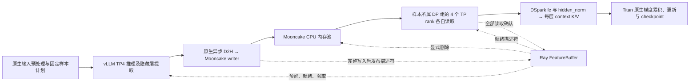

# DSpark 异步训练流水线

## v3 计划与受控运行（2026-09-20）

新入口支持 `preview/run/transport-check/status/cancel/verify`。下文旧入口的历史训练结果
保留原有证据范围，不能作为 v3 controller 或 M2/M3 的验收结果。

```bash
source ./h800conda.sh
"$PIPELINE_PYTHON" -m deepspec.pipeline.cli preview --config /absolute/task.json
"$PIPELINE_PYTHON" -m deepspec.pipeline.cli transport-check --plan /absolute/run/plan.json
"$PIPELINE_PYTHON" -m deepspec.pipeline.cli run --plan /absolute/run/plan.json
"$PIPELINE_PYTHON" -m deepspec.pipeline.cli status --run-dir /absolute/run
"$PIPELINE_PYTHON" -m deepspec.pipeline.cli status --run-dir /absolute/run --json
"$PIPELINE_PYTHON" -m deepspec.pipeline.cli cancel --run-dir /absolute/run
"$PIPELINE_PYTHON" -m deepspec.pipeline.cli verify --run-dir /absolute/run
```

配置示例见 `specs/001-unify-ray-topology/contracts/`，示例中的变量须替换为实际值。
每次 preview 使用不存在的输出目录；run 不复用已执行的计划。输入文件、兼容配置、
环境文件均被计划摘要绑定，运行前再次核对节点、源码、依赖、模型与原始输入身份。
生成的 `pipeline.runtime.json` 只补充本次服务 endpoint、actor 名称等运行信息。

CPU verifier 的工作集从模型 safetensors 元数据保守估计，执行前检查节点额度及
64 GiB 余量；模型进程与 GPU placement groups 完成释放后，在计划指定节点的一核
CPU actor 内加载完整原生 DCP，CUDA 可见设备为空。核验内存不够即拒绝；不会申请
额外 GPU。`verify` 另写 `verification.json`，不会将 failed/cancelled 的 status 改成成功。

`status` 为只读视图，分别列出 produced、complete_reads、逐 rank optimizer updates
和 checkpoint committed ranks。比如 48 次完整读取而 committed ranks 为空，表示
源数据读完但尚无全员训练提交。preview_complete 尚未启动，不要求 lease；运行中
controller lease 过期时视图显示 failed，并保留原 controller_state，清理缺证据仍为
unknown。预算等待按原因和本地单调时钟时长记录，缺失测量保留为 null。

取消在处理/清理期限内结束，终态保持 cancelled；独立资源观测或对象删除仍有 unknown
时不能 succeeded。成功须同时具备全计划样本、全部 rank 更新及 commit、CPU DCP
核验、源对象释放、实际落点与所有已登记资源的回收证据。指标不跨节点相减时间戳。

退出码：0 命令执行成功（status 的 0 不代表任务成功），2 配置/身份错误，3 运行或
核验失败，4 资源不足/节点不可达，130 主动取消。当前完整验收范围以
`specs/001-unify-ray-topology/acceptance-report.md` 和 append-only results.json 为准。

旧 `deepspec.pipeline.run` 和 `cluster.launch_cluster` 已转接同一 v3 planning/controller，旧脚本仍传递显式参数和 `PIPELINE_PYTHON`。生产 DP2、训练 DP1 不再被入口耦合限制。TCP 配置中的 `rdma_devices` 原样保留，不因此切换协议。历史 `retain_for_peak` 保留对象压力模式目前由 v3 迁移明确拒绝，不能当作已兼容。

## 历史入口与训练记录（以下为改造前记录）

本目录增量接入现有 vLLM 特征提取与 TorchTitan DSpark 训练。
Ray 负责资源、轻量元数据、就绪与背压；隐藏层张量通过 Mooncake Store 传输。
参考实现的 commit、关键函数和接入边界见 [源码核实记录](REFERENCES.md)。

**2026-09-16 已通过单机 4＋4 卡真实模型验证：12 批特征、3 次优化器更新、
完整 checkpoint，48 次 rank 读取校验通过，全部特征对象释放。**
配置、修复原因、运行证据与验证范围见 [本轮验收记录](VALIDATION.md)。
后续单机 128K 与两机接入的最新状态见 [会话交接](../../scripts/train/qwen3.8_ray_mooncake_vllm_torchtitan/HANDOFF.md)。
同日两机 128K 也已正常退出：12 个长度 131072 的微批、48 次读取校验、3 次更新，
完整 checkpoint 与全部特征释放通过，见 [两机结果](../../outputs/dspark_two_node_20260916_128k_run1/result.json)。
两机启动使用 [train_multinode.sh](../../scripts/train/qwen3.8_ray_mooncake_vllm_torchtitan/train_multinode.sh)，
具体接入命令见 [启动说明](../../scripts/train/qwen3.8_ray_mooncake_vllm_torchtitan/README.md#两机-44)。

后续两机 128K TCP20 已通过：80 个不同样本、320 次读取校验、20 次更新及独立验证的
`step-20` checkpoint，源对象全部释放；约 32.63 分钟的活动区间内没有内存压力。
第 2–20 次更新间隔中位 93.56 秒，转换中位 6.55 秒/批；见
[独立核验](../../outputs/dspark_two_node_20260916_128k_tcp20/verification-status.json)。
RDMA 跨机传输受第一台缺少 RoCE 网络接口阻塞，用户已明确暂时跳过，后续 DP 使用 TCP。
设备与路由证据及重测命令见
[RDMA 诊断](../../scripts/train/qwen3.8_ray_mooncake_vllm_torchtitan/RDMA_DIAGNOSIS.md)。
历史混布拓扑曾接入消费者跨机 DP2：生产 TP4、消费 TP4 × DP(shard)2，共十二卡，4K 和 128K
真实训练均已正常退出，各完成 12 个样本、48 次读取校验、三次更新和独立 checkpoint 核验。
本轮进程已清空，Ray 集群保留。见 [128K DP2 核验](../../outputs/dspark_two_node_20260916_128k_dp2_run1/verification-status.json)。
随后 DP2 的 128K / 20 步延长测试也已通过：80 个不同样本、320 次读取 SHA256，
八个 rank 各完成 20 次更新，源对象全部释放，独立读取 fc optimizer step=20。
第 2–20 步间隔中位 80.36 秒；28.65 分钟的活动区间无内存压力，稳态前后窗口
两机 RSS 中位数增加 26.34 / 44 MiB，十二卡显存中位数无增长。见
[DP2 TCP20 核验](../../outputs/dspark_two_node_20260916_128k_dp2_tcp20/verification-status.json) 和
[稳定性分析](../../outputs/dspark_two_node_20260916_128k_dp2_tcp20/stability-analysis.json)。
该混布拓扑不符合用户的整机分离要求，仅保留历史证据；这轮不能排除慢泄漏，GPU 直传仍未验收。命令见
[DP2 启动说明](../../scripts/train/qwen3.8_ray_mooncake_vllm_torchtitan/README.md#两机消费者-dp248-卡)。

全十六卡使用 `--producer-dp 2 --consumer-dp 2`：生产由一个原生 AsyncLLM frontend
显式路由至第一台的两组 TP4，第一台八卡生产、第二台八卡消费。整机分离小模型 DP2
显式路由和八 worker 归属已通过。真实整机分离 4K/3 步与 128K/3 步也已正常退出，
各完成 12 样本、48 次 SHA256、八 rank 各三次更新与完整释放；独立 checkpoint 和清理核验通过。
见 [十六卡验收](VALIDATION.md#整机分离全十六卡2026-09-16)。继续跳过 RDMA，未重跑十二卡 TCP20。

## 启动

使用指定的现有 Python 环境；不使用 uv。以下单机示例需要 8 张空闲 GPU。

```bash
cd /mnt/afs-agentpro/lezewei/DeepSpec
export PYTHONPATH="$PWD:$PWD/torchtitan:$PWD/vllm"
/tmp/deepspec_vllm_torchtitan_envs/bin/python -m deepspec.pipeline.run \
  --model /mnt/afs_agents/hongjiawei/share_models/Qwen/Qwen3.8-27B \
  --source outputs/dspark_torchtitan_orchestration_20260914/128k-source.jsonl \
  --output outputs/dspark_pipeline_example \
  --context-length 4096 --steps 3 --window 8
```

输出目录必须不存在。`--source` 可以指向其他符合现有原生预处理规则的 JSONL。
`--prepare-only` 仅生成 token 输入及不可变训练计划，不启动模型或服务。

首轮配置是正确性验证：真实 27B target、真实五层 draft、上下文上限 4096、
12 个样本、3 次更新。它不是原有 128K 配置的性能对照。

## 框架边界与数据流



- **生产者：** Ray placement group 提供四个单 GPU bundle 和一个 CPU frontend。
  frontend 使用 `LLM(distributed_executor_backend="ray")`，由当前 vLLM 的
  `RayExecutorV2` 创建四个 TP worker、设置其 GPU/rank 映射和通信。
  生产 DP2 使用单个 `AsyncLLM` frontend；先预留第二台的八卡消费组，vLLM 原生 Ray DP backend
  再在第一台创建两个 EngineCore/TP4 资源组。当前 dense target 不支持 offline DP。
- **消费者：** DP1 由一个四卡 placement group 和 Ray launcher 启动原生 torchrun。
  当前两机 DP2 则在第二台创建一个八卡 group，由单个本机 torchrun 启动八 rank
  TorchTitan 实例。TorchTitan 创建模型、通信组、优化器和训练循环。
- **GPU 分配：** 以 Ray 的实际分配为准。事件文件记录 vLLM worker 与消费者的
  节点和 GPU ID，汇总时要求生产 `4 × producer_dp` 张、消费 `4 × consumer_dp` 张，
  且 `(node_id, gpu_id)` 无交集。
  两机模式还检查各节点上的数量与预定拓扑一致，并拒绝生产与消费共享物理节点。
  第一台仅生产，第二台运行全部消费 rank 与唯一池；八个消费 rank 属于同一个模型。
  启动前检查 GPU 空闲；运行中检测其他任务的 GPU 进程并中止本次验证。
  生产 DP2 时第一台使用八卡。这个检测不能替代集群作业系统的资源预留，
  需事先安排对应的 8、12 或 16 卡窗口。
- **并行与更新：** 默认生产 TP4/DP1/PP1、消费 TP4/DP1/CP1/PP1，消费 GAS4。
  `--consumer-dp 2` 将消费端改为 TP4/DP(shard)2/GAS2，原生 FSDP2 的 DP/TP 通信均留在第二台。两种配置都保持每次更新四个样本，不宣称跨 DP 布局的数值逐位一致。
- **模型语义：** 保留 `[1,16,31,46,61]` 层、BF16、token/loss mask 对齐、
  五层 draft、512 anchors、block size 7、confidence/Markov head、loss、优化器、
  scheduler 和 SelectiveAC。隐藏层仍在 DSpark 内经训练参数投影成 context K/V；
  没有在生产者预先计算并替代这些可训练投影。

## 接口与对象生命周期

现有代码只增加两个接入点：

1. `FeatureLoader.read_entry()`：原文件路径保持原行为；流式子类读取 Mooncake 描述符。
2. `Trainer.materialize_batch()`：原行为保持逐微批搬到 GPU；流式子类在此完成特征读取。

另修复了指定环境中的原生初始化兼容问题：Transformers 5.16.1 的通用初始化器
按类名识别 RMSNorm，TP 包装类 `DraftNorm` 会被漏掉。`DSparkDraftModel.init_weights()`
现在按继承关系显式初始化 RMSNorm 的单位缩放，恢复原归一化语义；未改模型结构或 loss。

`connector.py` 继承现有 `ExampleHiddenStatesConnector`，仅替换异步 writer。
提取和 D2H 完成判定仍由 vLLM 处理。只有每组 TP rank 0 写入完整特征。
单 frontend 按全局计划顺序预留，以 `position % producer_dp` 分派；每个 DP 组最多一个
生成调用。原生 `data_parallel_index` 保留 dense EngineCore 的生产 DP 身份，connector
据此校验归属，buffer 在写前验证节点并拒绝重复 writer，发布时再次核验归属和输入 identity。
READY 可以乱序；生成请求结束后仍等待全部 Store 写入才报告生产完成。请求或 writer
失败会取消其他请求及阻塞的准入，buffer 随之失败。退出清理按本轮完整标识检查残留进程。
每个样本包含六个张量：`input_ids`、`loss_mask`、`seq_len`、
`context_chunk_len`、`target_hidden_states` 和 `target_last_hidden_states`。
每个张量默认按最多 8 MiB 分块（`transport.chunk_bytes` 可调整），描述符含 shape、dtype、
字节数、SHA256 和分块 key。准备阶段会把旧配置升级到 schema 2；旧的 schema 1
配置仍可读取。

现有原生循环先收齐一个更新所需的微批元数据，再逐微批计算。
因此 window 和容量必须能容纳完整的全局四样本更新组，DP2 时也不能缩成两个样本。
高水位暂停后仍允许补齐已经开始的更新组，避免两个 DP 组收集元数据时死锁。
输入样本顺序直接继承原生输入计划；DP2 的 DP0 读取偶数位置，DP1 读取奇数位置。

写入全部成功才发布 READY；每个 rank 完成同步 Store 读取并通过 SHA256 校验后确认。
样本所属 DP 组的四个 TP rank 都持有独立副本后，管理器才显式删除原对象并归还容量。
其他 DP 组不能领取该样本，也不计入其释放所需的 ACK。
原对象使用 `with_hard_pin=True`、单副本；禁用 SSD/offload，不用淘汰代替背压。

删除源对象不等于完成训练更新。训练侧副本覆盖 backward 和 SelectiveAC 重计算的
使用期；当前微批反向计算及 CUDA stream 同步完成后，移除其输入字典中的两项
大特征引用，避免原循环把整个累积组的大张量都保留到更新结束。梯度与更新不受此释放影响。
保留原生最终 checkpoint；本接入不实现特征恢复、
重新生成或故障重放，也不将源对象保留到 checkpoint 后。进程或存储故障会中止本次运行。

## 内存与传输边界

单节点只有一个 Store pool，默认 4 GiB。四个训练 rank 与生产 writer 不再各自申请
全局池。可用对象容量按 pool 的 75% 预留，留出分配器空间。
两机入口默认 128K、64 GiB 池，唯一池固定在第二台消费节点。
第一台仅预算生产暂存，生产 DP2 时包含两个 writer；第二台预算池及全部训练 rank 的
读取/校验/预取副本。生产暂存上界保守覆盖全局 window。
两节点分别核算特征内存上界，每个新累积组检查两端内存余量。

节点预算同时受物理内存 80%、cgroup 限额 80% 和当前可用内存约束，并另留 64 GiB。
启动时核算 pool、在途生产的 raw/gather/转换暂存、各 rank 的读取/校验副本、
Store 本地缓冲和额外余量。每次新累积组派发前检查实时内存余量；已开始的累积组
所需空间包含在预估上界中。pool 内删除只增加池内可用空间，不代表将预分配内存归还 OS。

默认使用 **Mooncake Store 的 TCP 配置 → 消费端 pinned CPU → GPU**。
单机是否命中 Store 内部的本地复制路径，需要进一步追踪，不能仅凭 TCP 配置判定。
生产与训练持续并行；消费端另有有界预取器，默认最多保留两批待取特征。
元数据客户端与预取客户端独立；预取 worker 受 `transport.prefetch_depth` 和
`transport.prefetch_bytes` 双重限制，并绑定当前训练 rank 的 CUDA device，避免
pinned-memory 分配意外使用其他设备。计算前确认当前批传输结束，同时允许后台读取
下一批。是否实际重叠以运行事件和后续 GPU trace 为准。
每个 TP rank 都需要完整 context 输入，因此会分别读取完整特征。
当前 DP2 的全部八个消费 rank 都在第二台读取本机池；第一台的两个生产组跨机写入。
NCCL 显式使用 `Socket`、禁用 IB，网口按节点 Ray IP 选择；节点内 P2P 不受影响。
`--protocol rdma` 与 `--receive-device cuda` 仍需按目标拓扑分别验收。
2026-09-18 在目标 CUDA 节点用真实 Mooncake wheel 做了节点级探针：同节点
`receive_device=cuda` 的 GPU 目标缓冲区接收和 SHA256 校验通过；RDMA client setup
虽通过，但 QP 建连因容器内没有 RoCE netdev 报 `No such device`。这不能证明跨机
RDMA、远端 GPU 直传或传输与计算重叠；完整记录见
[目标 CUDA 节点传输验证](../../scripts/train/qwen3.8_ray_mooncake_vllm_torchtitan/TARGET_CUDA_TRANSPORT_VALIDATION.md)。

生产写入使用按 writer slot 复用的注册 host buffer。模型提取线程只在 staging
窗口满时等待，Mooncake native call、可见性检查和 checksum 保持在传输 handle 的
生命周期内；部分写入会清理已出现的 keys。FeatureBuffer 的 ACK 仍是容量归还的
唯一条件，删除 RPC 由独立 worker 重试，删除失败会让本轮运行失败而不会提前释放
ledger credit。master 也由统一的 run-owned supervisor 启停，避免异常退出留下服务。

## 证据

`events.jsonl` 记录资源分配、预留/背压、完整写入、各 rank 领取/读取/GPU 就绪、
计算和更新完成事件。首个完整更新还检查 `fc`、第一层 `k_proj/v_proj` 的有效梯度。
传输校验和 GPU 同步会增加验证开销，时序结果不能直接作为生产性能结论。

`training-result.json` 使用原生 Trainer 的完成步数和 checkpoint commit。
`result.json` 仅在生产、训练、全部对象释放与 GPU 分配检查都成功后写入；
汇总还逐 rank 核对每批的领取、读取、GPU 就绪和计算事件、每次更新的完成记录，
并重读磁盘上的 checkpoint commit 和 metadata hash。
生产 DP2 还校验八个 worker 的 DP/TP/节点/GPU 身份及每个样本的唯一路由；
合并两个生产组的推理区间后再计算与消费计算的交集，避免重复累计重叠时间。
DP2 的事件还核对八个 rank 的主机、DP/TP 坐标、GAS2 与每个样本的 TP 读者组。
原生 `next_global_microbatch` 是同步 DP 微步计数，DP2 三次更新后为 6；
`next_global_sample` 和最终 `consumed_samples` 表示已完成的全局样本数，此时为 12。
组件测试：

```bash
CUDA_VISIBLE_DEVICES='' /tmp/deepspec_vllm_torchtitan_envs/bin/python -m pytest -q \
  tests/test_pipeline_cluster.py tests/test_pipeline_buffer.py tests/test_pipeline_store.py \
  tests/test_dspark_norm_initialization.py tests/test_qwen38_vllm.py
```

首轮通过 10 项组件与回归检查，包括真实 Ray/Mooncake 读写、全部读者确认、池容量压力下
未消费对象保护、有界预取，以及四个独立 CPU rank 使用原生数据加载器消费两个
完整累积组，另覆盖 TP 归一化层的 meta 初始化。CPU rank 检查不实例化模型。
两机接入再覆盖节点固定、独立内存预算、重复的本地 GPU 编号、独立客户端 Store probe
及 GPU 进程退出/PID 复用；运行记录见会话交接。
DP2 增补后 cluster/buffer/store 共 20 项通过，包含四/八个独立 CPU rank 使用原生
FeatureLoader 完成 DP1/DP2 读取、背压和释放。两机八卡 Socket 的 all-gather、reduce-scatter
及 TP/global all-reduce 探针也已通过。CPU 协议测试与 GPU 通信探针都不替代真实模型验收。
真实模型整链路结果以具体运行的 `result.json` 为准。

2026-09-15 的 `outputs/dspark_pipeline_4plus4_20260915_trial2` 已启动四卡 vLLM
与四卡 TorchTitan；TorchTitan 完成原生模型和训练初始化。随后发现外部 CI 任务
也在使用这些 GPU，本次验证已中止并清理自身进程。vLLM 权重尚未加载完毕，
特征生产、真实 loss/梯度、优化器更新和 checkpoint **均未完成整链路验证**。
详见该目录的 `verification-status.json`、`events.jsonl` 和 `consumer.log`。

2026-09-16 的 `outputs/dspark_pipeline_4plus4_20260916_run1` 在监测到 30 秒空闲后
再次启动。vLLM 已读完 18 个 checkpoint shard，TorchTitan 完成初始化；随后外部 CI
再次进入全部 8 卡，运行中的占用检查自动中止并清理了本次进程。
该轮仍是 0 个 READY 特征、0 次优化器更新。短暂空闲检测不能替代作业系统的 8 卡预留。
