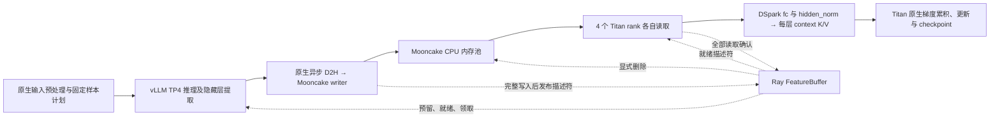

# 单机 4＋4 卡 DSpark 流水线

本目录增量接入现有 vLLM 特征提取与 TorchTitan DSpark 训练。
Ray 负责资源、轻量元数据、就绪与背压；隐藏层张量通过 Mooncake Store 传输。
参考实现的 commit、关键函数和接入边界见 [源码核实记录](REFERENCES.md)。

**2026-09-16 已通过单机 4＋4 卡真实模型验证：12 批特征、3 次优化器更新、
完整 checkpoint，48 次 rank 读取校验通过，全部特征对象释放。**
配置、修复原因、运行证据与验证范围见 [本轮验收记录](VALIDATION.md)。

## 启动

使用指定的现有 Python 环境；不使用 uv。需要 8 张空闲 GPU。

```bash
cd /mnt/afs_share/lezewei/DeepSpec_torchtitan_vllm
export PYTHONPATH="$PWD:$PWD/torchtitan:$PWD/vllm"
/tmp/deepspec_vllm_torchtitan_envs/bin/python -m deepspec.pipeline.run \
  --model /mnt/afs_agents/hongjiawei/share_models/Qwen/Qwen3.8-27B \
  --source outputs/dspark_torchtitan_orchestration_20260914/128k-source.jsonl \
  --output outputs/dspark_pipeline_example \
  --context-length 4096 --steps 3 --window 8
```

输出目录必须不存在。`--source` 可以指向其他符合现有原生预处理规则的 JSONL。
`--prepare-only` 仅生成 token 输入及不可变训练计划，不启动模型或服务。

首轮配置是正确性验证：真实 27B target、真实五层 draft、上下文上限 4096、
12 个样本、3 次更新。它不是原有 128K 配置的性能对照。

## 框架边界与数据流



- **生产者：** Ray placement group 提供四个单 GPU bundle 和一个 CPU frontend。
  frontend 使用 `LLM(distributed_executor_backend="ray")`，由当前 vLLM 的
  `RayExecutorV2` 创建四个 TP worker、设置其 GPU/rank 映射和通信。
- **消费者：** 另一个 placement group 提供四张 GPU，由一个 Ray launcher
  启动原生 `torchrun --nproc-per-node=4`。TorchTitan 创建模型、通信组、优化器和训练循环。
- **GPU 分配：** 以 Ray 的实际分配为准。事件文件记录 vLLM worker 与消费者的
  GPU ID，汇总时要求两边各四张且无交集。代码没有把同一个模型拆成独立训练实例。
  启动前检查 GPU 空闲；运行中检测其他任务的 GPU 进程并中止本次验证。
  这个检测不能替代集群作业系统的资源预留，需事先安排好 8 卡窗口。
- **并行与更新：** 本接入只支持单机、生产 TP4/DP1/PP1、消费 TP4/DP1/CP1/PP1。
  消费端 GAS=4，保持每次更新四个样本。原有八卡消费者是 DP2、GAS2；
  这里的数据并行布局发生了变化，不能据此宣称数值与原有八卡运行逐位一致。
- **模型语义：** 保留 `[1,16,31,46,61]` 层、BF16、token/loss mask 对齐、
  五层 draft、512 anchors、block size 7、confidence/Markov head、loss、优化器、
  scheduler 和 SelectiveAC。隐藏层仍在 DSpark 内经训练参数投影成 context K/V；
  没有在生产者预先计算并替代这些可训练投影。

## 接口与对象生命周期

现有代码只增加两个接入点：

1. `FeatureLoader.read_entry()`：原文件路径保持原行为；流式子类读取 Mooncake 描述符。
2. `Trainer.materialize_batch()`：原行为保持逐微批搬到 GPU；流式子类在此完成特征读取。

另修复了指定环境中的原生初始化兼容问题：Transformers 5.16.1 的通用初始化器
按类名识别 RMSNorm，TP 包装类 `DraftNorm` 会被漏掉。`DSparkDraftModel.init_weights()`
现在按继承关系显式初始化 RMSNorm 的单位缩放，恢复原归一化语义；未改模型结构或 loss。

`connector.py` 继承现有 `ExampleHiddenStatesConnector`，仅替换异步 writer。
提取和 D2H 完成判定仍由 vLLM 处理。只有 TP rank 0 写入完整特征。
每个样本包含六个张量：`input_ids`、`loss_mask`、`seq_len`、
`context_chunk_len`、`target_hidden_states` 和 `target_last_hidden_states`。
每个张量按最多 8 MiB 分块，描述符含 shape、dtype、字节数、SHA256 和分块 key。

现有原生循环先收齐一个更新所需的微批元数据，再逐微批计算。
因此 window 和容量必须能容纳完整 GAS。高水位暂停后仍允许补齐已经开始的 GAS，
避免累积组内死锁。输入样本顺序直接继承原生输入计划。

写入全部成功才发布 READY；每个 rank 完成同步 Store 读取并通过 SHA256 校验后确认。
四个 TP rank 都持有独立副本后，管理器才显式删除原对象并归还容量。
原对象使用 `with_hard_pin=True`、单副本；禁用 SSD/offload，不用淘汰代替背压。

删除源对象不等于完成训练更新。训练侧副本覆盖 backward 和 SelectiveAC 重计算的
使用期；当前微批反向计算及 CUDA stream 同步完成后，移除其输入字典中的两项
大特征引用，避免原循环把四个微批的大张量都保留到更新结束。梯度与更新不受此释放影响。
保留原生最终 checkpoint；本接入不实现特征恢复、
重新生成或故障重放，也不将源对象保留到 checkpoint 后。进程或存储故障会中止本次运行。

## 内存与传输边界

单节点只有一个 Store pool，默认 4 GiB。四个训练 rank 与生产 writer 不再各自申请
全局池。可用对象容量按 pool 的 75% 预留，留出分配器空间。

节点预算同时受物理内存 80%、cgroup 限额 80% 和当前可用内存约束，并另留 64 GiB。
启动时核算 pool、在途生产的 raw/gather/转换暂存、各 rank 的读取/校验副本、
Store 本地缓冲和额外余量。每次新累积组派发前检查实时内存余量；已开始的累积组
所需空间包含在预估上界中。pool 内删除只增加池内可用空间，不代表将预分配内存归还 OS。

默认使用 **Mooncake Store 的 TCP 配置 → 消费端 pinned CPU → GPU**。
单机是否命中 Store 内部的本地复制路径，需要进一步追踪，不能仅凭 TCP 配置判定。
生产与训练持续并行；消费端另有单线程预取器，最多保留两批待取特征。
元数据客户端与预取客户端独立；预取线程绑定当前训练 rank 的 CUDA device，
避免 pinned-memory 分配意外使用其他设备。计算前确认当前批传输结束，
同时允许后台读取下一批。是否实际重叠以运行事件和后续 GPU trace 为准。
每个 TP rank 都需要完整 context 输入，因此会分别读取完整特征。
`--protocol rdma` 与 `--receive-device cuda` 是待目标环境验证的选项，
TCP/CPU 测试不能证明跨机 RDMA、CPU→GPU 直传或传输与计算重叠。

## 证据

`events.jsonl` 记录资源分配、预留/背压、完整写入、各 rank 领取/读取/GPU 就绪、
计算和更新完成事件。首个完整更新还检查 `fc`、第一层 `k_proj/v_proj` 的有效梯度。
传输校验和 GPU 同步会增加验证开销，时序结果不能直接作为生产性能结论。

`training-result.json` 使用原生 Trainer 的完成步数和 checkpoint commit。
`result.json` 仅在生产、训练、全部对象释放与 GPU 分配检查都成功后写入；
汇总还逐 rank 核对每批的领取、读取、GPU 就绪和计算事件、每次更新的完成记录，
并重读磁盘上的 checkpoint commit 和 metadata hash。
组件测试：

```bash
CUDA_VISIBLE_DEVICES='' /tmp/deepspec_vllm_torchtitan_envs/bin/python -m pytest -q \
  tests/test_pipeline_buffer.py tests/test_pipeline_store.py \
  tests/test_dspark_norm_initialization.py
```

已通过 10 项组件与回归检查，包括真实 Ray/Mooncake 读写、全部读者确认、池容量压力下
未消费对象保护、有界预取，以及四个独立 CPU rank 使用原生数据加载器消费两个
完整累积组，另覆盖 TP 归一化层的 meta 初始化。CPU rank 检查不实例化模型。
真实模型整链路结果以具体运行的 `result.json` 为准。

2026-09-15 的 `outputs/dspark_pipeline_4plus4_20260915_trial2` 已启动四卡 vLLM
与四卡 TorchTitan；TorchTitan 完成原生模型和训练初始化。随后发现外部 CI 任务
也在使用这些 GPU，本次验证已中止并清理自身进程。vLLM 权重尚未加载完毕，
特征生产、真实 loss/梯度、优化器更新和 checkpoint **均未完成整链路验证**。
详见该目录的 `verification-status.json`、`events.jsonl` 和 `consumer.log`。

2026-09-16 的 `outputs/dspark_pipeline_4plus4_20260916_run1` 在监测到 30 秒空闲后
再次启动。vLLM 已读完 18 个 checkpoint shard，TorchTitan 完成初始化；随后外部 CI
再次进入全部 8 卡，运行中的占用检查自动中止并清理了本次进程。
该轮仍是 0 个 READY 特征、0 次优化器更新。短暂空闲检测不能替代作业系统的 8 卡预留。
