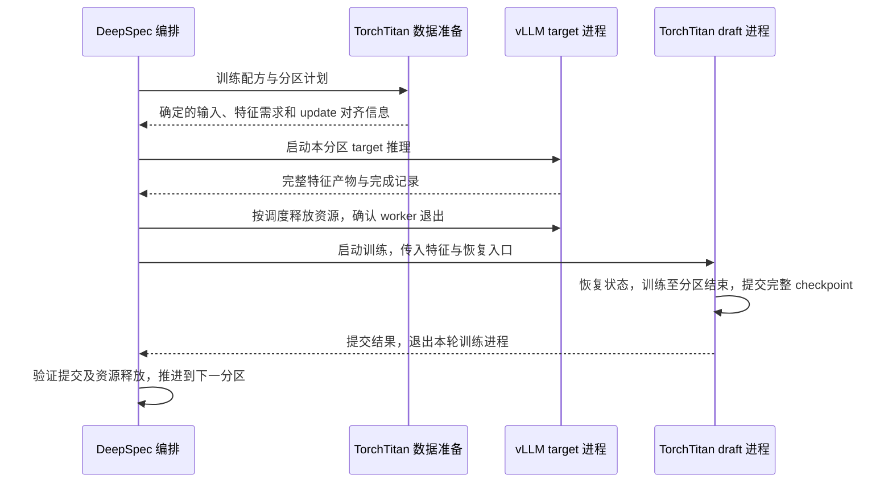

# DeepSpec 编排与 TorchTitan draft 训练设计

日期：2026-09-14。状态：待用户整体核对。本文整合 [ADR-0004](../docs/adr/0004-separate-feature-delivery-and-draft-training.md) 中已确认的 Q1–Q9；接口表描述职责和交换内容，具体 Python 类型、文件名及 CLI 参数在实施时确定。代码迁移、依赖变更和训练执行尚未开始。

## 职责与配置

| 所属方 | 配置与职责 |
| --- | --- |
| DeepSpec | 特征分区数量和阶段数据量、两端启动与卸载调度、交接产物的位置和状态。引用 TorchTitan 训练配方与独立的 vLLM 推理配置。 |
| TorchTitan | Draft 模型、数据预处理、特征需求、batch/GAS、loss、optimizer、scheduler、并行、AC/compile、checkpoint 和训练指标。尽可能直接使用其已有 Config 和组件。 |
| vLLM 推理配置 | Target 模型及其推理运行参数，包括解释器、源码位置、推理并行和显存预算，由 DeepSpec 按既定配置启动；不从 draft 并行配置推导。 |

DeepSpec 决定任务执行多少特征分区、何时交接 GPU；TorchTitan 决定每份输入如何训练。数据准备规则和实现归 TorchTitan，DeepSpec 调用其入口并组织请求。该准备步骤不需要构建 GPU draft 模型，避免在 vLLM 推理前占用 draft GPU 资源。

模型主体和模型专属配置、并行适配归 `torchtitan/torchtitan/models/` 下的独立 DSpark draft 模型目录；训练执行、特征读取和状态扩展也归 `torchtitan/`。DeepSpec 不再实例化旧 trainer 来执行 backward、optimizer update 或训练 checkpoint 保存。

本地 [Trainer.Config](../torchtitan/torchtitan/trainer.py) 和 [ConfigManager](../torchtitan/torchtitan/config/manager.py) 提供原生配置及构建入口。采用 TorchTitan 侧的 DSpark 训练适配，复用其通用组件；DSpark 输入、loss 和恢复状态通过扩展接入。这里的 batch/GAS 是训练语义，字段尽量映射到原生配置，不另建一套同义默认值。

## 一个特征分区的生命周期

DeepSpec 发出的阶段请求包含完整 update 停点和阶段结束后的退出要求。TorchTitan 执行保存、退出；DeepSpec 在所有 worker 退出并释放资源后才调度下一阶段。同一任务各 draft 阶段使用相同拓扑，target 沿用独立配置。

## 阶段计划与训练进度

DeepSpec 按特征分区安排工作量；TorchTitan 数据准备依据训练配方返回合法的样本分组和 update 边界，DeepSpec 据此持久化、执行分区计划。分区数量或大小的调整保持既有样本顺序、GAS 与每次 update 的 microbatch 分组，不允许通过提前 update、额外丢样本或改变权重满足分区大小。

整个训练任务的计划、已经完成的训练进度和当前阶段停点分别记录。TorchTitan 的 scheduler 按整个任务的训练进度推进；启动下一阶段后恢复原 scheduler 和 optimizer 状态，不能重新 warmup，也不能把本阶段数据量当作全程 scheduler 长度。DeepSpec 不复制 optimizer 或 scheduler 的实现。

阶段请求引用已解析训练配方及任务计划身份。恢复时核对配方、样本计划、拓扑、checkpoint 与当前分区的对应关系；具体元数据编码属于实施细节。

## 交换内容

| 交接 | 内容与约束 |
| --- | --- |
| 数据准备结果 → DeepSpec | 有序样本身份、确定的 token 序列及监督 mask、特征层需求、完整 update 对齐信息。预处理使用 TorchTitan 配方定义的 tokenizer/chat template 和截断规则。 |
| DeepSpec → vLLM | 本分区的推理输入、target 身份与特征需求、独立推理配置和产物位置；不要求 vLLM 理解 GAS、loss 或 optimizer。 |
| 特征产物 → TorchTitan | 输入对应关系、选定层 hidden states、所需最终归一化 hidden states、长度和 mask，以及 teacher/特征语义、原始文件和分片信息。沿用既有 target 特征内容，以补充索引连接新训练侧。 |
| DeepSpec → TorchTitan | 训练配方引用、本分区特征清单、阶段停点、全程任务计划以及最近已提交 checkpoint；首次训练使用初始状态。 |
| TorchTitan → DeepSpec | 有效 checkpoint 引用、已消费分区及样本范围、完成的 update 和下一消费位置。正常推进还必须确认训练 worker 已退出并释放资源。 |

特征产物描述输入及其 target 特征；draft 消费计划描述本次训练的 DP/TP/CP 读取布局、microbatch/update 归属和进度。两者分别表达，避免改变 draft 拓扑时重写 producer 的事实。

TorchTitan reader 负责校验 token、层顺序、dtype/shape、最终层语义及样本身份，依据 draft 拓扑组织数据。固定 producer 已有 shards 时，先恢复同一样本的原始顺序，再构造所需训练视图；TP 副本不产生新的独立样本。

## 保存、失败与恢复

每个正常阶段在完整 optimizer update 后同步提交完整 DCP。状态包括模型及 frozen 参数、FP32 优化状态和 Adam 计数、scheduler、各 rank RNG、样本消费游标及分区进度；RNG 在构建和状态加载完成后、下一次训练计算前恢复。

复用 [DCP checkpointer 的状态扩展入口](../torchtitan/torchtitan/components/checkpointer/dcp.py) 保存 DSpark 额外状态。当前原生 `train_state` 仅有 step/token 计数，rank-local RNG 保存仍有 TODO，默认设置不足以证明完整恢复。保存和恢复必须通过新流程的连续更新对照验证。

DeepSpec 依据有效提交中的进度推进任务。若 TorchTitan 已提交而 DeepSpec 尚未记录阶段完成就中断，重启需识别该提交，避免重复已完成的更新。若训练或保存失败，停止当前任务；从最近成功提交且通过验证的 checkpoint 重启，未提交的训练工作允许重跑。首次提交前失败从初始状态重跑。

特征缓存仅在相关消费者全部完成且对应阶段 checkpoint 成功提交后回收。恢复需要的未完成分区依据任务计划和特征身份校验处理，不能把不完整的特征输出当成完成产物。

沿用最近两份完整阶段 checkpoint 的滚动保留规则，显式里程碑和最终产物单独保留。HF/safetensors 按评估或最终交付需要导出。本次保证新流程自身完整恢复，旧 DeepSpec 完整训练状态转换不纳入范围。

## 验收与尚未验证的技术项

本次先完成 Qwen3.8 DSpark；后续 dense 并行组合和 GLM MoE EP 按既有顺序扩展。保持 [ADR-0001](../docs/adr/0001-preserve-dspark-training-semantics.md) 的 DSpark 数学、精度和更新语义，不能直接换成普通 Qwen 模型或默认 token 平均目标。

- 配置隔离：draft 的 batch、并行和 AC/compile 调整不改写固定 vLLM 推理配置；训练组件配置以 TorchTitan 为来源。
- 特征交接：同一固定产物经 reader 后，样本、tokens、mask、features 及顺序一致，分区边界保持原 update 分组。
- 数值与恢复：真实 DSpark 模型类的小规模 FP32/BF16 对照，含有效分母不同的 microbatch；连续训练与跨进程保存恢复比较后续 loss、梯度、优化状态、RNG 和数据进度。
- 编排恢复：验证保存失败、训练进程异常退出、提交成功而编排记录尚未更新等情况，确认有效恢复入口和消费进度一致。
- 资源交接：连续多个阶段验证所有 draft worker 退出及资源释放，下一阶段不依赖前一进程持有的状态。
- 目标规模：首阶段仍包含单机八卡真实 Qwen draft 尺寸与 128K 输入；具体拓扑和容差按 [实施规格](../.scratch/dspark-draft-torchtitan/spec.md) 的候选与基线确定。

性能统计为 draft 训练、保存、退出卸载及启动恢复的累计 wall time；包含通信组重建和实际发生的编译开销，排除 target 特征生产和等待时间。输入读取、索引及重分发属于 draft 开销。进程退出方案尚无实测加速比。

现有环境与源码编译 vLLM 保持既定基线。TorchTitan 依赖兼容性、DSpark 原生模型/并行适配、完整恢复和真实规模性能均须在实施中验证，不能把源码入口存在当成验证通过。

## 本轮收口

Q1–Q9 的用户选择已记录在 ADR-0004。上述接口和失败处理是这些选择与既有训练连续性要求的整合方案，等待用户核对是否完整表达需求；确认本设计不自动启动代码迁移或训练。
