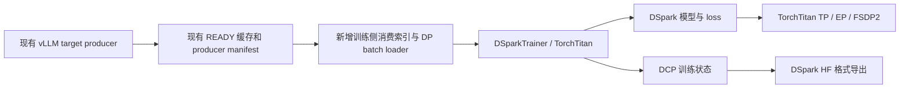

# DSpark draft 完整迁移到 TorchTitan 的历史设计分析

分析日期：2026-09-08。依据接入前工作区（包含未提交修改），DeepSpec HEAD `932be43`、本地 TorchTitan HEAD `f6b9152e9bedcc18f5dc339b9f88265e5a07e988`。本文记录完整迁移的设计方案。后续按用户选择先完成局部 DeepEP 接入，实现及验证另见 [GLM draft DeepEP](glm5_draft_deepep.md)；完整 TorchTitan Trainer 迁移尚未实施。

2026-09-14 设计讨论已确认：保持当前 DSpark 训练语义（[ADR-0001](../docs/adr/0001-preserve-dspark-training-semantics.md)），保留 DSpark 训练循环，以组件级接入 TorchTitan，并先用 Qwen3.8 DSpark dense draft 验证（[ADR-0002](../docs/adr/0002-retain-dspark-loop-for-torchtitan-components.md)）。下文保留先前完整 Trainer 迁移的分析，作为历史方案参考；本轮实施按上述 ADR 确定范围。早先记录的环境与训练路径限制须按当前工作树核对。

建议新增 DeepSpec 自有的 TorchTitan draft 后端：保留 DSpark 算法和现有 vLLM target producer，由 TorchTitan 独占 draft 的 mesh、TP/EP/FSDP、优化器和训练 checkpoint。用训练侧缓存适配器连接两者。以下以 GLM-5.3-Flash MoE draft 为主要例子，同时考虑 Qwen dense draft 和 DeepSeek-V4。

## 1. 当前实现与实际改造边界

| 现有代码 | 已有能力 / 迁移时要解决的问题 |
| --- | --- |
| `train.py:101` | 已按 `LOCAL_RANK` 接入 torchrun，多机入口不是从零建设。 |
| `deepspec/trainer/base_trainer.py` | 集中了 draft 构建、mesh、target、数据、梯度累积、优化器和 checkpoint；新后端应拆出 draft 职责。 |
| `deepspec/trainer/dspark_trainer.py:93` | DSpark batch 契约：input IDs、target 多层 hidden states、最终层 hidden states、loss mask、seq_len；不是普通 LM 的 inputs/labels。 |
| `deepspec/trainer/dspark_trainer.py:811` | vLLM 分区入口要求 draft `CP=TP=1`、`data_rank=global_rank`。不能只删限制，后续缓存身份校验仍绑定旧 rank。 |
| `deepspec/trainer/dspark_trainer.py:994` | READY 校验按当前 DP 布局重建 logical sample ID，并跨 world 检查 writer 唯一性；TP 下不能原样复用。 |
| `deepspec/distributed/tensor_parallel.py` | 已有 Qwen attention/MLP TP；并非给所有模块、所有 DSpark loss 都完成了 TP。 |
| `deepspec/modeling/glm5_next_parallel.py:140`、`deepseek_v4_parallel.py` | 已有模型专用 TP、pure EP、vocab/Markov 分片，但依赖当前 topology、手工 collective 和本地专家参数。 |
| `deepspec/modeling/dspark/loss.py:96` | CE、L1、confidence、接受率统计依赖完整 vocab；仅替换 backbone 的 TP 不能完成高效训练。 |
| `deepspec/distributed/distributed_checkpoint.py` | 已专门处理 pure-EP 本地参数的全局分片身份；不能迁移时退回普通 rank-local state_dict。 |

`vllm/**`、`deepspec/trainer/glm5_vllm.py` 及现有 teacher 权重、推理参数和特征导出语义保持原样。`glm5_next_parallel.py`、`deepseek_v4_parallel.py` 也被 target 使用，因此新 draft 后端不应直接改写这些共用适配器。训练入口和缓存 consumer 的调整属于 draft 侧改造。

## 2. 推荐结构和 TorchTitan 接入点



本地 TorchTitan 使用 `ModelSpec + Trainer.Config + config_registry`，不是旧版 `TrainSpec`。`torchtitan/config/manager.py:125` 支持完整外部模块路径；`torchtitan/train.py:44` 调用 `config.build()`。因此可把集成代码放在 `deepspec/torchtitan/`，通过 `--module deepspec.torchtitan` 接入，无需修改 TorchTitan 的模型注册表。

建议职责如下：

* `DSparkTrainer(TorchTitan Trainer)`：覆盖 DSpark batch 预处理、`train_step` 和 forward/loss/backward 适配；复用初始化、优化器容器、LR scheduler、FSDP、checkpoint、日志基础组件。
* `DSparkModel(BaseModel)`：实现 `Config`、`preprocess_inputs`、初始化与分片协议；将已有 DSpark 算法接入 Titan Module/Linear/Embedding/自定义 attention、router、experts。
* `parallelize_dspark`：唯一的 draft 并行化入口。先声明 TP/EP 分片，再配置 activation checkpoint/compile/FSDP；不叠加调用旧 `apply_parallelism`。
* `CacheBatchLoader`：仅消费现有 teacher 产物，按 draft 的 batch mesh 组织数据。
* `DSparkStateDictAdapter`：处理旧 DSpark/HF 权重与 Titan 参数命名、专家维度、张量转置之间的转换。

新后端固定 `spmd_backend="spmd_types"`，与本地版本保持一致；开发初期关闭 compile/CUDA graphs，用 eager 验证，再逐步启用。无需同时开发第二套 `partial_dtensor` 路径。上游近期也已切换到该默认后端，FSDP2 仍使用 DTensor 表示持久参数分片，参见 [PyTorch 官方说明](https://docs.pytorch.org/devlogs/distributed/2026-08-26-spmd-types-in-torchtitan/)。具体实现以本地锁定版本为准。

不能把现有 HF 模型简单包一层就认为完成接入：`torchtitan/protocols/model.py:81` 会检查子模块协议；初始化、配置遍历、分片和 checkpoint 也有相应要求。局部无法转换的模块可以显式适配，但必须说明参数初始化及通信责任。

复用 `distributed/fsdp.py:178` 的 `apply_fsdp_to_decoder` 还需要适配结构：它遍历 `layers.items()`，按 `tok_embeddings/norm/lm_head` 组织边界，并通过 `block.moe.routed_experts.inner_experts` 识别专家。新模型应满足这些约定，或在自有 parallelize 中明确构造相同 dense/sparse FSDP 边界；当前 `ModuleList + layer.mlp.experts` 不能直接传入并期待自动识别。

也不能直接使用 TorchTitan 自带 `qwen3_8` 或 `deepseek_v4` 整体模型：当前 Qwen3.8 DSpark 实际继承 Qwen3.6 的 full-attention draft，而 Titan Qwen3.8 复用 Qwen3.5 hybrid 模型。名字相同并不代表 draft 架构相同。

## 3. DSpark 模型与 TP 设计

保留当前计算语义：多层 teacher feature → `fc`/norm → context K/V；anchor/noise embedding → draft Q；DSpark mask/位置编码 → draft blocks → LM head + Markov 修正 → confidence。GLM/DeepSeek 的 MLA、hyper-connection、共享专家和 router 语义也要逐项保留。

| 模块 | 建议分片方式 | 必须保证的条件 |
| --- | --- | --- |
| `fc`，teacher feature 投影 | 先保留 replicated 输入、使用明确的 row/column 分片边界；再优化大 feature 的输入分片 | 拼接层的顺序、hidden 维度和归约梯度一致 |
| Attention | Q/输出 heads 分片，输出投影 row-wise；dense MLP gate/up column-wise、down row-wise | context 与 draft 序列长度不同；MLA 低秩/共享 KV 不可按标准 QKV 模板强切 |
| `embed_tokens` | vocab 分片 | token ID 仍是全局 ID，embedding 输出布局显式指定 |
| `lm_head` | vocab 分片 | 用 target 权重初始化并冻结；teacher 与 draft 两侧 logits 使用相同 vocab 范围 |
| Markov `w1` / `w2` | `w1` 按 vocab 分片，latent 合并；`w2` 输出 vocab 分片 | Markov bias 必须与 draft logits 同一 vocab 分片，不能分别 gather 成全量再相加 |
| confidence head | 小模块先复制 | 输入 hidden/Markov latent 完整；TP 梯度归约只能执行一次 |

第一步可保留 full-vocab 输出作数值基准；最终训练路径应保留 `V/TP` 的 logits，避免每步 all-gather 完整词表。

采样应从模型 forward 的隐式随机状态中提取到 batch preparation：以 logical sample ID、epoch、采样 seed 决定 anchors，同一 TP group 共享 anchors、mask、positions 和监督数据。现有 Qwen 路径主要在 CP>1 时广播，DeepSeek/GLM 已有 `_synchronize_anchor_sampling` 可作参考；仅依赖各 rank 相同初始 seed 不足以保证恢复后的同步。EP peers 可能持有不同样本，不能把 TP 的同样本广播扩大到整个 EP group。

`base_trainer.py:1019` 起会从 teacher 初始化并冻结 embedding/head。迁移应保留冻结状态；冻结 LM head 参数仍需保留 draft hidden 的输入梯度，不能把 draft projection 整体放进 `no_grad()`。teacher final hidden 的位置仍取对应 label 的前一位置，DSpark mask 和连续有效前缀规则也必须一致。

有状态的 RNN Markov head 要保持 block 内位置顺序。TP vocab 分片不等于沿 block 时间维度切分。

## 4. EP 设计

EP 仅对有 routed experts 的 draft 有意义。GLM/DeepSeek MoE draft 可启用；当前 Qwen3.8 dense draft 应明确要求 `EP=1`。

优先复用 `torchtitan/models/common/moe.py` 的专家计算和 `token_dispatcher.py` 的 `AllToAllTokenDispatcher`，适配现有 router；保持 top-k、评分函数、归一化、routing scale、bias、共享专家及更新规则。不能为了使用 stock MoE 而引入额外 load-balancing loss 或改变 router 更新策略。

模型在 meta 上保留全局专家形状，交由 Titan 按 EP 分片并按需加载。GLM 旧构造器会提前仅分配 `E/EP` 个专家，新后端不能继续执行该预切分后再让 Titan 切一次。

Titan 的 EP 是 dense rank 域上的另一种 mesh 视图，不是额外乘出的 GPU 维度。routed experts 使用 sparse `EP/EFSDP` 布局；attention、router、shared experts 使用 dense 布局。当前本地版本没有独立 `expert_tensor_parallel_degree` 字段，旧 `expert_tp` 不能机械映射。

`moe_sharding.py:99` 和 `:207` 会在 EP 入口沿 dense TP 分片 token，避免同一 token 被 TP ranks 重复 dispatch；即使整体 sequence parallel 关闭，这个内部转换仍需要。`moe.py:426` 要求 token 数可被 TP 整除。对于 `B × anchors × block_size`，应校验或 padding；padding 必须从 loss、统计以及有状态 router 计数中排除。

首次验收使用原生 all-to-all；DeepEP 等优化后端在正确性和环境核验完成后再切换。通信后端变化不能改变数值和 checkpoint 契约。

## 5. loss 与梯度归一化

vocab 分片后需要自定义 DSpark loss，普通 LM cross entropy 不够：

* CE：使用全词表的分布式 log-sum-exp 和目标 token logit；不能在每个 shard 内独立 softmax。
* L1：teacher/draft 各自完成全词表归一化，再把各 vocab shard 的 `abs(p-q)` 求和。
* 接受率：`1 - 0.5 * sum_v(abs(p-q))`；confidence 的 target 继续 detach。
* confidence BCE：沿实际样本/anchor 归约，不因为 TP 上有相同副本就重复计数。
* 上述可微通信必须具有正确 backward；不能用普通原地 `dist.all_reduce` 代替所有可微归约。

现有 `loss.py:243-259` 对 global denominator 归一化后乘归约组大小，`base_trainer.py:1639` 再除 GAS。Titan 的 `distributed/fsdp.py:85-99` 关闭了 FSDP 自动梯度除法。因此迁移时不能保留旧 DP 补偿项，也不能再叠加 Titan 默认的 `global_valid_tokens` 归一化。

更细的区别是：旧训练目标为“各 microbatch 的全局加权均值，再对 GAS 求平均”，而 Titan 默认按整个 optimizer step 的有效 token 总数归一化。mask/长度不同时，两者不同。首阶段应严格保留旧目标：

```text
每个 microbatch、每种 loss k:
  D[m,k] = sum(该 microbatch 所有独立数据分片上的有效权重)
  local_loss[m] = sum_k alpha[k] * local_numerator[m,k] / D[m,k] / GAS
```

在 Titan 的梯度 SUM 约定下不乘 DP 大小。TP 的词表归约先完成，样本 denominator/指标归约不再乘 TP 或 EP。CP 后续如启用，须只计各 rank 独有的 anchors。不同参数族的梯度仍应由各自的 sharding 合约保证正确。

将“整个 optimizer step 的全局加权均值”作为后续单独的训练算法调整，不与重构混在一起。仅 DCP 参数 reshard 也不能保证改变 DP/GAS 后训练轨迹完全相同。

## 6. target 缓存与多机数据流

保留现有 producer 的请求、READY 文件、manifest 和 teacher identity。新增只读消费索引，引用：producer identity、partition、writer rank、文件位置、logical sample ID、dataset index、teacher/data fingerprint；另外维护 consumer 的 global sample cursor、optimizer step 和版本。

旧 `logical_sample_id = producer_micro_step * producer_DP + writer_rank`。新 draft 的 DP/GAS 改变后，不能把旧 `stream_micro_step` 直接当成新训练步，也不能改写旧 manifest 伪装成新布局。

数据流按 Titan `batch` mesh 划分：不同 DP ranks 消费不同样本，同一 TP group 消费同一 batch。EP 调度的是 token/expert，不再额外划分 dataset。可由 TP leader 读缓存再广播 tensors；长序列进一步按明确的输入布局分发，广播内容和位置偏移必须一致。

旧缓存支持节点本地目录。跨节点改布局时，要选择共享缓存、训练侧文件搬运，或在同一 global batch 内按节点亲和重排。不能假设每个训练 rank 都能读到所有旧 writer 的路径。验收应检查每个 optimizer step 的样本集合没有遗漏或重复。

同一批 GPU 分时运行 vLLM 和 draft 时，保留阶段式资源交接：producer 完成并退出 → READY → 启动/恢复 draft → 等 DCP 完成 → 退出 draft/释放状态 → 下一分区。TorchTitan 默认 Trainer 构造就会创建模型，不能让它在 target 阶段占住 GPU。

最清晰的实现是由外层 coordinator 启动独立的 producer 和 draft 进程阶段，前者继续走现有 vLLM 协议；如果沿用常驻 worker，则必须完整处理 optimizer、FSDP、compiled closure、预取器和 NCCL work 的生命周期。控制面等待继续用现有 CPU/Gloo 方案，不把长时间 teacher 等待变成训练 NCCL barrier。

## 7. 多机拓扑建议

本地 `ParallelDims` 的约束为：

```text
WORLD = DP_replicate × DP_shard × CP × TP × PP
EP divides DP_shard × CP × TP
EFSDP = DP_shard × CP × TP / EP
数据并行度 = DP_replicate × DP_shard
global_batch = local_batch × 数据并行度 × GAS
```

再检查模型专家数可被 EP 整除、attention 各实际分片维度可整除、EP token 布局合法。以下是待实测的候选配置，假设每节点 8 GPU、节点内高速互联，CP=PP=1：

| 训练规模 | DP replicate | DP shard | TP | EP | EFSDP | 数据并行度 |
| --- | ---: | ---: | ---: | ---: | ---: | ---: |
| 1 节点 8 GPU MoE | 1 | 2 | 4 | 8 | 1 | 2 |
| 2 节点 16 GPU MoE | 2 | 2 | 4 | 8 | 1 | 4 |
| 16 节点 128 GPU MoE | 16 | 2 | 4 | 8 | 1 | 32 |
| 16 节点 128 GPU dense | 16 | 2 | 4 | 1 | — | 32 |

这样 TP 和 EP 可保持节点内，跨节点主要同步数据并行梯度。例如 128 GPU、TP4、local batch=1、global batch=128 时 GAS=4，不能继续按 world=128 计算数据 batch。

EP8 配置使 EFSDP=1，专家在跨节点方向复制；是否能容纳专家和 optimizer 状态需要计算和实测。显存不足再增加跨节点 shard 域并评估通信代价。3 层 draft 首先比较 TP2/TP4 与 HSDP 的吞吐，多机支持并不意味着 TP 越大越快。

启动使用每节点一个 torchrun agent、每卡一个 worker，共享 rendezvous endpoint/run ID；显式验证 global rank、local rank、节点数和网卡配置。现有 launcher 的 torchrun、超时和错误退出经验可复用。无需在节点内再次 multiprocessing.spawn。

## 8. 文件级改造清单

以下新增路径是建议，并非已经实现。

| 文件/目录 | 动作 |
| --- | --- |
| `deepspec/torchtitan/config_registry.py`、`config.py` | 新增外部配置，分离 DSpark 算法参数、draft parallel 参数、只读 teacher cache 引用；不映射 teacher TP 到 draft TP。 |
| `deepspec/torchtitan/trainer.py` | 新增 Titan Trainer 子类，迁移 draft step、GAS、loss 归一化、metrics 和恢复逻辑。 |
| `deepspec/torchtitan/model.py`、`models/{qwen,glm5,deepseek_v4}.py` | 新增 Titan 模块实现；从现有 draft 移植算法，保持模型家族差异。先落一个 MoE 家族。 |
| `deepspec/torchtitan/parallelize.py`、`sharding.py` | 新增 dense/sparse 分片契约，明确 attention、Markov、confidence 和 EP 的输入/输出布局。 |
| `deepspec/torchtitan/loss.py` | 新增 vocab-parallel DSpark loss 与统计，保留旧算法的归一化语义。 |
| `deepspec/torchtitan/data.py`、`partition_runner.py` | 新增只读缓存消费索引、DP/TP 分发、阶段调度和 consumer journal；复用现有 producer。 |
| `deepspec/torchtitan/state_dict_adapter.py` | 新增旧 draft 权重加载、DCP 适配、HF 导出。保留专家全局编号。 |
| `deepspec/modeling/dspark/common.py`、`markov_head.py` | 必要时提取可复用纯函数；已有推理/HF 接口保持可用，新并行实现放新后端。 |
| `deepspec/trainer/base_trainer.py`、`dspark_trainer.py` | 如需统一入口，只增加后端选择/委派；停止由旧 trainer 管理新后端的 draft mesh 和 optimizer，不在旧大类中继续堆叠 Titan 分支。 |
| `train.py` 或新增独立入口 | 推荐首阶段直接用 Titan 模块入口，旧训练入口用于基准对照；上线统一入口时再做薄委派。 |
| `scripts/train/*torchtitan*.sh`、依赖锁定文件 | 新增多机配置和独立 draft 环境；保留原 vLLM 环境、命令与依赖。 |
| `tests/` | 增加真实 DSpark 的单卡/TP/EP/组合、缓存消费、恢复和导出验证。 |
| `vllm/**`、`deepspec/trainer/glm5_vllm.py` | 保持原样。 |

## 9. checkpoint、环境和验收

训练态只由 Titan DCP 管理一份：模型、optimizer、LR scheduler、step、消费位置、RNG、必要的 router 状态。HF 导出单独执行，保持既有 DSpark config、参数命名和推理加载契约。切分专家必须具有全局形状/编号，不能将本地专家 tensor 当成普通副本。

consumer checkpoint 和 producer READY/journal 分开。保存完成后才提交 consumer cursor；全部消费者提交前不能删除其引用的 producer 缓存。同一资源池移交给 vLLM 前必须等待异步 checkpoint 写完。首次可用同步 checkpoint 缩小故障面。Titan `components/checkpointer/base.py:435` 默认 `last_save_model_only=True`，分区末尾需要续训时应设为 `False`，保证 optimizer/scheduler/业务状态一起保存。

恢复至少分两级：同拓扑精确续训；变 TP/EP/DP 的参数和 optimizer reshard。后者需要重新计算 GAS/数据位置，且可能改变浮点归约顺序、microbatch 目标权重与 RNG 路径，不能直接宣称逐位一致。旧 `data_position` 是 per-rank 位置，新 checkpoint 应补充全局样本消费位置。

当前默认解释器的包元数据显示 torch `2.11.0+cu130`，未安装 torchtitan/spmd_types；仓库根 requirements 固定 torch `2.9.1`。本地 Titan README 要求匹配的 nightly/source PyTorch，pyproject 固定 `spmd_types==0.2.5`，且 datasets 约束 `<4.8.0` 与根 requirements 的 `4.8.5` 冲突。需要为 draft 单独锁定可用环境；不能以本次源码分析声称环境已兼容。保持现有 vLLM 的 Python 环境。

建议按以下顺序实施，每阶段通过再扩展：

1. 固定小模型、teacher cache、初始权重和 anchors，建立现有 DSpark 的 forward、CE/L1/confidence、关键梯度及一次 optimizer update 基准。
2. 完成单卡 Titan draft 和缓存适配，保持冻结 head、router、优化器精度和旧 loss/GAS 语义。
3. 完成 TP2/TP4，包括 Markov/vocab loss；对照完整 logits 基准和真实 DSpark 参数更新。
4. 完成 EP2/EP8 及 TP×EP×FSDP；覆盖不均 token 分布、零 token 的专家/rank、padding 和 expert optimizer 状态。
5. 验证两机 checkpoint 恢复、缓存本地性、阶段切换和 HF 导出，再扩展到目标集群规模。
6. 正确性通过后再启用 compile、AC、通信 overlap、DeepEP 等优化；单独报告 draft throughput 与包含 target/缓存等待的总吞吐。

现有 `test_tp_numerics.py` 的数值测试主要使用 toy 模型；`test_deepseek_v4_composed.py` 实际配置 EP=1，使用 DFlash2 和辅助平方损失。这些可以复用作基础检查，但不足以证明真实 DSpark 的 TP+EP+CE/L1/confidence 已正确。
