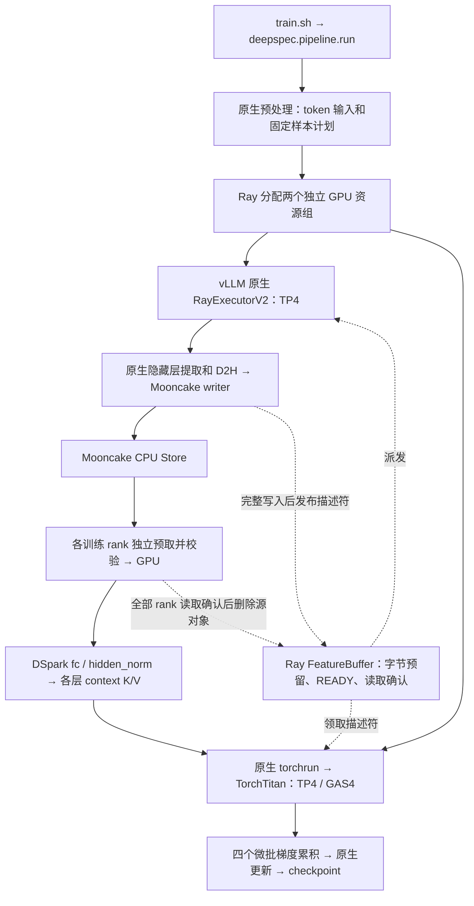

# DSpark 异步训练流水线：会话交接

更新：2026-09-18（Asia/Shanghai）。本文件用于在新窗口继续工作。

### 目标 CUDA 节点传输探针（2026-09-18）

- 在 `dev-951e3d4b-0` 使用 `/tmp/deepspec_vllm_torchtitan_envs` 的真实
  `mooncake-transfer-engine 0.3.13.post1` wheel，原生 `mooncake/store.so` 和
  `mooncake_master` 均实际加载成功。Torch 为 2.13.0+cu130，节点有八张 B300。
- 同节点 TCP Store put/get 通过；GPU 目标缓冲区 get 通过：两个特征 tensor 均落在
  `cuda:0`，SHA256 与 CPU 源数据逐字段一致，删除后六个对象全部不可见。
- `protocol=rdma --rdma-devices mlx5_10` 的 client setup 和 segment 挂载通过，
  但节点没有可见 RoCE netdev/GID IPv4。独立进程中的真实 RDMA client put 在 QP RTR
  阶段报 `No such device` 并返回 `-800`，所以 RDMA 仍未通过。
- 节点级只读预检、原生库 hash、GPU 直收及失败日志集中在
  [目标 CUDA 节点传输验证](TARGET_CUDA_TRANSPORT_VALIDATION.md) 和
  `outputs/target_cuda_transport_validation_20260918_175320/`。跨节点 RDMA、远端
  GPU 直传和完整训练配置仍需平台补齐 RoCE 网口后再验收。

**最新任务已完成：vLLM batch20、真实 4K/5 步及 128K/35 步近满池均完整通过。1 TiB CPU 池的有效载荷峰值为 1012.764 GiB（98.903%），Mooncake 分配指标独立确认同一字节数；owner RSS 高水位实测约 1024.196 GiB。140 条 epoch 样本全部读取、删除并完成 checkpoint，GPU/本轮进程已清理。此前短测见 0.11，两机 B 池扩容方案保留在 0.10；历史两机在线/空闲状态不代表当前状态。**

### 最新单机 batch20 / 近满池任务（2026-09-17）

- `debug_single_node.sh` 普通短测现在默认 producer batch20/window40/5 步，
  `LLM.generate()` 真正接收多个 prompt 与对应 SamplingParams，`max_num_seqs=20`。
  容量背压时返回可运行的批次前缀，避免预留半批后一直等待而没有启动生产。
- 新增 `--stage peak`：128K、1 TiB、batch20、window140、35 步、2 epochs、99% 对象额度，
  默认目标 135 条真实特征 = 1012.764 GiB。源数据只有 80 条，因此第二 epoch 是明确的
  容量压力复用，不能记作 140 条不同源样本或无重复数据性能比较。
- 峰值前持续消费但保留已 ACK 对象；达到目标后释放已确认对象，随后正常按 ACK 删除。
  writer 在 pinned D2H 分配前用 credit 限制为 2 条，CPU staging 预算与池窗口分开。
  `peak_resident_bytes` 只计 READY/未删除对象；独立核验从事件重算，峰值事件另存 owner RSS。
- 定向测试覆盖 26 个不同测试：buffer/cluster 共 25 passed；writer/buffer 共 14 passed
  （13 个 buffer 重复覆盖）；Ruff 与两种 dry-run 通过。
- `outputs/dspark_single_debug_20260917_batch20_4k_run1/`：退出码 0，一次提交 20 条、80 次读取
  SHA256、四 rank 梯度、5 次更新、fc optimizer step=5、全部释放与进程清理通过。
  驻留峰值 4.454 GiB；metadata SHA256 `acf37e76e2d653b98480552e616dd897f6890cf54da9727057cddf3e8f3d52fe`。
- `outputs/dspark_single_debug_20260917_batch20_peak_run1/`：128K 近满池轮完整通过，
  Run ID `dspark-14fd3bab2193`，debug/启动器退出码 0。实际批次为 `[20,20,20,20,20,20,15,5]`。
  135 条同时驻留，READY 和 Mooncake `master_allocated_bytes` 的峰值均为
  **1,087,446,714,480 字节 = 1012.763674 GiB（98.902703%）**。峰值事件 owner RSS
  1012.977 GiB；释放后再写入触及池其余页，`/proc` 实测 RSS 高水位 1024.196 GiB。
  峰值时 headroom 469.603 GiB，整轮最低 418.976 GiB；78 次容量背压、0 次内存压力。
- 达到目标后自动释放此前 132 条已 ACK 对象，再提交最后 5 条；140 条特征共 560 次 rank
  SHA256 读取，35 次更新、四 rank context 梯度、严格顺序与 ACK 后删除全部通过。
  剩余对象及最终 Mooncake 分配字节均为 0，无驱逐、无落盘。完整 checkpoint 独立读取
  fc optimizer step=35，metadata SHA256 `9343d2acc7158d4b978090af550ed42dcc3b4269706ab12fbd74b9b7a9b113c4`。
  四个 checkpoint 分片范围、运行源码 hash、进程清理与八张 GPU 空闲核验通过。
- 汇总：`outputs/dspark_single_debug_20260917_batch20_summary.json`；原始指标
  `mooncake-allocation.jsonl`、`owner-rss-observation.json`、`pool-occupancy.csv` 保存在 peak 轮根目录。
  这是显式保留对象、两 epoch 的容量压力验收，不是常规即读即删流量的吞吐对照。
  命令及语义见 [DEBUG_SINGLE_NODE.md](DEBUG_SINGLE_NODE.md)。

**整机分离全十六卡已通过：第一台八卡生产、第二台八卡消费，小模型探针及真实 4K/3 步、128K/3 步均验收完成，见 0.7。0.4–0.6 的混布方案不符合用户的整机分离要求，只保留历史证据。RDMA 继续跳过，未重复十二卡 TCP20。**

从零启动及日常复用请看 [训练操作指南](TRAINING_GUIDE.md)。Ray 与 Mooncake 启动脚本见 0.8，
操作文档及命令检查见 0.9。

## 0. 两机接入进度（2026-09-16 后续会话）

**以下第 1–8 节是最初的单机 4K 交接记录；当前状态以本节增补为准。**

- 当前共享项目目录为 `/mnt/afs-agentpro/lezewei/DeepSpec`。
- 用户已完成单机 128K：运行 `outputs/qwen3.8_ray_mooncake_vllm_torchtitan_20260916_141217_61024`，
  12 个长度 131072 的微批、3 次更新、48 次读取校验、12 个对象全部释放及 `step-3` checkpoint。
  该轮池为 64 GiB，窗口 8，仍为一个 vLLM TP4 生产者和一个 TorchTitan TP4/GAS4 消费者。
- 用户接受先两机 4+4、特征池放消费端，再考虑 RDMA 和跨机 DP 扩展的方案，已准备两台各八卡 B300。
  第一台 `dev-73915620-0` / `172.20.1.195`；第二台 `dev-3e072ae7-0`，SSH 地址 `10.119.16.15`，
  **Ray 节点地址为 `172.20.5.39`**。SSH root 公钥登录不可用；用户在第二台终端安装环境并加入 Ray。
- Ray Head 为 `172.20.1.195:26379`，以 `PIPELINE_RAY_BLOCK=true bash .../cluster.sh head` 常驻托管。
  两端 Python 和依赖版本已核对一致：torch 2.13.0、Ray 2.58.0、Mooncake 0.3.13.post1、
  Transformers 5.16.1、vLLM wheel 元数据 `0.26.1rc1.dev716+g933876c38.precompiled`。
  运行使用共享项目中的 vLLM 源码；环境安装版本号不代替源码 SHA256。
- 新增 `deepspec/pipeline/cluster.py`、`cluster.sh`、`train_multinode.sh`。入口参数增加
  `--ray-address / --producer-node / --consumer-node / --transport-only`。
  两端按节点固定资源组，消费节点拥有唯一 Store 池，客户端使用本机地址；预算、GPU 进程监控分节点执行。
  Store 传输、SHA256、生产转换、消费物化已有独立计时。消费者仍为单节点 TP4/DP1/GAS4。
- 回归：`test_pipeline_cluster.py`、`test_pipeline_buffer.py`、`test_pipeline_store.py`、
  `test_dspark_norm_initialization.py` 共 **14 passed**（62.30 秒；14 条上游弃用警告），Ruff 检查通过。
  随后为 GPU 退出监控新增一项回归，定向运行 `test_pipeline_cluster.py` 为 **4 passed**（1.81 秒）；
  两次合计覆盖 15 项不同测试，未重复运行完整套件。
- 跨机 CPU Store 检查已通过：`outputs/dspark_two_node_20260916_transport1/result.json`，
  第一台写入 12,619,792 字节，第二台分块读取、SHA256 校验及删除成功，池地址 `172.20.5.39:52125`。
  该检查不加载 GPU 模型，不等同于训练或 128K 跨机验收。
- 两机 4K 首轮 `outputs/dspark_two_node_20260916_4k_run1` 在模型初始化阶段因消费节点出现
  非本轮标识的 GPU 进程 PID 26019 被监控中止，尚无 READY 特征或优化器更新。
  该临时进程随后退出，无法进一步追溯命令；已通过两端 Ray 检查确认本轮 GPU 进程清理完毕。
- 两机 4K 重试 `outputs/dspark_two_node_20260916_4k_run2` 完成 12 批、48 次读取校验、
  3 次更新及完整 checkpoint；独立读取 DCP 的 fc optimizer step=3，metadata hash 匹配。
  **启动器退出码仍为 1**：退出中的训练 rank PID 27678 被 NVML 短暂报告，但 `/proc/environ`
  已清空，监控误判为其他任务。`verification-status.json` 保留“原生训练通过、启动器失败”的区别。
  现以 PID 与进程启动时间缓存已确认的归属，并忽略 zombie/dead 记录；PID 复用不会继承归属。
- **两机 128K 已完整通过**：`outputs/dspark_two_node_20260916_128k_run1`，Run ID `dspark-9287098d7f12`：
  12 个真实长度 131072 的微批、消费端 64 GiB 池、TCP/CPU、TP4/DP1/GAS4。
  启动器退出码 **0**；48 次 rank 读取校验、四个 rank 的 context 梯度检查、3 次更新全部通过。
  12 批全部在四个 rank 读取确认后释放，剩余 0；预留峰值 45.012 GiB。
  完整 `step-3` DCP 已独立读取 fc optimizer step=3，metadata SHA256 为
  `76e6aae18a54819cf27b3c2bf68a3d873a36c84e68d6dd3729bbbc0d3e972ad6`，
  四个分片覆盖 metadata 引用范围，运行源码 hash 在该轮核验时匹配；后续转换优化见 0.1。
  `verification-status.json` 保存独立核验与分项计时；`cleanup-verification.json` 确认两机模型 GPU
  进程均已退出，Ray 集群继续运行。生产与消费分别使用本机 GPU 0–3，总计八卡。
- 本轮每批写入准备/传输中位数：CPU 特征转换 **42.34 秒**、SHA256 描述生成 **8.01 秒**、
  Store 跨机 put **5.74 秒**；消费端 get **10.33 秒**、SHA256 **5.12 秒**。
  这些是主机调用计时，包含验证开销，不能作为相对基线加速比。
  这是优化前基线；转换优化与复测见 0.1。消费者跨机 DP/16 卡仍未接入。

启动方式、环境 CUDA runtime 补充及日志说明见 [README.md](README.md#两机-44)。
不要把“已加入两台 Ray 节点”“跨机 Store 成功”写成“多机训练已通过”，需以真实训练结果为准。

### 0.1 生产端转换优化（2026-09-16 后续）

- 用户授权继续定位并优化生产端特征转换。保留特征逐位内容、NaN/Inf 拒绝、CP head/tail
  排列及 padding、独立输出缓冲区、SHA256 与训练路径。
- 同尺寸单线程 CPU 分项测量：恒等 `index_select` 5.64 秒，空 padding 写入 2.49 秒，
  `torch.isfinite` 28.44 秒，拆分连续输出 4.63 秒。BF16 指数位检查的 NumPy 实现为 1.73 秒。
- `deepspec/trainer/qwen3_8_vllm.py` 现在跳过 CP1 的索引和 padding 操作，CPU BF16 采用
  分块指数位检查，CUDA 检查沿用原路径；输出显式 clone 为连续独立缓冲区。
  集群预检查增加 NumPy 版本及该转换源码 hash；两端 NumPy 实际均为 2.3.5。
- `test_qwen38_vllm.py` 与 `test_pipeline_cluster.py`：22 passed，16.19 秒。
  覆盖全部 65536 种 BF16 编码、跨检查块的 Inf、非连续输入、独立存储和原有 CP/worker 行为。
- 两轮完整 `[131072,6,5120]` CPU 对照：42.50→6.65 秒、42.61→6.58 秒，六个输出字段
  全部逐字节一致。记录见 `outputs/dspark_feature_conversion_20260916/{profile,comparison}.json`。
- **真实两机复测已通过**：`outputs/dspark_two_node_20260916_128k_opt1`，
  Run ID `dspark-c794f6247168`，启动器退出码 0。12 批/48 次读取校验/3 次更新，源对象全部释放。
  checkpoint 独立读取 fc optimizer step=3，metadata SHA256 为
  `c372798b11f48b8d9ddbfe579ae6f07759602dbfd3ee18b9a956634dc4e7173c`；两机 GPU 模型进程已清空，
  Ray 集群保留运行。
- 全轮每批中位耗时：转换 **42.34→6.54 秒（6.47×）**，writer 总耗时 **56.53→21.72 秒**。
  SHA256 描述为 7.67 秒，跨机 put 为 7.27 秒，消费 get 为 12.25 秒；生产加快后传输阶段
  也有更多重叠，不能把 put/get 的变化单独归因于网络。
  首次推理到消费者退出（含校验、checkpoint、退出，不含模型初始化）为 **791.19→371.40 秒**。
  这是一对 3 步短程运行的观测，不代表长期吞吐；第 2/3 步间隔为 83.81/92.99 秒。
- 三步日志 loss 均为 4.50247、3.08793、3.93578，四个 rank 记录的 context 梯度范数与基线相同。
  结果、独立核验和比较在本轮 `result.json`、`verification-status.json`、`performance-comparison.json`。
  随后的稳定性测试与 RDMA 检查见 0.2；完整 SHA256 和每个值的有限性检查仍保留。

### 0.2 20 步稳定性与 RDMA 检查（2026-09-16 后续）

- **TCP20 已正常退出（启动器 0）**：`outputs/dspark_two_node_20260916_128k_tcp20`，Run ID `dspark-e7988ab71d12`：
  两机 4+4、128K、TCP/CPU、64 GiB 消费端池、TP4/DP1/GAS4，20 次更新、80 条真实样本。
  80 条不同源样本为一个 epoch，未重复扩充数据。320 次 rank 读取 SHA256、四个 rank 的
  context 梯度检查、各 rank 的 20 次更新与严格消费顺序全部通过；80 批均在四个 ACK 后释放，剩余 0。
  特征逻辑写入累计 600.156 GiB，池预留峰值仍为 45.012 GiB；记录到 1477 次容量背压，没有内存压力。
- 独立读取完整 `step-20` DCP，fc optimizer step=20，metadata SHA256 为
  `ce3d7545e6f9a744322b85a6621b60210b6b4be6d23ad22ce8da5680d93f0a6a`；四个分片引用范围及源码 hash 通过。
  20 步的 loss/日志梯度范数均有限，前三步与上轮短测一致；不同更新组的 loss 不作为收敛结论。
  `verification-status.json` 和 `cleanup-verification.json` 保存核验；两机本轮标识进程与 GPU 进程清空，
  Ray 保留两个节点，16 张 GPU 资源空闲。
- 第 2–20 次更新间隔：中位 93.56 秒，范围 88.92–96.52 秒，均值 93.19 秒。
  首次推理至消费端完成 1958.07 秒（32.63 分钟，含最终 checkpoint 和退出，不含模型初始化）。
  每批转换（含输入读取）中位 6.55 秒，writer 20.02 秒，跨机 put 5.65 秒；消费 get 11.17 秒、SHA256 5.02 秒。
  这些是主机计时，不是纯网络带宽；这轮不是 TCP/RDMA 成功对比。
- 从第 4 次更新到第 20 次更新，进程 RSS 总和的前/后四分位窗口中位数：
  生产 63.870→63.869 GiB，消费 165.123→165.189 GiB（+68 MiB）。全轮峰值分别 63.872/208.414 GiB，
  最低准入 headroom 为 3508.79/3382.03 GiB。当前未出现明显累积增长；约半小时测试不能排除慢泄漏。
- 启动前增加节点监控：按本轮环境标识统计进程 RSS/匿名页，读取指定设备可用的 RDMA 计数器。
  RSS 总和可能重复计算共享页，仅用于趋势；准入继续使用节点/cgroup headroom。
  TCP20 启动时带了 `--rdma-devices mlx5_z0`，TCP 传输会忽略该参数；该设备无可读计数器。
  训练启动后没有继续修改运行源码。节点监控相关回归 `test_pipeline_cluster.py`：4 passed，1.74 秒。
- RDMA 未通过，已定位两项问题：最初的 `mlx5_z0` 是 NVLink 管理桥，VPD 含 `SMDL=SW_MNG`；
  改用 `mlx5_10` 后，第一台缺少容器内可见的 RoCE 网口，QP 转 RTR 报 `No such device`。
  两端初始化和 1 MiB 内存注册成功；第二台本机两个进程 RDMA write/SHA256 成功，跨机 write 失败。
  不将本机成功或初始化成功记为跨机 RDMA 验收。详细证据、平台配置检查点及重测命令见
  [RDMA_DIAGNOSIS.md](RDMA_DIAGNOSIS.md)。
- 第一台只有 `lo/eth0`，第二台有 `net1–net8`。第一台 sysfs 中 RoCE GID 不可见，
  verbs 仍返回 GID 3 / `100.93.129.30`，但没有关联网口；第二台 GID 3 为
  `100.93.128.84` / `net1`。需先补齐第一台平台网络资源/命名空间配置，再做 RDMA20 对比。
  不要继续使用 `mlx5_z0–z3`，也不要把仅设 GID index 当作该问题的修复。
- 下一步：补齐第一台 RoCE 网络后，先 `--protocol rdma --rdma-devices mlx5_10 --transport-only`，
  再运行相同 80 样本的 RDMA20。消费者跨机 DP、全 16 卡与 GPU 直传仍未验收。

### 0.3 RDMA 平台权限复查（2026-09-16 17:47，Asia/Shanghai）

- 用户提供 RDMA 网络名 **`roce-cluster-01`**，尚待确认第一台保存及重新启动的状态。
  本轮从第二台经 Ray 复查：第一台仍只有 `lo/eth0`，`mlx5_10` 缺少可见的 GID 网口；
  到第二台 RoCE 地址仍走 `eth0`。第二台 `mlx5_10` / GID 3 / `net1` / `100.93.128.84` 一致。
- 两端均无 NET_ADMIN/SYS_ADMIN，当前 Kubernetes ServiceAccount 读取两台 Pod 返回 403；
  权限自查未授予任何工作负载读写权限，没有可用的平台管理连接。本轮未修改平台配置，
  **网络阻塞仍未解除，未启动 RDMA20**。本轮检查时两端 GPU 无计算进程。
- 新增只读 `check_rdma.py`，检查网口/GID/IP/路由并写 JSON；实际运行退出码 2，
  正确指出第一台缺失网口，不将第二台本地映射正常记为跨机传输成功。
  Ruff 通过。训练代码和 TCP20 记录的源码 hash 仍一致。
- 证据：`outputs/dspark_rdma_platform_20260916/{network-preflight,platform-access,baseline-contract}.json`。
  平台检查点和完整复测命令见 [RDMA_DIAGNOSIS.md](RDMA_DIAGNOSIS.md#平台复查2026-09-16-1747asiashanghai)。

### 0.4 跳过 RDMA，接入消费者跨机 DP（2026-09-16 后续）

- **用户最新要求：先跳过 RDMA 测试，继续后续任务。** 0.2–0.3 的 RDMA 阻塞保留为历史记录，
  不再作为继续 TCP 多机训练的前置条件。当前工作从第一台共享目录发起，Ray 两节点保持运行。
- 新增 `--consumer-dp 2`：一个 vLLM TP4 生产者，一个 TorchTitan TP4 × DP(shard)2 / GAS2
  消费者，使用原生 FSDP2。第一台四卡生产 + 四卡消费，第二台四卡消费 + 唯一 CPU 池，共十二卡。
  消费 global rank 0–3 位于第二台（DP0），4–7 位于第一台（DP1）；每个 TP 组不跨机。
  默认 DP1/GAS4 和单机入口保留。每次更新仍为四个样本，模型、特征字段、训练路径与校验保留。
- `topology.py` 统一样本读者组与原生 DP 微步计数。DP0 读取偶数位置，DP1 读取奇数位置，
  每批仅其所属四个 TP rank 确认后释放；12 个样本仍是 48 次读取，不是 96 次。
  原生 `next_global_microbatch` 为同步 DP 微步，三次更新后为 6；全局消费样本数另记为 12。
  window/容量仍按全局四样本更新组检查，第一台预算合并生产暂存与本机四个消费 rank。
- 每节点一个原生 torchrun launcher，共享第二台的 rendezvous。全部八个 rank 初始化并
  通过 barrier 后才开始生产；两端都正常结束才判定消费完成。第二台日志为 `consumer.log`，
  第一台为 `consumer-node1.log`。NCCL 显式设置 `NCCL_NET=Socket`、`NCCL_IB_DISABLE=1`，
  以各节点 Ray IP 选择网口；Mooncake 继续 TCP/CPU，不依赖 RoCE 配置。
- 回归 `test_pipeline_cluster.py`、`test_pipeline_buffer.py`、`test_pipeline_store.py`
  共 **20 passed**，89.02 秒（14 条上游警告）。包含真实 Mooncake、四/八个 CPU rank、原生
  FeatureLoader 的 DP1/DP2 样本切分、背压、ACK 和释放。Ruff 通过。
  随后的两机八卡 NCCL 探针验证 global/TP all-reduce、DP all-gather/reduce-scatter 和 Socket
  实际路径。证据在 `outputs/dspark_cross_node_dp_20260916/{tests.log,collectives/}`。
- **4K 真实十二卡训练已通过**：`outputs/dspark_two_node_20260916_4k_dp2_run1`，
  Run ID `dspark-c54bccc6a704`，启动器退出码 0；12 个真实 4096-token 样本、48 次读取校验，
  八个 rank 的 context 梯度检查与三次更新通过；12 批全部释放，剩余 0。
  独立读取 DCP 的 fc optimizer step=3，原生微步游标为 6，八个 checkpoint 分片引用范围通过；
  metadata SHA256 为 `acfb17408ee6257f61f525d994de6c58516e783bd7ba5cb2b38de99e5993027e`。
  两机本轮标识进程和 GPU 进程清空，Ray 两节点保留，16 张 GPU 恢复空闲。
- **128K 十二卡验收也已通过**：`outputs/dspark_two_node_20260916_128k_dp2_run1`，
  Run ID `dspark-cf5513a417f8`，启动器退出码 0；64 GiB 池，12 个不同的真实 131072-token
  样本，48 次 SHA256 读取、八个 rank 的 context 梯度检查及各自三次更新全部通过。
  样本及输入 identity 与之前 DP1 短测相同；全部源对象在所属四个 ACK 后释放，剩余 0。
  池预留峰值 45.012 GiB，140 次容量背压，两端无内存压力或其他任务 GPU 进程。
- 独立读取完整 `step-3` DCP 的 fc optimizer step=3，原生微步游标 6、全局样本数 12；
  metadata SHA256 为 `1ece50d0e830c4e99d06e13f957ee477a639adf788d0169d6076dccf7bd2fff6`，
  八个分片引用范围通过。三步日志 loss 为 3.91829、3.09029、3.89470，八个 rank 一致且有限。
  DP1→DP2 改变数据和累积布局；本轮不宣称与 DP1 loss 或 checkpoint 逐位相同。
  两端运行源码 hash 匹配，模型运行期间未修改 Python 源码。
- 第 2/3 次更新间隔为 **70.69 / 78.98 秒**，中位 74.83 秒；首次推理至全部消费者结束
  344.33 秒（含 checkpoint/退出，不含初始化）。每批转换中位 6.52 秒，writer 20.57 秒，
  put 6.36 秒；DP0 本机 get / DP1 远程 get 中位 11.78 / 11.88 秒。
  第一台进程 RSS 峰值 208.12 GiB（包含生产和消费），第二台 172.78 GiB；最低准入 headroom
  分别为 3389.33 / 3447.02 GiB。主机短程计时不能直接作为纯网络带宽或长期吞吐结论。
- 19:26 独立清理检查确认两机本轮标识进程与 GPU 进程全部清空，Ray 继续运行，
  两节点 16 张 GPU 资源恢复空闲。证据在本轮 `verification-status.json` 和
  `cleanup-verification.json`；验收脚本与日志在 `outputs/dspark_cross_node_dp_20260916/`。
  Bash 语法、Ruff 和 diff 检查通过，改动仍未提交。
- 本阶段完成十二卡跨机 DP 短测；后续 DP2 延长稳定性结果见 0.5，全十六卡与 GPU 直传仍未验收。
  DP1 的 TCP20 和 DP2 的 TCP20 使用各自独立运行证据。最新启动方法见
  [两机消费者 DP2](README.md#两机消费者-dp248-卡)。

### 0.5 消费者 DP2 的 20 步稳定性（2026-09-16 后续，已通过）

- 用户要求继续下一阶段，已完成十二卡跨机 DP2 的 128K 延长测试，继续跳过 RDMA。
  启动前核对两机 GPU 无计算进程、Ray 可用 GPU=16，运行源码与 0.4 的 DP2 短测快照一致。
  沿用相同训练代码，无新增运行时改动，也未重复运行已经通过的组件回归。
- 运行目录 `outputs/dspark_two_node_20260916_128k_dp2_tcp20`，Run ID `dspark-124899ba1b40`。
  启动于 19:39，`--consumer-dp 2 --steps 20 --timeout-seconds 7200`，
  仍为 TP4 生产、TP4 × DP(shard)2 / GAS2 消费，TCP/CPU，64 GiB 唯一池。
  80 个不同的真实 131072-token 样本、单个 epoch；输入 identity 和顺序与 DP1 TCP20 相同。
  八个 rank 实际各完成 20 次更新，320 次读取 SHA256 及严格样本顺序核验通过，
  首次 context 梯度检查八个 rank 全部通过，80 批在各自四个 TP 读者 ACK 后释放，剩余 0。
- **启动器退出码 0**。独立读取完整 `step-20` DCP 的 fc optimizer step=20，原生 DP 微步
  游标为 40、全局样本数为 80，八个分片引用范围通过；metadata SHA256 为
  `2d96759a0512dadfade64644598a3f8889dfa6bbf2270ea13e6e1d107b123440`。
  全部更新的 loss/日志梯度范数有限，前三步与 DP2 短测一致；第 20 步为 2.67902 / 1.3828。
  不从不同更新组的 loss 推断收敛，也不宣称与 DP1 数值等价。
- 首次推理至全部消费者结束 **1719.01 秒（28.65 分钟）**，含 checkpoint/退出，不含初始化。
  第 2–20 步间隔中位 **80.36 秒**，均值 80.33 秒，范围 70.68–87.98 秒。
  输入吞吐约 6527 token/秒；先前同 80 样本的 DP1 TCP20 为 5626，观测比为 1.160×。
  两轮分别使用八卡和十二卡、DP 布局不同，这是顺序运行的观测，不代表统计保证或收敛等价。
- 每批转换中位 6.57 秒、描述符/SHA256 7.66 秒、Store put 5.32 秒，writer 总耗时 19.70 秒。
  DP0 本机 get / DP1 跨机 get 为 10.46 / 9.59 秒，读取 SHA256 为 5.51 秒。
  特征逻辑写入 600.156 GiB、读取累计 2400 GiB；池预留峰值 45.012 GiB，1266 次容量背压。
  单 writer 每批平均 20.13 秒，每更新四批的供给周期约 80.51 秒，接近实测更新周期；
  这是下一阶段优先扩展生产端的依据，不把主机计时当作纯网络带宽。
- 两机各 381 次监控记录，没有内存压力或其他任务 GPU 进程。按第二台时间选取第 4–20 步
  的 251 个监控序号，第一台按相同序号对齐，前/后四分位窗口 RSS 中位数：
  第一台（生产+四卡消费）160.892→160.918 GiB（+26.34 MiB），第二台 126.136→126.179 GiB
  （+44 MiB）；十二卡的显存前后中位数均无增量。RSS 峰值 207.62 / 172.87 GiB，最低准入
  headroom 3404.66 / 3431.72 GiB。RSS 求和可能重复计算共享页，约半小时测试不能排除慢泄漏。
- 20:16 独立清理检查通过：两机本轮标识进程和 GPU 进程清空，Ray 保留两节点，16 张 GPU
  资源恢复空闲。本轮未修改训练源码；与 DP2 短测的源码快照一致。分析工具 Ruff 通过。
- 证据：本轮目录的 `verification-status.json`、`stability-analysis.json`、
  `performance-comparison.json`、`cleanup-verification.json`；可导出的数据为
  `step-intervals.csv` 和 `memory-trend.csv`。脚本与核验日志在
  `outputs/dspark_dp2_stability_20260916/`，启动日志为 `outputs/launch_logs/two_node_128k_dp2_tcp20.log`。
- 下一阶段：全十六卡，候选为生产 vLLM DP2×TP4、消费 TP4×DP2，各节点四卡生产+四卡消费。
  本轮只做了源码调查，未实现/启动十六卡模型；当前单进程 `LLM(data_parallel_size=2)` 会被
  原生接口拒绝。**随后已确认 offline DP 不支持当前 dense target，旧候选方案已纠正，见 0.6。**

### 0.6 全十六卡接入断点（2026-09-16 20:46，尚未验收）

- 用户已授权继续全十六卡阶段，随后要求整理进度、换窗口。此刻停在调查及小模型探针阶段，
  **没有启动真实十六卡 4K/128K 训练，也没有实现 `--producer-dp` 参数。**
  当前 `deepspec/pipeline/*.py` 等运行源码与 0.5 的成功快照仍完全一致。
  本阶段新增文件在 `outputs/dspark_full16_20260916/`；未修改 vLLM 核心、未提交代码。
- 目标拓扑：每台四卡生产、四卡消费；生产原生 vLLM DP2×TP4，消费沿用原生
  TorchTitan TP4×DP(shard)2/GAS2/global batch 4。第二台仍提供唯一 Mooncake CPU 池，
  TCP/CPU、完整 SHA256 和有限值检查保留；继续跳过 RDMA。

**版本调查纠正：**

- `vllm/vllm/config/parallel.py` 明确拒绝 dense 模型使用 `VLLM_DP_*` 环境变量的 offline DP。
  不要按之前的多 frontend offline 草案实现，也不要绕过检查或改变模型结构。
- 当前可继续验证的原生入口为单个 `AsyncLLM` frontend + Ray DP backend，创建两个
  EngineCore，各自四个 TP worker。使用 `AsyncEngineArgs(data_parallel_size=2,
  data_parallel_size_local=1, data_parallel_backend="ray", tensor_parallel_size=4,
  distributed_executor_backend="ray", data_parallel_address="172.20.1.195")`。
  用 `VLLM_RAY_DP_PLACEMENT_NODE_IPS=172.20.1.195,172.20.5.39` 和
  `VLLM_RAY_DP_PACK_STRATEGY=strict` 固定每节点一个 TP4；先预留消费组，生产 PG 交给 vLLM。
- dense EngineCore 会把内部 `data_parallel_size/rank` 重设为单副本，
  **`parallel_config.data_parallel_index` 保留原始生产 DP 身份**，后续用它记录生产者归属。
  `AsyncLLM.generate(..., data_parallel_rank=position % 2)` 可显式路由；该生成路径仍待实测。

**已运行的探针及失败点：**

- 脚本：`outputs/dspark_full16_20260916/native_dp_probe.py`；日志：同目录 `native-probe.log`。
  输出 `native_probe1/`，Run ID `dspark-native-dp-probe-73215f82`，启动器退出码 **1**。
  使用本地随机小型 dense Qwen3（不是 27B target），预留每节点四个消费 GPU 资源，
  两台各启动四个 vLLM worker。日志确认两个 EngineCore 初始化及 DP coordinator 订阅完成。
- 随后在脚本第 69 行 `await llm.collective_rpc(worker_evidence, args=(output,))` 失败：
  `TypeError: Object of type <class 'function'> is not serializable`。
  原生异步 RPC 默认禁止函数的 pickle fallback。这是探针采集代码的问题；
  **失败发生在两个 generate 请求之前，没有 `result.json` 或 worker JSON，不能记录为 DP2 通过。**
- 优先修复方向：把采集方法放入独立、可导入的 worker extension，通过
  `worker_extension_cls="模块.类"` 注册，再用字符串方法名调用 `collective_rpc`；
  当前 `v1/worker/worker_base.py` 支持此扩展。此方向尚未实现/验证，无需打开不安全序列化开关。
  DP 广播 utility 只返回第一个 EngineCore 的结果，仍应让每个 worker 写各自证据文件。
  重试须使用新的输出目录，原脚本当前把 `native_probe1` 写死且拒绝覆盖。
- 探针 finally 已关闭原生引擎/协调进程并移除资源组，`native_probe1/cleanup.json` 通过。
  **20:46 再次通过 Ray 检查：两节点存活、16 GPU 空闲、两机无 GPU 计算进程，无探针或
  TCP20 标识进程。** 证据 `outputs/dspark_full16_20260916/handoff-state.json`；共享 Ray 未停止。

**新窗口接续顺序：**

1. 修复并重跑小模型探针，验证 DP0/DP1 的显式请求、全部八个 worker 的 DP/TP/节点/GPU
   归属和完整清理。不要重复已通过的十二卡 TCP20。
2. 接入单 AsyncLLM frontend 的全局按序准入，按 `position % 2` 分派，每个生产组最多一个
   正在调用的生成请求，pending/异步写入受全局 window 和容量约束；允许 READY 乱序。
   任何请求失败要取消其他请求并使 buffer 失败；全部请求及 Store 写入结束后才完成生产。
3. 新增 `--producer-dp 2`、两节点八卡准入、第二台生产暂存预算、connector 生产 DP 身份
   与发布归属校验、八生产 GPU 事件核验。消费端保持现有八 rank 布局。
   生产推理区间有重叠时，统计 compute overlap 应先取区间并集，避免重复累计。
4. 组件检查覆盖双 writer 乱序 READY、唯一归属、失败取消、八 CPU rank 的原生 loader
   和完整 ACK/释放；随后真实十六卡 **4K/3 步 → 128K/3 步**，逐轮独立验 checkpoint 和清理。
   128K 仍用 64 GiB 池、12 个不同样本、48 次读取、8 消费 rank、native cursor 6、fc step 3。
   20 步延长测试放在十六卡短测成功之后，不提前宣称吞吐收益。

详细代码接入点、探针参数和未验证项见
[十六卡接续记录](../../../outputs/dspark_dp2_stability_20260916/next_16_gpu_notes.md)。
固定 Python `/tmp/deepspec_vllm_torchtitan_envs/bin/python`，用户要求不用 uv；Git 用 `/usr/bin/git`。
运行期间不改训练 Python 源码；保留共享 Ray、用户已有未提交改动及无关文件删除。
Head `172.20.1.195:26379`，第二台 Ray IP `172.20.5.39`（SSH IP `10.119.16.15` 不是 Ray 地址）。
两机时钟约差 21 秒，跨节点时间不能直接相减；训练事件统一由第二台 FeatureBuffer 记时。

### 0.7 整机分离纠正与十六卡验证（2026-09-16 后续）

- 用户明确指出原要求为生产与消费分离。已停止 `4k_full16_run2` 的混布验证，
  当时 0 READY、0 更新；两机本轮 GPU/模型进程清空，原生 DP PG 已移除，Ray 保留。
  该轮不作为验收证据。固定拓扑为 A `172.20.1.195` 八卡 vLLM DP2×TP4，
  B `172.20.5.39` 八卡 TorchTitan DP(shard)2×TP4/GAS2，唯一 CPU 池仍在 B。
- 前一混布小模型探针 `native_probe3` 已解决 RPC 序列化问题，但不能代替整机分离验收。
  `native_probe4_separated` 已通过，启动器 0：单 frontend、两个本地 EngineCore、
  `data_parallel_size_local=2`、原生 DP placement 仅允许 A；B 预留全部八个消费 GPU。
  八个 worker 都在 A，DP0/GPU0–3、DP1/GPU4–7，两个显式请求在各组四 worker 中实际观察到。
  worker extension 使用可导入类及字符串 RPC，无需开启不安全序列化；清理后 16 GPU 空闲。
- 已实现全局按序准入、每生产 DP 组一个生成请求、双 writer 乱序 READY、写前唯一归属
  和节点校验、失败取消、全部写入后完成生产，以及推理区间合并计时。
  原组件检查 27 passed；修复 Ray 事件循环入口及失败退出残留后定向 4 passed。
  整机分离已调整单机八 rank launcher、两端预算与事件核验：随后 24 passed（83.60 秒），
  另有同节点混布拒绝的定向检查 2 passed。原生 DP2 微步/读者语义和训练数学路径保留。
- **整机分离真实 4K/3 步已通过**：`outputs/dspark_two_node_20260916_4k_full16_separated1`，
  Run ID `dspark-7637338bd9cc`，启动器 0，12 样本/48 SHA256 读取/八 rank 梯度检查及三次更新，
  全部源对象在所属四 ACK 后释放；独立读取 fc optimizer step=3、native cursor6、八分片通过。
  metadata SHA256 `dcf0fced4db990ab7a17045a3c79742820b6b13d08730485fdbd1e803227219e`。
  A 八个生产 GPU、B 八个消费 GPU，节点无交集；21:30 清理检查全部通过，Ray 保留。
- **整机分离真实 128K/3 步也已通过**：`outputs/dspark_two_node_20260916_128k_full16_separated1`，
  Run ID `dspark-6f0a5195f37b`，启动器 0；64 GiB 池、window8、12 个不同的 131072-token
  样本，使用与 4K 同一份冻结源码。48 次 SHA256 读取、八 rank 的 context 梯度及各自三次更新
  通过；12 批均在所属四 ACK 后释放，剩余 0。原生 DP 微步游标 6，独立读取 fc optimizer step=3，
  metadata 与八个 DCP 分片引用范围通过；SHA256 为
  `8be16a5eb81a8aa20b43b47b7b87579b76d2a545d5ed1f65bee3c3d689f47a55`。
- 128K 实际 READY 存在乱序，但每个 rank 的样本顺序仍精确匹配计划，所有位置只有所属生产组写入。
  A 的 DP0/TP0–3 使用 GPU0–3，DP1/TP0–3 使用 GPU4–7；B 的单 torchrun 启动全部八个消费 rank。
  两轮输入 identity 与对应历史短测相同，未改变训练数学路径；不据此宣称 checkpoint 逐位相同。
- 128K 预留峰值 45.012 GiB，140 次容量背压，没有内存压力或其他任务 GPU 进程。
  首次推理至消费结束 299.84 秒（含 checkpoint/退出，不含初始化），第 2/3 步间隔 64.60/66.00 秒。
  writer 总耗时中位 34.65 秒、转换 6.68 秒、put 20.42 秒；两个本机消费 DP 组 get 中位约 26.94 秒。
  这是三步主机计时；双 writer 和八个本机读者会共享 Store/内存带宽，不作为纯网络带宽或长期收益结论。
- 21:41 独立清理核验通过：两机本轮标识进程、GPU 进程清空，原生 DP PG 不再存在，Ray 两节点
  和 16 张空闲 GPU 保留。证据为两轮 `verification-status.json` 与 `cleanup-verification.json`，
  探针、检查脚本及日志在 `outputs/dspark_full16_20260916/`。全十六卡 20 步延长未运行；RDMA、GPU 直传仍未验收。
- `4k_full16_run1` 在推理前因 Ray 将带 async helper 的 Producer 识别为异步 actor 而失败；
  helper 已移到类外。该失败轮残留消费进程已按完整 run ID 清理；启动器现有 node monitor
  在退出时清理本轮残留，psutil 发送信号前检查 PID/start time，保留其他任务和 Ray。
- 本次开始时旧 Ray Head 已不再运行。已恢复 `172.20.1.195:26379`，用户重新加入 B。
  当前 Head 临时目录为 `/tmp/dspark-ray-16-2055`，由 `PIPELINE_RAY_BLOCK=true .../cluster.sh head` 常驻托管；
  脚本默认临时目录已缩短，修复 UNIX socket 路径超过 107 字节的启动失败。

### 0.8 Ray 与 Mooncake 启动脚本（2026-09-16 22:40）

- 用户要求将两者的启动脚本放到本目录。新增 [start_ray.sh](start_ray.sh)，支持
  `head` / `worker HEAD_IP:PORT`、`--help`、`DRY_RUN=true`，默认每节点 8 GPU/24 CPU，
  Head 端口 26379，保留短 `/tmp/dsray-...` 临时目录。`PIPELINE_RAY_BLOCK=true` 现在对
  Head 和 worker 都有效。[cluster.sh](cluster.sh) 保留为兼容入口，转发参数到新脚本。
- 新增 [start_mooncake.sh](start_mooncake.sh)，独立前台启动环境内的 `mooncake_master`，
  支持 RPC 绑定地址/端口、metrics 端口、lease 环境变量及原生参数透传；默认 RPC 50051、
  metrics 9003、lease 300 秒，关闭磁盘 offload/eviction。两个脚本均使用固定 Python
  `/tmp/deepspec_vllm_torchtitan_envs/bin/python`，补充 CUDA 12 runtime 路径，不使用 uv。
- 独立脚本启动的是 Master 元数据/控制服务，不分配特征池。当前训练入口仍自动管理
  每轮 Master 和 FeatureBuffer，不会复用手动启动的 Master。整机分离运行由 A 上的
  driver 启动 Master，唯一特征池和八个消费 rank 均在 B；Master 在 A 不代表消费端混布。
  [README 启动说明](README.md#ray-与-mooncake-启动) 已给出 A/B 分别执行的命令，
  将旧单机混布入口标明为历史配置；当前全十六卡命令继续指定不同生产/消费节点。
- 验证：目录内 6 个 Shell 脚本语法通过；19 次 help/错误参数/dry-run 调用通过，覆盖从
  `/tmp` 调用、旧入口转发、Head/worker、IP 自动选择和参数覆盖。Master 在空闲本机端口
  实际启动，RPC 可达、metrics HTTP 200，SIGTERM 退出码 0，两个端口均已关闭。
  未重启共享 Ray、未使用 GPU、未修改训练 Python 源码；0.7 的训练验收证据保留。

### 0.9 训练操作文档（2026-09-16 22:51）

- 按用户要求新增 [TRAINING_GUIDE.md](TRAINING_GUIDE.md)，并在 README 开头加入入口。
  按实际顺序说明 A 启动 Head、B 加入 Worker、A 另开终端仅执行一次训练；Mooncake Master
  和 B 机唯一特征池随训练自动启动/清理，手动 Master 仅用于独立调试，当前训练不复用它。
- 文档覆盖整机分离的 4K/3 步、128K/3 步完整命令、DP/卡数组合、参数和环境默认值、
  dry-run/prepare-only/transport-only 区别、Ray 复用、日志、退出与常见问题。
  明确多机脚本默认 DP1/DP1，只用八卡；全十六卡须显式传两个 DP2 参数，TP 固定为 4。
- 13 个 Bash 文档代码块语法通过；5 条训练命令、2 条 Ray 启动命令和 1 条 Mooncake 命令
  dry-run 通过，训练参数还用当前源码的 argparse 定义解析核对。相对文档链接检查通过。
  本次仅修改文档，未启动训练、数据预处理或服务，未重启共享 Ray；原验收证据保留。

### 0.10 B 机特征池扩容方案（2026-09-17，待机器到位后调试）

- 用户确认先扩展 B 池，当前只有一台机器，本阶段只要求方案。新增
  [B_POOL_EXPANSION_PLAN.md](B_POOL_EXPANSION_PLAN.md)，README 已加入入口。
- 用户进一步确认 A、B 申请规格均为每台 2048 GiB（2 TiB）CPU RAM；方案已补充
  该容量条件及 512 GiB/window32 的远期预算参考，初始对照顺序不变。
  资源规格不等于当前空闲余量，第二台到位后仍需核对实际节点/cgroup 状态。
- 沿用 A 八卡生产/B 八卡消费、TCP/CPU、DP2/TP4、GAS2、全局 batch 4，唯一池仍在 B。
  现有 `--pool-gib` 和 `--window` 已支持配置扩池，无需先修改训练 Python。
- 计划在新机器上依次对照 P0=64 GiB/window8、P1=128 GiB/window8、P2=128 GiB/window12；
  P2 为首选待测候选，P3=256 GiB/window16 仅按结果决定是否追加。默认值暂不变。
- 新环境先做既有 4K 冒烟和扩池 128K/3 步短测，再以相同 80 个真实样本做 20 步对照。
  历史整机分离仅有 3 步记录，不能用十二卡混布 TCP20 替代本次基线。
- 增大 window 会同步增加 A 机生产暂存预算；方案列明两端保守上界、节点/cgroup 检查、
  命令模板、正确性验收和统一性能口径。当前固定 Python 路径不存在，待两机恢复环境后核验。
- 历史 `outputs/dspark_full16_20260916/verify_run.py` 硬编码对比 12 样本计划，不能直接
  核验新的 80 样本长测；后续需增加参数化核验工具，保留输入一致性、checkpoint 与清理检查。
- 本次仅文档与不启动服务的命令检查；未启动模型、数据预处理、Ray 或 Mooncake。
  多节点池、A 机供池、RDMA 和远端单次读取继续留待后续单独评估。

### 0.11 单机八卡与 1 TiB 池调试（2026-09-17）

- 用户先要求可行性分析，随后明确授权“新建一个 debug 脚本来做”。新增
  [debug_single_node.sh](debug_single_node.sh)、配套 `debug_single_node.py` 和
  [DEBUG_SINGLE_NODE.md](DEBUG_SINGLE_NODE.md)。默认 1024 GiB/window8，支持
  `check/pool/4k/128k/all`、dry-run、输出目录、模型/输入和超时参数。
  单机一个 vLLM TP4 生产者、一个 TorchTitan TP4/DP1/GAS4 消费者；TCP/CPU。
  1 TiB 是 Store 池容量，整机预算还包括生产暂存及四个消费 rank 的副本。
- 当前机器 `dev-951e3d4b-0` / `172.20.2.179`，8 × B300；分析时物理内存约
  4031 GiB、cgroup 限额 3680 GiB、headroom 1710 GiB。按 128K/window8 计算，
  特征上界约 1445.27 GiB，另需 64 GiB 预留。每轮仍重新检查实时状态。
- `/tmp/deepspec_vllm_torchtitan_envs` 不存在。debug 脚本回退到
  `/mnt/afs-agentpro/share/env/miniconda3/envs/deepspec_vllm_torchtitan_envs/bin/python`，
  可用 `DEBUG_PYTHON` 覆盖；补充 CUDA 12 runtime，不使用 uv。
  默认模型改为现有 `/mnt/afs-agentpro/share/models/Qwen/Qwen3.8-27B`。
  原 `train.sh` 默认环境/模型路径及池容量未改。
- **大池探针已通过**：`outputs/dspark_single_debug_20260917_1tib_run1/pool-probe/`。
  1 TiB Store setup 约 0.21 秒，三个独立 CPU 进程分别持池、写、读；
  251,695,120 字节合成特征、SHA256、34 个块删除及池关闭通过。
  这是初始化和小负载验证，未填满池。run2 重试中的池探针也通过。
- 首轮真实 4K 在初始化失败：vLLM EngineCore 默认 Ray 发现未连接私有集群，
  无法解析现有 placement group，出现 `KeyError: bundles`；退出中单机 GPU
  父子关系监控又发生误报。`run.py` 现显式传递 Ray 地址/本轮标识，并将 GPU
  归属检查合并父子关系和已有 PID/启动时间缓存。保留外部任务/PID 复用拦截，
  对未归属进程额外记录命令。run2 曾被 GPU7 临时未标识进程中止，来源未能追溯；
  两次失败均无 READY/更新，自动清理无残留，证据未覆盖。
- 监控回归 `tests/test_pipeline_cluster.py`：11 passed；随后补充单机启动子进程
  分支，定向退出/PID 复用检查 1 passed。Shell 语法、Ruff、help/dry-run、
  带独立会话子进程的超时清理检查通过。真实模型运行期间冻结 Python 源码。
- **4K/3 步完整通过**：`outputs/dspark_single_debug_20260917_1tib_4k_run3/`。
  原生运行位于其 `4k/`，Run ID `dspark-16f799d9d3b0`，
  启动器和 debug 退出码 0；12 样本、48 次读取 SHA256、四 rank context 梯度、
  三次更新、所有源对象释放通过。独立 DCP fc optimizer step=3，四分片范围通过。
  metadata SHA256 `84cb3d4322c71ff8e4a943b65316b4ddd162f9af2ab6b075940bd7826906f9b2`。
  生产 GPU0–3，消费 GPU4–7；池预留峰值约 1.875 GiB，监控最低 headroom
  约 1580.04 GiB。最终 GPU 空闲、debug session 进程残留为 0。
  新环境首次触发 FlashInfer SM103a 编译，初始化时间不作为吞吐结果。
- **128K/3 步完整通过**：`outputs/dspark_single_debug_20260917_1tib_128k_run1/`，
  原生运行位于 `128k/`，Run ID `dspark-ec919d0d82a2`，1 TiB/window8。
  启动器和 debug 退出码 0；12 个不同的真实 131072-token 样本，48 次读取 SHA256、
  四 rank context 梯度、各 rank 三次更新及全部对象释放通过。
  独立 DCP fc optimizer step=3、原生微步游标 12、四分片范围及 metadata hash 通过；
  metadata SHA256 `b5a6971f500986facc819dc8cc966d3cabc05aed86aa8c94addac148769f4129`。
  池预留峰值 64,441,286,784 字节，约 60.016 GiB；无内存压力，监控最低 headroom
  约 1378.84 GiB。最后检查八 GPU 无计算进程、debug session 进程残留为 0。
  证据见 `debug-result.json`、`128k/verification.json`、`memory.jsonl` 和原生运行日志。
- 本轮两次真实训练均使用同一份修复后的流水线 Python 源码；运行源码 hash 在各自
  独立核验时匹配。原有训练结构、TP/DP/GAS、SHA256、ACK/释放和 checkpoint 路径保留。
  本次未运行 20 步、满池压力、跨机或 RDMA；1 TiB 是池容量，不是整任务 RSS 上限。

## 1. 先看结论

**真实 Qwen3.8-27B target + 五层 DSpark draft 的单机 8 卡流水线已跑通：
vLLM 使用四卡，TorchTitan 使用另外四卡，Mooncake 保存和传输隐藏层特征，Ray 调度资源和数据状态。**

- 成功轮：12 个 4096-token 微批、3 次优化器更新、完整 checkpoint；四个训练 rank 共 48 次读取校验通过，源特征全部释放。
- 这证明短程整链路可运行。多机、128K、RDMA、CPU→远端 GPU 直传、长期稳定性和实际加速比尚未验证。
- 新增代码及修复仍在未提交的工作区中。仅 checkout 下表 commit 不包含完整实现。
- 启动及 HF 导出脚本已写入本目录，已检查 Bash 语法、dry-run、`--help`；脚本整理未重新启动训练或执行大模型导出。
- 用户随后完成了 `step-3` HF 导出。修复 Qwen DSpark 被误判为 MTP 后，11 项配置测试通过，GPU 4–7、TP4、BF16 模型加载及 warmup 通过；参数抽查与短生成尚未完成，见 [加载验证](VLLM_LOAD.md)。

新窗口先读本文，再按问题定位下列材料：

| 要做什么 | 阅读位置 |
| --- | --- |
| 启动、改参数、找日志 | [启动说明](README.md)、[train.sh](train.sh) |
| 导出 checkpoint 为 HF 模型 | [导出说明](README.md#导出-hf-模型)、[export_hf.sh](export_hf.sh) |
| 查看导出草稿头的 vLLM 加载结果 | [加载验证](VLLM_LOAD.md) |
| 核实成功结果和修复原因 | [验收记录](../../../deepspec/pipeline/VALIDATION.md) |
| 理解进程、数据、容量和释放接口 | [流水线说明](../../../deepspec/pipeline/README.md)、本文第 4–5 节 |
| 查 slime / Mooncake 源码依据 | [参考源码记录](../../../deepspec/pipeline/REFERENCES.md) |

## 2. 工作目录、版本和环境

主机：`app-e110ba357a9f4d969bc3d910774f334e-64776bd647-2n7s6`。

项目根目录：`/mnt/afs_share/lezewei/DeepSpec_torchtitan_vllm`。

以下分支与 HEAD 在整理本文时重新核实：

| 仓库目录（相对项目根目录） | 分支 | HEAD |
| --- | --- | --- |
| `.`（DeepSpec） | `dev/vllm_torchtitan` | `ee5d0c82f89358ef03f735af9ac3fd17feb33a39` |
| `vllm/` | `lzw/support_dspark_v.0.1.1` | `1ee54c40df7ffe2c8934f5bd1c79917f34cb954e` |
| `torchtitan/` | `dev/vllm_torchtitan` | `57598edc53e4c21809a2b58176031f280bd3cc1f` |

TorchTitan 有自己的 `.git`；主仓库也跟踪其部分源码，后续提交时需检查两层 Git 状态。
工作区原本存在文档删除、vLLM 文件模式及 demo 改动等，与本次流水线改造分开核对、保留。
流水线训练验收后，在导出草稿头的推理测试中修改了
`vllm/vllm/config/speculative.py` 的 Qwen DSpark 配置识别，并在
`vllm/tests/config/test_speculative_draft_hf_overrides.py` 添加回归测试；见 [加载验证](VLLM_LOAD.md)。

**固定 Python 环境：`/tmp/deepspec_vllm_torchtitan_envs`；用户明确要求不使用 uv。**
Python / pip 调用使用该环境的 `bin/python` / `bin/python -m pip`。

成功轮记录：8 × H800；PyTorch 2.13.0、vLLM `0.26.1rc1.dev719+g1ee54c40d.d20260912`、
Ray 2.58.0、Mooncake wheel `0.3.13.post1`、Transformers 5.16.1。
详见运行目录的 `environment.json` 和 `outputs/dspark_pipeline_reference_20260916/installed-versions.json`。
新窗口需重新核实机器、工作区及 GPU 占用，历史空闲状态不能当作当前资源预留。

## 3. 已确认的用户要求与授权

1. 目标是加快**投机解码 DSpark 草稿头训练**；最终支持多机多卡。当前先完成单机 4+4。
2. 一个逻辑分布式生产者、一个逻辑分布式消费者，使用不同 GPU。内部 rank 属于同一实例。
3. **vLLM 接管生产端**的 worker、模型推理和内部通信；**TorchTitan 接管消费端**的 DSpark、训练 rank、分布式通信和更新。Ray 负责外围资源分配、生命周期、轻量元数据及同步。
4. 大隐藏层张量经 Mooncake Store / Transfer Engine。Ray driver / object store 不集中保存完整特征副本。
5. 保留现有 DSpark 结构、特征层、token 对齐、训练目标、优化器和原生 checkpoint。特征必须进入 DSpark 的可训练 context K/V 路径。
6. **用户后续明确取消了特征恢复、重新生成和重放要求。** 当前为消费后释放、故障中止；训练 checkpoint 仍保存。不能据此承诺从任意历史 checkpoint 恢复这条流。
7. 每节点特征相关 CPU 内存上限为物理内存 80%，还受作业/cgroup 限制和实际可用内存约束；所有 rank 共用节点预算，80% 不是目标。
8. 早期“仅只读调查”的限制已被后续明确的实现和运行授权更新；用户已授权为单机 4+4 跑通所需的修改与实验。当前里程碑已完成，后续按新窗口的具体任务继续。

需要用户决定的设计问题，每次只提出一个最关键问题，先给建议及取舍。已有决定沿用；变更训练语义须明确说明影响。

## 4. 当前实现：一个微批如何经过系统



1. 原生 preparation 先生成 token 输入和固定训练计划；**不先生成完整数据集的隐藏特征**。生产者等待消费者初始化完成后开始派发。
2. 每个微批按计划顺序预留输出字节数。vLLM `LLM.generate()` 执行推理，现有 hidden-state connector 完成提取和 D2H；仅 TP rank 0 写完整特征。
3. 自定义 writer 复用 `convert_hidden_states()` 的 token、层选择和 final-norm 对齐。Store 的所有分块写入完成后发布 READY；vLLM 请求结束本身不等于 Store 就绪。
4. 四个 TorchTitan TP rank 读取同一微批的完整 context 输入，各自持有模型参数分片。默认经 pinned CPU 接收，再搬到 GPU；每 rank 最多预取两批特征。
5. GPU 数据就绪后执行原生 forward/backward。GAS=4 表示四个微批组成一次更新；一个请求完成不会立即触发优化器更新。

### 特征与 DSpark K/V 语义

- 六个字段：`input_ids`、`loss_mask`、`seq_len`、`context_chunk_len`、`target_hidden_states`、`target_last_hidden_states`。
- Target 层为 `[1,16,31,46,61]`。本轮 H=5120，BF16；输入契约为 `[1,L,25600]` 的多层拼接特征和 `[1,L,5120]` 的最终 norm 后特征；成功轮 L=4096。
- 原生 `Qwen3DSparkModel._forward_backbone()` 执行 `hidden_norm(fc(target_hidden_states))`；每层 `Qwen3DSparkAttention.forward()` 再用可训练 `k_proj/v_proj` 构建 context K/V，与 draft/noise K/V 一起计算 attention。
- 当前训练调用使用 `past_key_values=None`、`use_cache=False` 的 backbone 默认值。这里是 context K/V 注入语义；不能改成生产者预先固定投影后交付 K/V，否则会改变草稿头训练路径。
- `target_last_hidden_states` 经冻结的 LM head 提供监督，作用与多层 context 特征不同。

### 对象生命周期和背压

- Store 对象按最多 8 MiB 分块，描述符含 shape、dtype、字节数和 SHA256；单副本、hard pin，禁用 SSD/offload。
- **领取、传输、计算、更新、checkpoint 是不同事件。** 四个 rank 完成 Store 读取且校验通过、都拥有独立副本后，才显式删除源对象并归还额度；无需等到优化器更新或 checkpoint。
- 训练侧大特征保留到当前微批 backward、SelectiveAC 重计算及 CUDA 同步完成，再释放引用。读取 ACK 不代表训练计算已经完成。
- 单节点共享 4 GiB 池；对象额度为池的 75%，默认窗口 8 批，低水位为对象额度的 60%。窗口和容量必须容纳完整 GAS，背压仍允许补齐已经开始的累积组，避免死锁。
- 启动时核算 pool、生产暂存、读取/校验副本、客户端缓冲等，并额外保留 64 GiB；每个新累积组检查实时内存余量。对象删除只归还池内空间，不等于将预分配内存退给 OS。
- 当前依据固定计划精确预留特征字节数；实际输出字节数不匹配会失败，并未实现任意变长流的超额扩容。任一关键进程/传输失败则中止本轮，没有自动特征重放。

## 5. 代码入口和改动范围

下表路径相对项目根目录；省略目录的文件均在 `deepspec/pipeline/` 下。

| 文件 / 接口 | 职责 |
| --- | --- |
| `scripts/train/qwen3.8_ray_mooncake_vllm_torchtitan/train.sh` | 固定环境、默认参数、新输出目录，转交 Python 入口 |
| `scripts/train/qwen3.8_ray_mooncake_vllm_torchtitan/export_hf.sh` | CPU 导出入口，转交原生 `torchtitan.models.dspark_draft.export` |
| `deepspec/pipeline/run.py::main / prepare / launch` | 原生输入准备、私有 Ray/Mooncake 启动、资源组、监控、退出和结果核验 |
| `actors.py::Producer / Consumer` | CPU producer frontend 调用 vLLM；consumer launcher 调用原生 torchrun，避免重复管理 worker/通信组 |
| `connector.py::MooncakeHiddenStatesConnector._write_tensors` | 继承 vLLM `ExampleHiddenStatesConnector`，替换特征写出接口 |
| `store.py::TensorStore` | 注册缓冲、分块 put/get、同步完成、校验和显式删除 |
| `buffer.py::BufferLedger / FeatureBuffer`、`memory.py` | 顺序、容量、READY/ACK 状态、节点预算和背压 |
| `data.py::MooncakeFeatureLoader`、`prefetch.py::FeaturePrefetch` | 复用原生输入计划和数据校验，有界预取 |
| `trainer.py::StreamingDSparkTrainer` | 在逐微批物化边界接特征，验证 context 梯度，记录训练事件 |
| `recipe.py::qwen38_preparation / qwen38_streaming` | 在原生 `qwen38_27b_tp4` recipe 上设置当前 4+4 配置 |

原生 TorchTitan 仅修改了三个文件：

1. `torchtitan/torchtitan/models/dspark_draft/data.py`：抽出 `FeatureLoader.read_entry()`，保留原文件读取行为。
2. `torchtitan/torchtitan/trainer.py`：抽出 `materialize_batch()`，保留原逐微批搬运位置、累积和更新循环。
3. `torchtitan/torchtitan/models/dspark_draft/__init__.py`：修复 RMSNorm 初始化兼容问题，见下节。

已有 `deepspec/trainer/qwen3_8_vllm.py::teacher_identity / convert_hidden_states`、
`deepspec/orchestration/process.py` 进程管理及原生 DSpark model/loss/checkpoint 被复用。

**并行语义差异：** 原八卡消费者基线为 DP2/TP4/GAS2；本轮消费者只有四卡，使用 DP1/TP4/GAS4。
每次更新仍是四个样本，但不能声称数值或并行执行与旧基线逐位等价。当前入口也不能任意配置成多机或其他 world size。

## 6. 已有运行证据与两个修复

成功目录：
`/mnt/afs_share/lezewei/DeepSpec_torchtitan_vllm/outputs/dspark_pipeline_4plus4_20260916_run4`。

Run ID：`dspark-94a613ec6136`；启动器退出码 0；vLLM 实际 GPU 0–3，TorchTitan GPU 4–7。

| 检查项 | 已验证结果 |
| --- | --- |
| 特征 | 生产 12、释放 12、剩余 0；48 次 SHA256 读取校验通过 |
| 顺序及更新 | 每 rank 按 0–11 消费，3 次更新后的消费位置为 4、8、12 |
| Loss | 4.56851、3.03412、4.12592；不同输入组，不作为收敛结论 |
| DSpark 梯度 | 四个 rank 的 fc、第一层 K/V 梯度有限且非零；fc 范数约 116.49 |
| Checkpoint | `checkpoints/step-3`；独立读取 DCP 得到 fc optimizer step=3，metadata hash 匹配 |
| 背压 | 9 次等待；特征预留峰值 2,013,790,336 字节，约 1.88 GiB |
| 组件与回归 | 10 passed，14 条上游弃用警告，47.57 秒 |

两个实际问题已修复并经真实模型验证：

- **DraftNorm 漏初始化：** Transformers 5.16.1 通用初始化按类名识别 RMSNorm，TP 包装类 `DraftNorm` 被漏掉。meta→to_empty 后出现 fc 零梯度；原生初始化现在按 `Qwen3RMSNorm` 继承关系显式把缩放设为 1。新增 NaN poison 回归测试先失败、修复后通过，恢复原归一化语义。
- **梯度检查未识别 SelectiveAC 包装：** 根模块 `named_parameters()` 中 K/V 名字带 `_checkpoint_wrapped_module`；检查改用 `get_submodule(...).weight`，保留非零梯度要求。

查证入口：

- [result.json](../../../outputs/dspark_pipeline_4plus4_20260916_run4/result.json)：生产、训练、buffer、GPU 分配和 checkpoint 汇总。
- [verification-status.json](../../../outputs/dspark_pipeline_4plus4_20260916_run4/verification-status.json)：独立核验、源码 SHA256、边界说明。
- [events.jsonl](../../../outputs/dspark_pipeline_4plus4_20260916_run4/events.jsonl)、[consumer.log](../../../outputs/dspark_pipeline_4plus4_20260916_run4/consumer.log)：生命周期、梯度、更新和训练日志。
- [组件测试日志](../../../outputs/dspark_pipeline_component_tests_final.log)；测试文件为 `tests/test_pipeline_buffer.py`、`tests/test_pipeline_store.py`、`tests/test_dspark_norm_initialization.py`，另有 CPU rank probe。

整理本文时重新核对了验收记录中的 **14 个 Python 文件 SHA256，全部匹配**。
随后新增启动脚本和文档不在该次运行哈希清单中，脚本仅完成不启动训练的检查。

资源处理历史：早期若干轮被外部 CI 占用 GPU 中断；成功轮在用户授权的独占窗口执行，
本轮模型进程已清理，临时暂停的 CI 调度已恢复，见运行目录 `ci-restoration.json`。
这是成功轮结束时的状态；再次运行必须检查当前资源，不复用旧 PID。

## 7. 如何再次启动

在 8 张 GPU 已预留且空闲的条件下：

```bash
cd /mnt/afs_share/lezewei/DeepSpec_torchtitan_vllm
bash scripts/train/qwen3.8_ray_mooncake_vllm_torchtitan/train.sh
```

默认 target：`/mnt/afs_agents/hongjiawei/share_models/Qwen/Qwen3.8-27B`。
默认输入：`outputs/dspark_torchtitan_orchestration_20260914/128k-source.jsonl`。
该文件名含 128k，**本次脚本的实际上下文上限仍是 4096**。

脚本自动创建新的带时间/PID 的输出路径；可传 `--source`、`--output`、`--steps`、
`--context-length`、`--pool-gib`、`--window`、`--timeout-seconds` 等入口参数。
输出目录必须尚不存在。扩大规模前要相应检查有效样本数、完整 GAS 容量和超时。

只查看命令：`DRY_RUN=true bash scripts/train/qwen3.8_ray_mooncake_vllm_torchtitan/train.sh`。
只查看参数：在脚本后加 `--help`。`--prepare-only` 会生成输入和计划，不启动模型或服务。
完整参数及日志位置见 [启动说明](README.md)。

### 导出供推理使用的草稿头

本轮产物为完整 DCP checkpoint，自动 HF 导出未开启。同目录的 `export_hf.sh`
接收两个位置参数：`checkpoint 目录`、`HF 输出目录`；在 CPU 上调用原生导出器，
精度沿用 checkpoint 的 `export_dtype`（当前为 FP32）。命令见 [导出说明](README.md#导出-hf-模型)。
用户已将本轮 `step-3` 导出到运行目录下 `draft-hf-step-3`；vLLM 实测记录及必要的
配置识别修复见 [加载验证](VLLM_LOAD.md)。导出目录可交给 `Qwen3_8DSparkModel.from_pretrained()`；vLLM DSpark
推理需要 V2 model runner，不能沿用训练特征提取时的 `VLLM_USE_V2_MODEL_RUNNER=0`。

## 8. 尚未完成的工作与建议接续点

- **导出后的推理：** vLLM 加载和 warmup 已通过；后续在可持续使用的 GPU 窗口完成参数抽查与短生成。完整验收被 RPC 脚本问题、外部任务及一次来源未定位的 SIGTERM 打断，详见 [加载记录](VLLM_LOAD.md)。
- **正确性对照：** SHA256 证明存储和传输没有改变已生成字节，尚不能替代与旧文件路径的特征数值、token 对齐和同配置训练对照。
- **性能与稳定性：** 主机事件中推理/训练重叠约 0.783 秒、传输/训练重叠约 2.333 秒；没有 GPU trace 或相对原流程加速比。先在相同模型、输入顺序、更新数和可比并行配置下对照，再延长运行、增加上下文。
- **内存：** 池容量、字节预留和背压已有实现及局部验证；尚未实测整机特征相关 CPU 峰值满足 80% 的完整上界。所有副本和暂存都要计入。
- **多机和传输：** 目前固定单机 4+4、消费者 DP=1、CP=PP=1。多节点资源/内存预算、不同并行布局的 rank 映射、跨机 RDMA 和 CPU→GPU 直传仍待接入与验证。已有选项不代表能力已验证。
- **尾批与故障：** 成功轮使用完整的三个累积组；通用尾批、输入提前结束、异常注入尚未完整验收。checkpoint 保存和独立读取已验证，训练重启恢复未验证；特征重放继续保持用户已取消的范围。

参考源码已读 commit：slime `4c193f1f37509cca70f0e88807a9305b70f63f4e`；
Mooncake `9fb95ed0339e15b8f969d32df599f3c8ebcbba2a`。
实际 Mooncake wheel 与该源码 commit 的对应关系尚无证据；见 [源码记录](../../../deepspec/pipeline/REFERENCES.md)。

**建议新窗口的第一步：** 根据用户的新问题读取对应源码/证据，核对当前工作区；
若继续优化性能，优先形成单机 4+4 的可比正确性及吞吐对照，保留已经跑通的默认启动方式。
