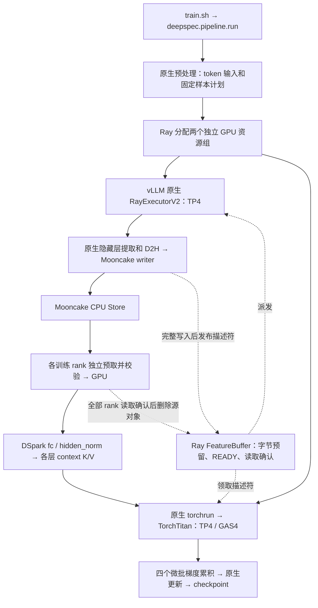

# DSpark 异步训练流水线：会话交接

更新：2026-09-16（Asia/Shanghai）。本文件用于在新窗口继续工作。

## 1. 先看结论

**真实 Qwen3.8-27B target + 五层 DSpark draft 的单机 8 卡流水线已跑通：
vLLM 使用四卡，TorchTitan 使用另外四卡，Mooncake 保存和传输隐藏层特征，Ray 调度资源和数据状态。**

- 成功轮：12 个 4096-token 微批、3 次优化器更新、完整 checkpoint；四个训练 rank 共 48 次读取校验通过，源特征全部释放。
- 这证明短程整链路可运行。多机、128K、RDMA、CPU→远端 GPU 直传、长期稳定性和实际加速比尚未验证。
- 新增代码及修复仍在未提交的工作区中。仅 checkout 下表 commit 不包含完整实现。
- 启动及 HF 导出脚本已写入本目录，已检查 Bash 语法、dry-run、`--help`；脚本整理未重新启动训练或执行大模型导出。

新窗口先读本文，再按问题定位下列材料：

| 要做什么 | 阅读位置 |
| --- | --- |
| 启动、改参数、找日志 | [启动说明](README.md)、[train.sh](train.sh) |
| 导出 checkpoint 为 HF 模型 | [导出说明](README.md#导出-hf-模型)、[export_hf.sh](export_hf.sh) |
| 核实成功结果和修复原因 | [验收记录](../../../deepspec/pipeline/VALIDATION.md) |
| 理解进程、数据、容量和释放接口 | [流水线说明](../../../deepspec/pipeline/README.md)、本文第 4–5 节 |
| 查 slime / Mooncake 源码依据 | [参考源码记录](../../../deepspec/pipeline/REFERENCES.md) |

## 2. 工作目录、版本和环境

主机：`app-e110ba357a9f4d969bc3d910774f334e-64776bd647-2n7s6`。

项目根目录：`/mnt/afs_share/lezewei/DeepSpec_torchtitan_vllm`。

以下分支与 HEAD 在整理本文时重新核实：

| 仓库目录（相对项目根目录） | 分支 | HEAD |
| --- | --- | --- |
| `.`（DeepSpec） | `dev/vllm_torchtitan` | `ee5d0c82f89358ef03f735af9ac3fd17feb33a39` |
| `vllm/` | `lzw/support_dspark_v.0.1.1` | `1ee54c40df7ffe2c8934f5bd1c79917f34cb954e` |
| `torchtitan/` | `dev/vllm_torchtitan` | `57598edc53e4c21809a2b58176031f280bd3cc1f` |

TorchTitan 有自己的 `.git`；主仓库也跟踪其部分源码，后续提交时需检查两层 Git 状态。
工作区原本存在文档删除、vLLM 文件模式及 demo 改动等，与本次流水线改造分开核对、保留。
本次没有修改 vLLM 核心源码。

**固定 Python 环境：`/tmp/deepspec_vllm_torchtitan_envs`；用户明确要求不使用 uv。**
Python / pip 调用使用该环境的 `bin/python` / `bin/python -m pip`。

成功轮记录：8 × H800；PyTorch 2.13.0、vLLM `0.26.1rc1.dev719+g1ee54c40d.d20260912`、
Ray 2.58.0、Mooncake wheel `0.3.13.post1`、Transformers 5.16.1。
详见运行目录的 `environment.json` 和 `outputs/dspark_pipeline_reference_20260916/installed-versions.json`。
新窗口需重新核实机器、工作区及 GPU 占用，历史空闲状态不能当作当前资源预留。

## 3. 已确认的用户要求与授权

1. 目标是加快**投机解码 DSpark 草稿头训练**；最终支持多机多卡。当前先完成单机 4+4。
2. 一个逻辑分布式生产者、一个逻辑分布式消费者，使用不同 GPU。内部 rank 属于同一实例。
3. **vLLM 接管生产端**的 worker、模型推理和内部通信；**TorchTitan 接管消费端**的 DSpark、训练 rank、分布式通信和更新。Ray 负责外围资源分配、生命周期、轻量元数据及同步。
4. 大隐藏层张量经 Mooncake Store / Transfer Engine。Ray driver / object store 不集中保存完整特征副本。
5. 保留现有 DSpark 结构、特征层、token 对齐、训练目标、优化器和原生 checkpoint。特征必须进入 DSpark 的可训练 context K/V 路径。
6. **用户后续明确取消了特征恢复、重新生成和重放要求。** 当前为消费后释放、故障中止；训练 checkpoint 仍保存。不能据此承诺从任意历史 checkpoint 恢复这条流。
7. 每节点特征相关 CPU 内存上限为物理内存 80%，还受作业/cgroup 限制和实际可用内存约束；所有 rank 共用节点预算，80% 不是目标。
8. 早期“仅只读调查”的限制已被后续明确的实现和运行授权更新；用户已授权为单机 4+4 跑通所需的修改与实验。当前里程碑已完成，后续按新窗口的具体任务继续。

需要用户决定的设计问题，每次只提出一个最关键问题，先给建议及取舍。已有决定沿用；变更训练语义须明确说明影响。

## 4. 当前实现：一个微批如何经过系统



1. 原生 preparation 先生成 token 输入和固定训练计划；**不先生成完整数据集的隐藏特征**。生产者等待消费者初始化完成后开始派发。
2. 每个微批按计划顺序预留输出字节数。vLLM `LLM.generate()` 执行推理，现有 hidden-state connector 完成提取和 D2H；仅 TP rank 0 写完整特征。
3. 自定义 writer 复用 `convert_hidden_states()` 的 token、层选择和 final-norm 对齐。Store 的所有分块写入完成后发布 READY；vLLM 请求结束本身不等于 Store 就绪。
4. 四个 TorchTitan TP rank 读取同一微批的完整 context 输入，各自持有模型参数分片。默认经 pinned CPU 接收，再搬到 GPU；每 rank 最多预取两批特征。
5. GPU 数据就绪后执行原生 forward/backward。GAS=4 表示四个微批组成一次更新；一个请求完成不会立即触发优化器更新。

### 特征与 DSpark K/V 语义

- 六个字段：`input_ids`、`loss_mask`、`seq_len`、`context_chunk_len`、`target_hidden_states`、`target_last_hidden_states`。
- Target 层为 `[1,16,31,46,61]`。本轮 H=5120，BF16；输入契约为 `[1,L,25600]` 的多层拼接特征和 `[1,L,5120]` 的最终 norm 后特征；成功轮 L=4096。
- 原生 `Qwen3DSparkModel._forward_backbone()` 执行 `hidden_norm(fc(target_hidden_states))`；每层 `Qwen3DSparkAttention.forward()` 再用可训练 `k_proj/v_proj` 构建 context K/V，与 draft/noise K/V 一起计算 attention。
- 当前训练调用使用 `past_key_values=None`、`use_cache=False` 的 backbone 默认值。这里是 context K/V 注入语义；不能改成生产者预先固定投影后交付 K/V，否则会改变草稿头训练路径。
- `target_last_hidden_states` 经冻结的 LM head 提供监督，作用与多层 context 特征不同。

### 对象生命周期和背压

- Store 对象按最多 8 MiB 分块，描述符含 shape、dtype、字节数和 SHA256；单副本、hard pin，禁用 SSD/offload。
- **领取、传输、计算、更新、checkpoint 是不同事件。** 四个 rank 完成 Store 读取且校验通过、都拥有独立副本后，才显式删除源对象并归还额度；无需等到优化器更新或 checkpoint。
- 训练侧大特征保留到当前微批 backward、SelectiveAC 重计算及 CUDA 同步完成，再释放引用。读取 ACK 不代表训练计算已经完成。
- 单节点共享 4 GiB 池；对象额度为池的 75%，默认窗口 8 批，低水位为对象额度的 60%。窗口和容量必须容纳完整 GAS，背压仍允许补齐已经开始的累积组，避免死锁。
- 启动时核算 pool、生产暂存、读取/校验副本、客户端缓冲等，并额外保留 64 GiB；每个新累积组检查实时内存余量。对象删除只归还池内空间，不等于将预分配内存退给 OS。
- 当前依据固定计划精确预留特征字节数；实际输出字节数不匹配会失败，并未实现任意变长流的超额扩容。任一关键进程/传输失败则中止本轮，没有自动特征重放。

## 5. 代码入口和改动范围

下表路径相对项目根目录；省略目录的文件均在 `deepspec/pipeline/` 下。

| 文件 / 接口 | 职责 |
| --- | --- |
| `scripts/train/qwen3.8_ray_mooncake_vllm_torchtitan/train.sh` | 固定环境、默认参数、新输出目录，转交 Python 入口 |
| `scripts/train/qwen3.8_ray_mooncake_vllm_torchtitan/export_hf.sh` | CPU 导出入口，转交原生 `torchtitan.models.dspark_draft.export` |
| `deepspec/pipeline/run.py::main / prepare / launch` | 原生输入准备、私有 Ray/Mooncake 启动、资源组、监控、退出和结果核验 |
| `actors.py::Producer / Consumer` | CPU producer frontend 调用 vLLM；consumer launcher 调用原生 torchrun，避免重复管理 worker/通信组 |
| `connector.py::MooncakeHiddenStatesConnector._write_tensors` | 继承 vLLM `ExampleHiddenStatesConnector`，替换特征写出接口 |
| `store.py::TensorStore` | 注册缓冲、分块 put/get、同步完成、校验和显式删除 |
| `buffer.py::BufferLedger / FeatureBuffer`、`memory.py` | 顺序、容量、READY/ACK 状态、节点预算和背压 |
| `data.py::MooncakeFeatureLoader`、`prefetch.py::FeaturePrefetch` | 复用原生输入计划和数据校验，有界预取 |
| `trainer.py::StreamingDSparkTrainer` | 在逐微批物化边界接特征，验证 context 梯度，记录训练事件 |
| `recipe.py::qwen38_preparation / qwen38_streaming` | 在原生 `qwen38_27b_tp4` recipe 上设置当前 4+4 配置 |

原生 TorchTitan 仅修改了三个文件：

1. `torchtitan/torchtitan/models/dspark_draft/data.py`：抽出 `FeatureLoader.read_entry()`，保留原文件读取行为。
2. `torchtitan/torchtitan/trainer.py`：抽出 `materialize_batch()`，保留原逐微批搬运位置、累积和更新循环。
3. `torchtitan/torchtitan/models/dspark_draft/__init__.py`：修复 RMSNorm 初始化兼容问题，见下节。

已有 `deepspec/trainer/qwen3_8_vllm.py::teacher_identity / convert_hidden_states`、
`deepspec/orchestration/process.py` 进程管理及原生 DSpark model/loss/checkpoint 被复用。

**并行语义差异：** 原八卡消费者基线为 DP2/TP4/GAS2；本轮消费者只有四卡，使用 DP1/TP4/GAS4。
每次更新仍是四个样本，但不能声称数值或并行执行与旧基线逐位等价。当前入口也不能任意配置成多机或其他 world size。

## 6. 已有运行证据与两个修复

成功目录：
`/mnt/afs_share/lezewei/DeepSpec_torchtitan_vllm/outputs/dspark_pipeline_4plus4_20260916_run4`。

Run ID：`dspark-94a613ec6136`；启动器退出码 0；vLLM 实际 GPU 0–3，TorchTitan GPU 4–7。

| 检查项 | 已验证结果 |
| --- | --- |
| 特征 | 生产 12、释放 12、剩余 0；48 次 SHA256 读取校验通过 |
| 顺序及更新 | 每 rank 按 0–11 消费，3 次更新后的消费位置为 4、8、12 |
| Loss | 4.56851、3.03412、4.12592；不同输入组，不作为收敛结论 |
| DSpark 梯度 | 四个 rank 的 fc、第一层 K/V 梯度有限且非零；fc 范数约 116.49 |
| Checkpoint | `checkpoints/step-3`；独立读取 DCP 得到 fc optimizer step=3，metadata hash 匹配 |
| 背压 | 9 次等待；特征预留峰值 2,013,790,336 字节，约 1.88 GiB |
| 组件与回归 | 10 passed，14 条上游弃用警告，47.57 秒 |

两个实际问题已修复并经真实模型验证：

- **DraftNorm 漏初始化：** Transformers 5.16.1 通用初始化按类名识别 RMSNorm，TP 包装类 `DraftNorm` 被漏掉。meta→to_empty 后出现 fc 零梯度；原生初始化现在按 `Qwen3RMSNorm` 继承关系显式把缩放设为 1。新增 NaN poison 回归测试先失败、修复后通过，恢复原归一化语义。
- **梯度检查未识别 SelectiveAC 包装：** 根模块 `named_parameters()` 中 K/V 名字带 `_checkpoint_wrapped_module`；检查改用 `get_submodule(...).weight`，保留非零梯度要求。

查证入口：

- [result.json](../../../outputs/dspark_pipeline_4plus4_20260916_run4/result.json)：生产、训练、buffer、GPU 分配和 checkpoint 汇总。
- [verification-status.json](../../../outputs/dspark_pipeline_4plus4_20260916_run4/verification-status.json)：独立核验、源码 SHA256、边界说明。
- [events.jsonl](../../../outputs/dspark_pipeline_4plus4_20260916_run4/events.jsonl)、[consumer.log](../../../outputs/dspark_pipeline_4plus4_20260916_run4/consumer.log)：生命周期、梯度、更新和训练日志。
- [组件测试日志](../../../outputs/dspark_pipeline_component_tests_final.log)；测试文件为 `tests/test_pipeline_buffer.py`、`tests/test_pipeline_store.py`、`tests/test_dspark_norm_initialization.py`，另有 CPU rank probe。

整理本文时重新核对了验收记录中的 **14 个 Python 文件 SHA256，全部匹配**。
随后新增启动脚本和文档不在该次运行哈希清单中，脚本仅完成不启动训练的检查。

资源处理历史：早期若干轮被外部 CI 占用 GPU 中断；成功轮在用户授权的独占窗口执行，
本轮模型进程已清理，临时暂停的 CI 调度已恢复，见运行目录 `ci-restoration.json`。
这是成功轮结束时的状态；再次运行必须检查当前资源，不复用旧 PID。

## 7. 如何再次启动

在 8 张 GPU 已预留且空闲的条件下：

```bash
cd /mnt/afs_share/lezewei/DeepSpec_torchtitan_vllm
bash scripts/train/qwen3.8_ray_mooncake_vllm_torchtitan/train.sh
```

默认 target：`/mnt/afs_agents/hongjiawei/share_models/Qwen/Qwen3.8-27B`。
默认输入：`outputs/dspark_torchtitan_orchestration_20260914/128k-source.jsonl`。
该文件名含 128k，**本次脚本的实际上下文上限仍是 4096**。

脚本自动创建新的带时间/PID 的输出路径；可传 `--source`、`--output`、`--steps`、
`--context-length`、`--pool-gib`、`--window`、`--timeout-seconds` 等入口参数。
输出目录必须尚不存在。扩大规模前要相应检查有效样本数、完整 GAS 容量和超时。

只查看命令：`DRY_RUN=true bash scripts/train/qwen3.8_ray_mooncake_vllm_torchtitan/train.sh`。
只查看参数：在脚本后加 `--help`。`--prepare-only` 会生成输入和计划，不启动模型或服务。
完整参数及日志位置见 [启动说明](README.md)。

### 导出供推理使用的草稿头

本轮产物为完整 DCP checkpoint，自动 HF 导出未开启。同目录的 `export_hf.sh`
接收两个位置参数：`checkpoint 目录`、`HF 输出目录`；在 CPU 上调用原生导出器，
精度沿用 checkpoint 的 `export_dtype`（当前为 FP32）。命令见 [导出说明](README.md#导出-hf-模型)。
原生模型路径已有导出并加载的历史成功记录；本轮 `step-3` 尚未实际导出或接入 vLLM
投机解码验收。导出目录可交给 `Qwen3_8DSparkModel.from_pretrained()`；vLLM DSpark
推理需要 V2 model runner，不能沿用训练特征提取时的 `VLLM_USE_V2_MODEL_RUNNER=0`。

## 8. 尚未完成的工作与建议接续点

- **正确性对照：** SHA256 证明存储和传输没有改变已生成字节，尚不能替代与旧文件路径的特征数值、token 对齐和同配置训练对照。
- **性能与稳定性：** 主机事件中推理/训练重叠约 0.783 秒、传输/训练重叠约 2.333 秒；没有 GPU trace 或相对原流程加速比。先在相同模型、输入顺序、更新数和可比并行配置下对照，再延长运行、增加上下文。
- **内存：** 池容量、字节预留和背压已有实现及局部验证；尚未实测整机特征相关 CPU 峰值满足 80% 的完整上界。所有副本和暂存都要计入。
- **多机和传输：** 目前固定单机 4+4、消费者 DP=1、CP=PP=1。多节点资源/内存预算、不同并行布局的 rank 映射、跨机 RDMA 和 CPU→GPU 直传仍待接入与验证。已有选项不代表能力已验证。
- **尾批与故障：** 成功轮使用完整的三个累积组；通用尾批、输入提前结束、异常注入尚未完整验收。checkpoint 保存和独立读取已验证，训练重启恢复未验证；特征重放继续保持用户已取消的范围。

参考源码已读 commit：slime `4c193f1f37509cca70f0e88807a9305b70f63f4e`；
Mooncake `9fb95ed0339e15b8f969d32df599f3c8ebcbba2a`。
实际 Mooncake wheel 与该源码 commit 的对应关系尚无证据；见 [源码记录](../../../deepspec/pipeline/REFERENCES.md)。

**建议新窗口的第一步：** 根据用户的新问题读取对应源码/证据，核对当前工作区；
若继续优化性能，优先形成单机 4+4 的可比正确性及吞吐对照，保留已经跑通的默认启动方式。
