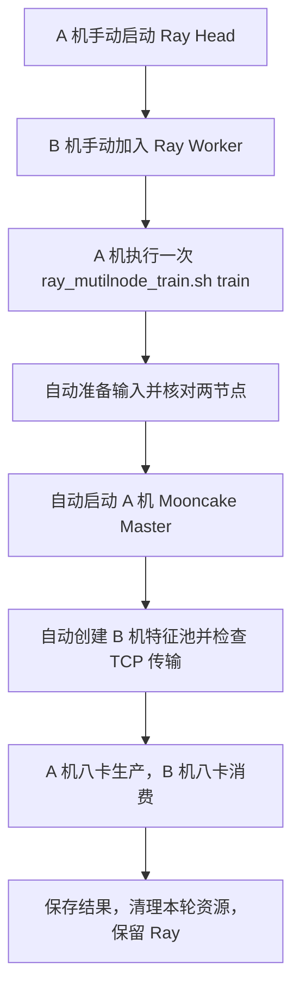

# 训练操作指南：Ray、Mooncake 与两机多卡

本文按实际操作顺序说明如何使用本目录的脚本。当前推荐配置是**两台各八卡、整机分离**：
A 机负责 vLLM 生产，B 机负责 TorchTitan 消费及唯一 Mooncake CPU 特征池。
已完成该布局的真实 4K/3 步和 128K/3 步验证，记录见 [HANDOFF.md 的 0.7](HANDOFF.md)。
当前使用 TCP/CPU，继续跳过 RDMA。

## 0. 当前统一入口：`ray_mutilnode_train.sh`

当前多机启动推荐使用本目录的统一编排脚本。文件名中的 `mutilnode` 拼写按仓库实际文件保留，
入口支持 `head`、`worker`、`wait`、`status` 和 `train` 五个子命令。A 机是生产节点，B 机是消费节点，
也是唯一的 Mooncake CPU 特征池节点。

如果 Ray 集群尚未建立，在两台机器分别执行以下命令。两个 Ray 进程默认前台运行；需要后台返回时可设置
`PIPELINE_RAY_BLOCK=false`。

```bash
# A 机：Ray Head / vLLM producer
cd /mnt/afs-agentpro/lezewei/DeepSpec
RAY_NODE_IP=172.20.1.195 PIPELINE_RAY_BLOCK=true \
  bash scripts/train/qwen3.8_ray_mooncake_vllm_torchtitan/ray_mutilnode_train.sh head
```

```bash
# B 机：Ray Worker / TorchTitan consumer / Mooncake pool
cd /mnt/afs-agentpro/lezewei/DeepSpec
RAY_NODE_IP=172.20.5.39 PIPELINE_RAY_BLOCK=true \
  bash scripts/train/qwen3.8_ray_mooncake_vllm_torchtitan/ray_mutilnode_train.sh worker \
  172.20.1.195:26379
```

Head 和 Worker 就绪后，只在 A 机执行一次训练。`wait` 会等待两节点、16 张 GPU 就绪，`status` 会打印成员
和 Ray 状态；如果集群已经在运行，可跳过 `head`/`worker`，直接执行这两个检查或 `train`。

```bash
# A 机：检查集群
cd /mnt/afs-agentpro/lezewei/DeepSpec
RAY_HEAD_ADDRESS=172.20.1.195:26379 \
  bash scripts/train/qwen3.8_ray_mooncake_vllm_torchtitan/ray_mutilnode_train.sh wait
RAY_HEAD_ADDRESS=172.20.1.195:26379 \
  bash scripts/train/qwen3.8_ray_mooncake_vllm_torchtitan/ray_mutilnode_train.sh status
```

```bash
# A 机：默认全十六卡多机训练（producer DP2、consumer DP2）
cd /mnt/afs-agentpro/lezewei/DeepSpec
RAY_HEAD_ADDRESS=172.20.1.195:26379 \
PRODUCER_NODE=172.20.1.195 \
CONSUMER_NODE=172.20.5.39 \
  bash scripts/train/qwen3.8_ray_mooncake_vllm_torchtitan/ray_mutilnode_train.sh train \
  --producer-dp 2 --consumer-dp 2
```

未显式覆盖时，`train` 使用 131072 上下文、64 GiB 池、3600 秒超时、3 步、窗口 8，并沿用 TCP/CPU
传输。训练脚本会自动在 A 机启动并在本轮结束时关闭 Mooncake Master，在 B 机创建并关闭
FeatureBuffer 池；正常训练不需要另外执行 `start_mooncake.sh`。输出目录会自动生成在
`outputs/dspark_ray_multinode_<时间>_<PID>`，启动日志写入 `outputs/launch_logs/`。

4K 短测只需在同一条 `train` 命令后覆盖参数：

```bash
RAY_HEAD_ADDRESS=172.20.1.195:26379 \
PRODUCER_NODE=172.20.1.195 \
CONSUMER_NODE=172.20.5.39 \
  bash scripts/train/qwen3.8_ray_mooncake_vllm_torchtitan/ray_mutilnode_train.sh train \
  --producer-dp 2 --consumer-dp 2 \
  --context-length 4096 --steps 3 --window 8 --pool-gib 4 \
  --protocol tcp --receive-device cpu --timeout-seconds 1800
```

`--pool-gib` 是 Mooncake Store 的实际共享池配置：多机入口默认 `64 GiB`，即
`68,719,476,736` 字节，池位于 B 机。流水线默认 `pool_utilization=0.75`，因此特征账本的可接纳容量为
`48 GiB`；这是预留暂存、读取和传输开销后的调度容量，不是 Mooncake Store 的分配上限。4K 命令中的
`--pool-gib 4` 会把这两个数分别改为 `4 GiB` 和 `3 GiB`。多机路径固定使用该 75% 利用率。

## 1. 谁启动什么，什么时候启动

**多机训练先启动 Ray；随后只在 A 机执行一次 `ray_mutilnode_train.sh train`。Mooncake 随每轮训练自动启动。**

| 组件 | 所在机器 | 启动时机与入口 | 训练结束后 |
| --- | --- | --- | --- |
| Ray Head | A：`172.20.1.195` | 建立集群时执行 `ray_mutilnode_train.sh head` | 保留，可供下一轮使用 |
| Ray Worker | B：`172.20.5.39` | Head 就绪后执行 `ray_mutilnode_train.sh worker HEAD_IP:PORT` | 保留，可供下一轮使用 |
| 训练启动器（driver） | A 的另一个终端 | 两个 Ray 节点就绪后执行 `ray_mutilnode_train.sh train` | 本轮完成后退出 |
| Mooncake Master | A，与训练启动器同机 | 训练自动完成两节点预检查后启动 | 训练自动关闭 |
| Mooncake FeatureBuffer 池 | B | Master 就绪后，由训练通过 Ray 自动创建 | 特征释放、池关闭 |
| vLLM 生产模型 | A 的八张 GPU | 特征池和跨机传输检查通过后，由训练自动加载 | 训练自动清理 |
| TorchTitan 消费模型 | B 的八张 GPU | 特征池和跨机传输检查通过后，由训练自动加载 | 训练自动清理 |



Master 管理元数据和对象位置，实际特征保存在 B 机的 CPU 内存池。
因此 A 机存在 Mooncake Master 进程时，生产与消费仍然保持整机分离。
两端的 TP 都是 4；DP2 表示各有两组 TP4，两组生产留在 A，两组消费留在 B。

## 2. 两台机器先准备好环境

本文命令均使用 Bash。两个节点都需要以下路径，代码、模型、输入和输出使用共享文件系统：

| 项目 | 当前路径或要求 |
| --- | --- |
| 项目目录 | `/mnt/afs-agentpro/lezewei/DeepSpec` |
| 每台本地 Python 环境 | `/tmp/deepspec_vllm_torchtitan_envs/bin/python` |
| 多机入口默认模型 | `/mnt/afs-agentpro/share/models/Qwen/Qwen3.8-27B` |
| 默认输入 JSONL | `outputs/dspark_torchtitan_orchestration_20260914/128k-source.jsonl`，相对项目目录 |
| GPU | 两台各八张 GPU 全部可见，启动前两节点均无其他 GPU 计算进程 |
| 软件 | 两端 Python 构建、依赖版本及训练源码一致；训练启动器会核对 |
| 网络 | 使用两节点互通的 Ray IP，允许 Ray 与 Mooncake 的动态服务端口互通 |

脚本固定使用上述 Python，不需要激活环境，也不使用 uv。脚本自动补充环境内的
`nvidia/cuda_runtime/lib` 到 `LD_LIBRARY_PATH`。如果某节点报 `libcudart.so.12` 缺失，
在该节点补装 CUDA 12 runtime，详见 [README.md](README.md)。

可在两台机器分别检查环境和 GPU：

```bash
cd /mnt/afs-agentpro/lezewei/DeepSpec
/tmp/deepspec_vllm_torchtitan_envs/bin/python --version
nvidia-smi --query-gpu=index,name,memory.used --format=csv
nvidia-smi --query-compute-apps=pid,gpu_uuid,used_memory --format=csv
```

本次 B 机的 SSH 地址为 `10.119.16.15`，Ray 地址为 `172.20.5.39`。
以下集群连接及节点选择都使用 **Ray 地址**。换机器时同步替换所有对应 IP。

## 3. 建立或复用 Ray 集群

若已启动过 Ray，先在 A 机检查现有集群：

```bash
/tmp/deepspec_vllm_torchtitan_envs/bin/python -m ray.scripts.scripts status \
  --address 172.20.1.195:26379
```

这套两机配置应有两个活动节点，合计 16 GPU；开始全十六卡训练前应无 GPU 资源占用。
已有两个节点正常在线时，直接进入第 4 节。每轮训练复用集群，不需要重复执行 `ray_mutilnode_train.sh head/worker`。

### 3.1 A 机终端一：启动 Head

只有尚未建立集群时才执行：

```bash
cd /mnt/afs-agentpro/lezewei/DeepSpec
RAY_NODE_IP=172.20.1.195 PIPELINE_RAY_BLOCK=true \
  bash scripts/train/qwen3.8_ray_mooncake_vllm_torchtitan/ray_mutilnode_train.sh head
```

等待 Ray 输出启动成功。该终端常驻，保持它或托管它的平台作业运行。
默认 Head 地址为 `172.20.1.195:26379`，注册 8 GPU、24 CPU。

### 3.2 B 机终端一：加入 Worker

在 A 的 Head 就绪后执行：

```bash
cd /mnt/afs-agentpro/lezewei/DeepSpec
RAY_NODE_IP=172.20.5.39 PIPELINE_RAY_BLOCK=true \
  bash scripts/train/qwen3.8_ray_mooncake_vllm_torchtitan/ray_mutilnode_train.sh worker 172.20.1.195:26379
```

该终端也保持运行。随后在 A 机另开终端，执行本节开头的 `ray ... status` 命令确认两节点就绪。
不需要在 B 再执行训练脚本、vLLM 或 `torchrun`，这些进程由 A 的训练启动器统一管理。

`PIPELINE_RAY_BLOCK=true` 对 Head 和 Worker 都有效；省略时启动命令在 Ray 启动后返回。
Ray 进程仍需要其所在的终端、容器或作业环境持续存活。若直接使用底层脚本，
`start_ray.sh` 仍可单独启动 Ray；统一入口会把相同的资源参数传给它。

需要修改 Ray 端口时，在 A 启动命令前设置 `RAY_HEAD_PORT`，同时修改 B 的 Head 地址和下节的
`RAY_HEAD_ADDRESS`。Ray 注册多少 GPU 由 `RAY_NUM_GPUS` 控制；默认 8，实际训练用多少由 DP 参数决定。

## 4. A 机终端二：启动全十六卡训练

### 4.1 设置集群与节点

在 A 的训练终端执行；换一个训练终端时重新设置：

```bash
cd /mnt/afs-agentpro/lezewei/DeepSpec
export RAY_HEAD_ADDRESS=172.20.1.195:26379
export PRODUCER_NODE=172.20.1.195
export CONSUMER_NODE=172.20.5.39
```

`RAY_HEAD_ADDRESS` 带端口，两个 `*_NODE` 使用节点 IP 或 Ray node ID，不带端口。
生产和消费必须指向不同物理机器，训练会检查并拒绝同节点布局。

**全十六卡必须同时传 `--producer-dp 2 --consumer-dp 2`。**
统一入口 `ray_mutilnode_train.sh train` 默认就是 DP2/DP2；底层 `train_multinode.sh` 直接执行时默认
是 DP1/DP1，只使用 A 四卡生产、B 四卡消费，总共八卡。仅把两台八卡机器加入 Ray，并不会自动启用全十六卡。

先预览命令可以使用：

```bash
DRY_RUN=true \
RAY_HEAD_ADDRESS=172.20.1.195:26379 \
PRODUCER_NODE=172.20.1.195 \
CONSUMER_NODE=172.20.5.39 \
  bash scripts/train/qwen3.8_ray_mooncake_vllm_torchtitan/ray_mutilnode_train.sh train \
  --producer-dp 2 --consumer-dp 2 --context-length 4096 --pool-gib 4 --steps 3
```

统一入口的 `DRY_RUN=true` 只打印它将等待的 Ray 地址和下游命令，不调用训练 Python，不创建输出目录，也不启动服务。
它不会核验数据或集群可用性；打印出的同名标量参数以最后一个值为准。需要查看下游最终 Python 命令时，
可直接对 `train_multinode.sh` 设置 `DRY_RUN=true`。

### 4.2 真实 4K / 3 步

首次在新环境运行时先用这组短上下文参数。它会实际加载 27B target 和 draft 模型，使用全部十六卡：

```bash
set -o pipefail
RUN_DIR="outputs/dspark_full16_4k_$(date +%Y%m%d_%H%M%S)_$$"
mkdir -p outputs/launch_logs

bash scripts/train/qwen3.8_ray_mooncake_vllm_torchtitan/ray_mutilnode_train.sh train \
  --producer-dp 2 --consumer-dp 2 \
  --context-length 4096 --steps 3 --window 8 --pool-gib 4 \
  --protocol tcp --receive-device cpu --timeout-seconds 1800 \
  --output "${RUN_DIR}"
```

命令前台运行到训练和清理结束，统一入口会将日志写入 `outputs/launch_logs/`。
等待这轮结束并确认成功后，再启动下一轮。

### 4.3 真实 128K / 3 步

在同一个 A 机训练终端执行，Ray 继续复用；新的 Mooncake Master 和池随新一轮自动创建：

```bash
set -o pipefail
RUN_DIR="outputs/dspark_full16_128k_$(date +%Y%m%d_%H%M%S)_$$"
mkdir -p outputs/launch_logs

bash scripts/train/qwen3.8_ray_mooncake_vllm_torchtitan/ray_mutilnode_train.sh train \
  --producer-dp 2 --consumer-dp 2 \
  --context-length 131072 --steps 3 --window 8 --pool-gib 64 \
  --protocol tcp --receive-device cpu --timeout-seconds 3600 \
  --output "${RUN_DIR}"
```

`--context-length` 是 token 上限，实际样本长度由数据预处理结果决定。默认输入已用于真实
131072-token 验证；更换数据后，应查看 `pipeline.json` 的 `samples[*].length` 确认实际长度。
64 GiB 是 B 机特征池容量，整机内存还需要容纳生产暂存、消费读取和预取等开销，启动器会分节点核算。

每轮输出目录必须尚不存在，**只创建 `outputs/launch_logs`，不要提前创建 `${RUN_DIR}`**。
也可省略 `--output`，脚本会自动生成新目录。相对路径均以项目根目录为基准。

## 5. 多机卡数和常用参数怎么改

所有两机组合都保持 A 生产、B 消费及特征池。用下表替换上面命令的两个 DP 参数即可：

| 使用范围 | `--producer-dp` | `--consumer-dp` | A 生产 GPU | B 消费 GPU |
| --- | --- | --- | --- | --- |
| 两机八卡，显式 DP1/DP1 | 1 | 1 | 4 | 4 |
| 两机十二卡 | 1 | 2 | 4 | 8 |
| 两机十六卡，统一入口默认/本文推荐 | 2 | 2 | 8 | 8 |

当前入口只选择一台生产节点和一台消费节点，TP 固定为 4，DP 只接受 1 或 2。
生产 DP2 要求消费也为 DP2；增加 Ray 节点数量不会自动扩展训练到三台或更多机器。
当前整机分离十六卡 4K/128K 已验收；十二卡混布 TCP20 是历史记录，不能作为整机分离十二卡的验收证据。

| 参数 | `train_multinode.sh` 默认值 | 修改时的含义 |
| --- | --- | --- |
| `--model` | `/mnt/afs-agentpro/share/models/Qwen/Qwen3.8-27B` | 两节点均可访问的兼容 target 模型路径 |
| `--source` | `outputs/dspark_torchtitan_orchestration_20260914/128k-source.jsonl` | 原生 DSpark 预处理支持的 JSONL 输入 |
| `--context-length` | 131072 | 每个样本的 token 上限；4K 使用 4096 |
| `--steps` | 3 | 优化器更新次数，每次更新需要四个样本 |
| `--window` | 8 | 在途特征数量上限，同时受池容量约束 |
| `--pool-gib` | 64 | B 机 Mooncake CPU 池容量；本文 4K 使用 4 |
| `--timeout-seconds` | 3600 | 流水线运行等待超时，不是平台作业的墙钟时限 |
| `--protocol / --receive-device` | `tcp / cpu` | 本阶段沿用 TCP 与 CPU 接收路径 |
| `--output` | 自动生成的新目录 | 输入计划、日志、结果和 checkpoint 的保存位置 |

默认训练使用一个 epoch，需要提供足够的有效输入；3 步需要 12 个样本，20 步需要 80 个样本。
增加 `--steps` 前先检查数据量及作业时限。池只限制在途特征，不需要随总步数等比例增大。
更换输入或参数时，可先用下面的预处理模式确认计划。

## 6. 预览、预处理、传输检查分别会启动什么

以下特殊模式仍在 A 机执行，并沿用第 4.1 节的环境变量。`ray_mutilnode_train.sh train` 面向正常训练，
会先等待 Ray；`--prepare-only` 等不需要 Ray 的模式继续使用底层 `train_multinode.sh`，避免无意义地等待集群。

| 模式 | 需要已有 Ray | 启动 Mooncake | 加载 GPU 模型 | 产生输出目录 |
| --- | --- | --- | --- | --- |
| `DRY_RUN=true` | 否 | 否 | 否 | 否 |
| `--prepare-only` | 否 | 否 | 否 | 是 |
| `--transport-only` | 是 | 自动启动本轮 Master 和 B 机池 | 否 | 是 |
| 正常多机训练 | 是 | 自动启动本轮 Master 和 B 机池 | 是 | 是 |

只准备输入、token 化和训练计划：

```bash
bash scripts/train/qwen3.8_ray_mooncake_vllm_torchtitan/train_multinode.sh \
  --producer-dp 2 --consumer-dp 2 --context-length 4096 --pool-gib 4 --steps 3 \
  --prepare-only
```

该命令不连接 Ray，但 `train_multinode.sh` 仍要求设置三个集群环境变量，用于生成目标配置。
它只生成准备结果，不会继续启动训练；正式训练使用新输出目录并重新准备输入。

需要单独排查跨机 Store 时，可以执行：

```bash
bash scripts/train/qwen3.8_ray_mooncake_vllm_torchtitan/train_multinode.sh \
  --producer-dp 2 --consumer-dp 2 --context-length 4096 --pool-gib 4 --steps 3 \
  --protocol tcp --receive-device cpu --transport-only
```

传输检查仍会读取模型配置/分词器、准备数据并核对两端环境和 GPU 空闲状态。
成功只代表跨机写入、读取校验和删除通过，`result.json` 会记录 `models_started=false`。
正常训练在加载模型前也自动执行该检查，因此日常每轮不必额外单跑一次。

## 7. 什么时候手动执行 start_mooncake.sh

**只有需要独立调试 Mooncake Master 服务时才手动执行。正常训练无需执行这个脚本。**

```bash
cd /mnt/afs-agentpro/lezewei/DeepSpec
MOONCAKE_RPC_ADDRESS=172.20.1.195 MOONCAKE_RPC_PORT=50051 MOONCAKE_METRICS_PORT=9003 \
  bash scripts/train/qwen3.8_ray_mooncake_vllm_torchtitan/start_mooncake.sh
```

这个命令不需要 Ray，前台运行 Master，日志在终端输出，Ctrl-C 退出。
默认 lease 为 300 秒，关闭磁盘 offload 和 eviction；完整参数见脚本 `--help`。

它只启动控制服务，不创建 B 机特征池。当前训练入口不会连接或复用这个独立 Master，
也不会读取这里的 `MOONCAKE_RPC_PORT` 等变量来指定训练用的 Master。
正常训练通过 Python 启动器直接启动同一环境里的 `mooncake_master`，分配动态端口，
最终地址保存在本轮 `pipeline.json` 的 `store.master`。
独立脚本的默认 50051/9003 端口不代表训练实际使用的端口。

## 8. 看日志、确认结束、开始下一轮

本文两条真实训练命令会显示启动日志，并保存到 `outputs/launch_logs/<运行目录名>.log`。
输出目录可在启动日志的 `--output` 参数中找到；在另一终端将 `RUN_DIR` 设为对应路径即可查看：

```bash
tail -f "${RUN_DIR}/preparation.log"
tail -f "${RUN_DIR}/consumer.log"
```

按阶段选择一个日志跟踪；`tail -f` 的 Ctrl-C 只结束日志查看。消费日志要到训练进程启动后才出现。

| 文件或目录 | 用途 |
| --- | --- |
| `pipeline.json` | 本轮参数、输入长度、节点选择、Mooncake Master 地址 |
| `preparation.log` | 数据预处理过程；长时间尚未出现训练日志时先查看它 |
| `environment.json` | 两端环境、GPU、源码和内存预算的预检查记录 |
| `mooncake-master.log` | 本轮自动启动的 Master 日志 |
| `transport-probe.json` | 自动跨机 Store 检查结果及消费端池地址 |
| `consumer.log` | B 机全部消费 rank 的 TorchTitan 日志 |
| `events.jsonl` | 生产、传输、读取校验、节点/GPU 归属及释放事件 |
| `result.json` | 本轮训练及结果检查成功后的汇总；传输模式另有精简格式 |
| `failure.json` | 进入集群启动阶段后发生异常时的错误记录 |
| `checkpoints/step-3/` | 本文三步训练的 TorchTitan DCP checkpoint |
| `cleanup-node-producer.json` / `cleanup-node-consumer.json` | 各节点本轮进程清理记录 |

Ray 系统及生产 worker 日志位于各节点的 Ray session 日志目录。
A 的默认路径为 `/tmp/dsray-<时间>-<PID>/session_latest/logs`，实际路径由 Head 启动脚本打印；
B 的 session 位置查看 B 的 Ray 启动输出。Ray 日志与训练输出目录分开保存。

真实三步训练成功时，启动命令退出码应为 0，`result.json` 中应有：
`consumer.completed_updates=3`、`buffer.produced=12`、`buffer.released=12`、
`buffer.remaining=0` 和 `events.verified_rank_receives=48`，且存在 `checkpoints/step-3/`。
既有运行的独立 checkpoint/清理核验记录见 [HANDOFF.md](HANDOFF.md)；那些独立核验文件不由普通启动命令自动生成。

下一轮直接在 A 再执行训练命令并使用新输出目录。正常完成或进入异常清理时，启动器会关闭本轮
模型、actor、特征池和 Master；共享 Ray 继续保留。需要主动中断时，在 A 的**训练终端**按一次
Ctrl-C，等待清理结束，再检查两机 GPU 进程及本轮日志。

只有结束整个集群，且集群上所有任务都已结束时，才先在 B、再在 A 分别执行：

```bash
/tmp/deepspec_vllm_torchtitan_envs/bin/python -m ray.scripts.scripts stop
```

`ray stop` 停止本机 Ray 服务，会影响该节点上的其他 Ray 任务；它不属于每轮训练的清理步骤。
若重新建立了 Head，B 也要结束旧连接并重新加入新集群，再检查节点状态。

## 9. 常见问题

| 现象 | 检查方式 |
| --- | --- |
| `RAY_HEAD_ADDRESS` / `PRODUCER_NODE` / `CONSUMER_NODE` 未设置 | 在当前训练终端重新执行第 4.1 节的三个 export |
| Head 连接失败或找不到指定节点 | 检查 A/B Ray 启动终端、Head 端口和 Ray IP；B 尚未加入时先完成第 3.2 节 |
| 注册了 16 GPU，训练只用了八卡 | 检查训练命令是否同时指定 `--producer-dp 2 --consumer-dp 2` |
| 提示生产和消费必须使用不同节点 | `PRODUCER_NODE` 指向 A，`CONSUMER_NODE` 指向 B；两者不能解析到同一个物理节点 |
| 提示 GPU 忙或资源不足 | 在两节点检查 GPU 进程和 Ray 资源，等待占用任务或上一轮清理结束 |
| 提示源码/依赖不一致或共享文件缺失 | 核对两端环境及代码、模型、输入、输出路径；环境变更后重新启动相应 Ray 服务 |
| 输出目录已存在 | 更换 `--output` 或省略它使用自动新目录，不复用已有运行目录 |
| 128K 提示池容量不足 | 检查是否仍传了 4K 的 `--pool-gib 4`；本文 128K 使用 64 GiB |
| 手动 Master 已启动，但训练仍启动另一个 Master | 当前训练按轮自行管理 Master；日常训练按第 4 节操作即可 |

`train.sh` 不带 `--ray-address` 时是历史单机入口，会自行启动本机私有 Ray 和 Mooncake，
在一台机器使用四卡生产、四卡消费。当前要求整机分离时，使用本文的 `ray_mutilnode_train.sh` 流程；
底层 `train_multinode.sh` 仅作为统一入口调用的实现脚本或特殊模式入口。
HF 导出独立于训练，不需要 Ray 或 Mooncake，使用方法见 [README.md](README.md)。
