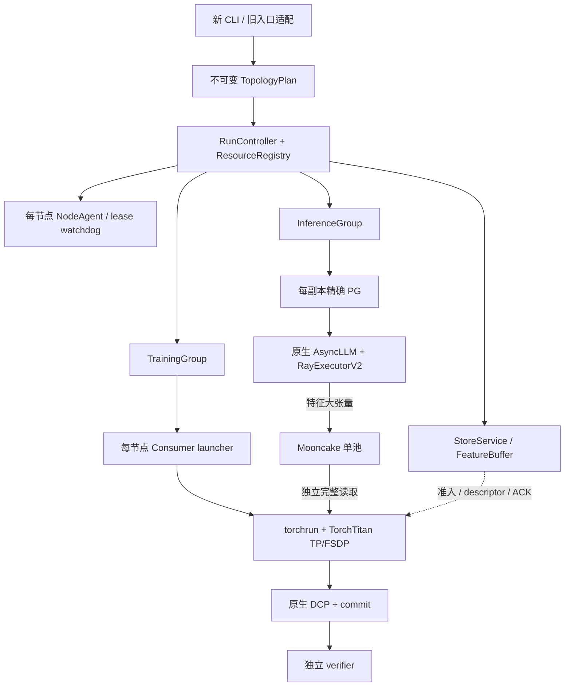

# Implementation Plan: 统一 Ray 拓扑与生命周期，扩展多节点 draft 训练

**Branch**: `dev/vllm_torchtitan`（沿用，未创建分支） | **Date**: 2026-09-20 | **Spec**: [spec.md](spec.md)

**Feature ID**: `001-unify-ray-topology`；setup-plan 返回的 BRANCH 是该功能标识，不是当前 Git 分支。

**Input**: `specs/001-unify-ray-topology/spec.md`，已完成五项澄清。

**Status**: Phase 0研究、Phase 1设计与任务拆分完成；已按analyze修订契约及依赖。本文描述待实现方案，实施与GPU验收尚未开始。

## Summary

以一个不可变 `TopologyPlan` 和一个 `RunController` 替代单机/两机入口各自编排的做法。统一准备、分配、初始化、运行、收尾、失败和取消；保留原生 vLLM Ray V2 执行器、TorchTitan DSpark 训练与 Mooncake 字节/ACK 契约。

新增两条独立验收路径：M2 在两个推理节点各用 8 GPU，形成两个 TP8 副本，每副本严格 4＋4 跨节点，第三节点运行 TP4×DP2；M3 在一个推理节点使用 TP4×DP1，两个训练节点各 4 GPU，以 TP4×DP2 协同训练。M0/M1 和旧配置继续兼容。推理卡数增加用于增加固定 TP 的 DP 副本；不引入运行中弹性。

关键技术选择见 [research.md](research.md)：每副本一个精确 PG，项目持有、原生 vLLM 借用；每训练节点一个 launcher，内部仍用 torchrun；单池放在第一个训练节点，按实际 writer/reader 所在节点核算预算。

## Technical Context

**Language/Version**: Python 3.12.14、Bash；当前 H800 环境由仓库 `h800conda.sh` 激活。

**Primary Dependencies**: Ray 2.58.0；torch 2.13.0（既有验证 CUDA 13 构建）；vLLM 0.26.1rc1.dev719+g1ee54c40d.d20260912 加当前 vendored 源码；Mooncake 0.3.13.post1；Transformers 5.16.1；vendored TorchTitan DSpark。版本是本次本机元数据核验结果，不承诺远端环境已一致。

**Storage**: Mooncake TCP/CPU 单特征池；共享文件系统保存输入计划、运行证据、TorchTitan DCP/commit。Ray 只传描述符与控制信息，不搬运完整特征张量。

**Testing**: pytest 9.1.1 的配置/账本/调度与失败契约测试；无模型的 Ray 分配探针；真实 H800 M0–M3 4K/128K 训练及独立 checkpoint 核验。未来命令和矩阵见 [quickstart.md](quickstart.md)。

**Target Platform**: Linux、H800/CUDA、同一可信 Ray 集群、节点间 TCP 可达、共享模型/输入/输出身份可核验。

**Project Type**: 分布式训练 CLI 与内部 Python 管线，增加版本化 CLI/配置契约，不新增 HTTP 服务或数据库。

**Performance Goals**: 扩展拓扑、保持训练正确性与容量上界；观测 feature tokens/s、传输/训练/等待耗时和内存峰值，无未经测量的吞吐提升目标。

**Constraints**: 原生 Ray 与 TorchTitan；训练 TP4、CP=PP=1；DP2 沿用 `data_parallel_shard_degree=2`，不切换为 DDP；输入计划顺序固定；每次全局更新 4 样本；写前预留、全部指定读者 ACK、删除成功后退源池额度；有限等待；只清理本运行资源。

**Scale/Scope**: M0 单节点 8 GPU；M1 两节点角色分离、各角色 TP4×DP1/2 的四种组合；M2 三节点 24 GPU 与推理 DP1 的 16 GPU 对照；M3 三节点 12 GPU。M2/M3 可顺序复用三台机器。M2 推理 DP 按两节点额度推导正整数，不在实现中硬编码只能为1/2；本次必验规模为DP1/DP2，更大合法规模需单独取得验收证据，不能仅凭配置可解析宣称已验证。新增节点数、TP/CP/PP等超出支持边界的组合仍明确拒绝。

## Constitution Check

未发现 `.specify/memory/constitution.md`、`memory/constitution.md` 或 `/memory/constitution.md`。因此正式 constitution 检查为 **N/A**，不创建或虚构条款。采用用户规格作为本次设计门槛：

| 门槛 | Phase 0 前 | Phase 1 后依据 |
|---|---|---|
| 原生 vLLM Ray 与 TorchTitan 不替换 | 通过 | 借 PG 的原生 AsyncLLM/V2；每节点 torchrun，原生 FSDP/TP |
| 训练数学、计划、游标与 DCP 保留 | 通过 | 固定 reader/producer 映射；原生微步与样本游标分开 |
| 字节预算、所有 reader ACK、删除确认 | 通过 | 单池账本＋逐节点组件预算＋更新边界准入 |
| 无重复 GPU 预留、角色隔离 | 通过 | 单一 PG owner；加载模型前全角色 allocation gate |
| 有限失败/取消、driver 丢失清理 | 通过 | 有界 RPC、独立节点 watchdog、资源登记与回收核验 |
| 旧布局兼容及 M2/M3 独立验收 | 通过 | 旧入口适配、明确矩阵与阻塞状态，不以模拟代替训练 |
| 无无依据性能/恢复承诺 | 通过 | 指标只记录；fail-fast；无自动重放或弹性 |

以上是设计检查通过，实际运行门槛仍需实施后验收。未发现需豁免的规格冲突。

## Project Structure

### Documentation (this feature)

```text
specs/001-unify-ray-topology/
├── spec.md
├── plan.md
├── tasks.md
├── research.md
├── research-vllm.md
├── research-training.md
├── source-manifest.json
├── data-model.md
├── quickstart.md
├── contracts/
│   ├── cli.md
│   ├── runtime.md
│   ├── task-config.schema.json
│   ├── m2.example.json
│   └── m3.example.json
└── checklists/requirements.md
```

`tasks.md` 已生成；执行顺序以其章节及依赖表为准，T079/T080证据采集先于首次真实训练验收。

### Source Code (repository root)

下列标为“新增”的源码与测试是待实现位置，本阶段只生成上面的设计文件。

```text
deepspec/pipeline/
├── cli.py               # 新增：preview/run/status/cancel/verify/transport-check
├── planning.py          # 新增：CPU 准备、节点事实、immutable plan
├── controller.py        # 新增：生命周期、registry、allocation/readiness gates
├── groups.py            # 新增：InferenceGroup / TrainingGroup / StoreService
├── vllm_adapter.py      # 新增：运行期 PG 绑定、native config、分配报告
├── schema.py            # v1/v2 升级、v3 严格输入校验
├── topology.py          # 纯布局/rank/reader/producer 推导
├── run.py               # 旧单机 CLI 兼容，复用控制流程
├── cluster.py           # 旧集群入口兼容；NodeMonitor 扩展为节点事实/监督
├── actors.py            # CPU frontend、每节点 Consumer 的可停止启动句柄
├── runtime.py           # 自建 master 与 lease/本地监督整合
├── buffer.py            # 全 rank ready、逐节点/完整更新组准入
├── memory.py            # 节点组件预算，writer/reader 位置来自计划
├── connector.py         # TP 动态配置后的 worker/writer 身份核验
├── data.py / prefetch.py # rank 映射、分开的预取额度与释放证据
├── recipe.py / trainer.py# 保留 TorchTitan；握手、更新事件与期限适配
└── verification.py      # 新增：布局无关的独立 DCP/证据核验

deepspec/orchestration/process.py # 复用并补齐所有阻塞回收的期限
vllm/vllm/config/parallel.py
vllm/vllm/v1/engine/{utils,core}.py
vllm/vllm/v1/executor/ray_executor_v2.py
# 上述 vLLM 文件仅增加运行期 PG 透传、CPU core 分支与 preload gate。
# 实施时遵循 vllm/AGENTS.md，并保留子模块既有修改。

torchtitan/torchtitan/models/dspark_draft/
# preparation、原生 trainer、mesh、PhaseCheckpointer 继续复用；不重写训练内核。

scripts/train/qwen3.8_ray_mooncake_vllm_torchtitan/
# 保留现有 shell 入口、PIPELINE_PYTHON 和 h800conda 使用方式。

tests/
├── test_pipeline_{buffer,cluster,store,writer}.py # 现有回归
├── test_pipeline_plan.py                        # 新增纯计划/兼容性
├── test_pipeline_lifecycle.py                   # 新增阶段失败/取消/driver 丢失
├── test_pipeline_vllm_placement.py              # 新增借 PG/V2 gate
├── test_pipeline_multinode_training.py          # 新增 rank/readiness/cursor
└── test_pipeline_verification.py                # 新增独立核验与证据负例
```

**Structure Decision**: 保持现有 `deepspec.pipeline` 包；新增模块分别封装纯计划、控制、后端接入与独立核验。训练算法和特征传输实现留在原模块，避免为拓扑扩展引入新的 trainer 层级。

## Architecture and Integration

### 控制与数据路径



1. **准备**：先拒绝不支持布局/冲突字段，生成原生输入计划和训练身份；收集节点只读事实、版本/源码/模型/输入身份、CPU/GPU 额度及预算。冻结配置与计划 hash。预览不创建 GPU actor、PG 或大池。允许创建临时 CPU 探针，结束即回收。
2. **分配**：创建并立即登记运行资源。每 TP4/TP8 推理副本按 1 GPU/bundle 创建 PG；训练 launcher 每节点一个能容纳全部本地 GPU 和 CPU 的 bundle；frontend、engine-core 和监督 CPU 分开核算。等待所有资源 ready 有总期限，不能把多个部分分配当成原子全任务分配。
3. **加载前 gate**：并发启动仅取得 Ray 资源的推理 worker shells 与训练 launchers，汇总实际 node/bundle/GPU UUID/rank-slot。协调器 gate 运行在独立 CPU actor 上，以免 driver 等待 engine 构造时无法处理上报。任一重复/错节点/超额度/超时都使全组拒绝初始化；收齐所有角色后放行。
4. **初始化 gate**：检查特征池、跨节点读写探针、所有推理 TP/DP 身份、全部训练 ranks 和相同计划、TorchTitan mesh、通信就绪。现有 rank0 布尔 ready 不能单独开闸。全部通过才进入 ready→running。
5. **运行**：输入位置决定 producer DP 与训练 DP；推理可乱序完成，训练计划顺序不变。FeatureBuffer 用完整更新组准入，独立记录源池额度、节点常驻副本与 train commit。
6. **收尾**：所有计划样本与训练更新完成、源特征释放、原生 DCP 保存；释放模型/PG 后执行可独立复验的 CPU checkpoint 核查，避免 verifier 偷占未分配 GPU。若模型尺寸令 CPU 验证预算不足则预检失败或明确验收阻塞，不隐式使用闲置 GPU。最终服务/监督清理确认后才写 succeeded。

### 原生 vLLM 的三处接入

具体字段、调用链和行号见 [推理研究](research-vllm.md)。`ParallelConfig` 的 runtime PG/local-rank/placement-plan 透传到 `CoreEngineActorManager`；借入 PG 时 CPU core 跳过错误的本机 GPU offset；V2 获得实际 GPU IDs 后且 `initialize_worker` 前等待 allocation gate。通用 callback/报告接口留在 vLLM 接缝，训练业务校验放在 DeepSpec adapter。

所有受支持布局迁移到同一个 owner/borrow 规则，并保留现有 DP1 批量含义。PG 句柄由 driver 创建后经 actor 参数传递到 frontend，持久化配置只存声明/ID。运行配置与 hash 排除规则均需覆盖 native 序列化路径测试；不使用全局 monkey patch。旧 Ray executor、MP 后端不在此特性 fallback 范围。

### TorchTitan 多节点与数据一致性

M3的静态ranks为训练节点0:0–3、节点1:4–7；node_rank、local_world_size、endpoint明确记录。M2在一个训练节点启动8 ranks，同一个DP-major/TP-minor mesh。DP2沿用shard degree=2、GAS=2；原生微步cursor=steps*global_batch_size/training.dp，global sample cursor=steps*global_batch_size，三次更新验收时分别为6和12。DCP commit沿用原生同步语义，独立核验器按冻结计划推导预期值，不固定样本数、更新数或分片文件数。

所有节点必须能读相同输入与 commit 身份、写同一个共享输出目录。启动端口在 node_rank0 节点选定且探测可达，冲突有界失败；不通过重试重分配已开始 rendezvous 的 rank。`max_restarts=0`，任一 rank 致命失败立即传播到整个推理/训练/存储任务。

### 内存、生命周期与证据

组件预算和状态见 [data-model.md](data-model.md)，跨进程协议见 [contracts/runtime.md](contracts/runtime.md)。默认单池位于 training node 0；M2 两 writer 的暂存在 inference node A 累加。旧 NodeMonitor 的“整个节点必须没有任何 GPU 进程”改为“本次已分配 GPU 不得被外部进程使用”，避免拒绝节点其他额度上的旁路任务；节点级总内存压力仍需计入。

启动按特征分配前headroom校验组件总上界；新更新组按当前headroom检查剩余分配上界，只抵扣已证实计费且持续驻留的本运行内存，避免重复扣算池。预算快照有效期由timeouts_seconds.budget_snapshot声明，缺省5秒并进入计划hash；controller按请求发出到最终准入的同钟年龄上界判断，等于有效期即过期，刷新重试共用transfer/run总期限。旧RDMA设备选择通过transport.rdma_devices原样迁移，冲突拒绝，TCP/CPU验收基线保持不变。

watchdog 不与长时间 run RPC 共队列；现有 subreaper 监督继续使用。父 actor 死亡后的本地回收也必须有界。登记 PID 时保存 start-time/归属，权限不足不能当成归属证据。NodeAgent 使用包含 node_id 的报告名，多个训练节点不覆盖日志。超时/cancel 通知立即唤醒等待 allocation、ready、admission、read/delete 的各方。外部 Ray/master 从不被本任务 stop。

## Delivery Sequence and Validation Gates

| 阶段 | 交付内容 | 放行条件 |
|---|---|---|
| D1 计划与兼容 | v3/legacy 规范化、M0–M3 计划、纯 rank/reader 映射、CLI 预览 | 非法输入无 GPU 副作用；旧参数语义不变；FR-001–004/010/020 |
| D2 生命周期与资源 | registry、group 接口、NodeAgent、lease、错误传播、逐节点预算 | 分配/初始化/取消/driver SIGKILL 负例；旁路任务不受影响；FR-005–008/015–018 |
| D3 原生推理接入 | 精确PG、三处vLLM seam、动态TP、writer预算、实际事件与独立采样 | 无模型分配探针及T079/T080证据采集检查先通过，再执行M0/M1正常回归；FR-009/011–014/018/019 |
| D4 跨节点训练 | 本地卡数 launcher、M3 rendezvous、全 rank ready、通用 verifier | CPU/Gloo rank/游标负例；M3 4K 再 128K；FR-021 |
| D5 完整验收 | M2 DP1 对照、DP2 4K/128K；M0/M1/M3 矩阵与故障证据 | SC-001–010 全部有明确结果；缺资源标 blocked，不减验收范围 |

D2的预算/监督与T079/T080的实际证据采集都是D3/D4真实训练前置；US6的状态展示与汇总可后置，运行数据不能事后补采。M2/M3独立能力必须分别验收，详细顺序见 [tasks.md](tasks.md#依赖与执行顺序)。

## Requirement Traceability

| 规格要求 | 设计落点 | 主要验收 |
|---|---|---|
| FR-001–004 | v3/schema、TopologyPlan、旧入口适配、preview | SC-001/002；US1/2 |
| FR-005/006 | 精确 PG、加载前 gate、registry owner/borrow | SC-004；跨角色重复/错误节点负例 |
| FR-007/008 | 状态机、声明期限、两道 gate、lease | SC-007/008 |
| FR-009 | M2 TP8×DP2 的两个 4＋4 PG、DP1 对照 | SC-003 |
| FR-010 | 两种 DP 独立、固定 plan、GAS/native cursor | SC-005；M1 四组合 |
| FR-011–014 | 单池 ledger、节点预算、读取副本与源删除分账 | SC-006；慢读者/删除失败/跨更新 batch |
| FR-015/016 | 全组 fail-fast、取消、driver 丢失、幂等清理 | SC-007；旁路任务保持 |
| FR-017 | 原生 DCP commit、布局无关独立 verifier | SC-002/003/005/010 |
| FR-018 | per-node/rank 事件、状态、峰值/进度/清理证据 | SC-008/009 |
| FR-019/020 | 原生后端、环境摘要、TCP/CPU、数学回归 | SC-002/005/009 |
| FR-021 | M3 node-local launchers、FSDP mesh、全 rank ready | SC-010 |

## Risks and Implementation Checks

- **vLLM 版本接缝**：vendor patch 很小但位于初始化路径；必须验证 runtime fields 的传播/hash、DP rank 0/1 的 core 设备处理与 gate 并发，预检明确检查 capability。不能只把默认 PACK 改一个参数就宣布支持。
- **共享训练与 checkpoint**：物理网络、共享目录权限、端口、跨节点 FSDP 必须实测；已有单机 H800 证据不能替代。
- **内存上界**：128K 特征很大；writer 聚集与逐 rank 预取必须按组件计账，runtime sampling 不能代替准入约束。GPU extraction 峰值另按模型/runner 预算检查。
- **driver 退出**：Ray fate sharing 不等于完整子进程已回收。轻量进程故障测试先验证 watchdog/subreaper，再做真实任务故障注入。
- **数字与证据**：配置计划、源码可行、无模型调度、真实训练分别记录。计划完成不表示这些实测已执行。

## Complexity Tracking

无规格门槛豁免。必要新增复杂度是精确 PG 借用接缝、加载前 gate 和本地 lease 监督，分别解决已定位的放置错误、初始化前隔离与 driver 丢失问题；不引入新 trainer、分池、恢复系统或在线弹性。
