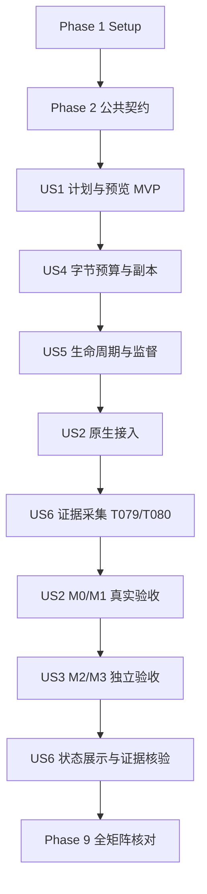

# Tasks: 统一 Ray 拓扑与生命周期，扩展多节点 draft 训练

**Input**: `specs/001-unify-ray-topology/` 下的 `spec.md`、`plan.md`、`research.md`、`research-vllm.md`、`research-training.md`、`data-model.md`、`contracts/` 与 `quickstart.md`。

**Date**: 2026-09-20

**Status**: 实施进行中；仅勾选实际完成且核验的任务。实施起点与验证记录见 `implementation-baseline.md`；历史单机证据不计为本功能验收。

**Workflow**: 使用本机 `specify-cli` 内置的 `core_pack/commands/tasks.md` 和 `core_pack/templates/tasks-template.md`。`setup-tasks.sh --json` 能定位当前功能，但因工作区缺少模板无法返回模板内容；已通过 `specify preset resolve tasks-template` 确认并读取 CLI 内置模板。未发现 `.specify/extensions.yml` 或项目 constitution，无前后置 hook 与额外 constitution 门槛。

**Tests**: 规格明确要求配置、分配、容量、失败、数学兼容、checkpoint 与真实多节点验收，因此包含对应测试任务。先写能暴露契约缺口的测试，再实现并使其通过；不把纯逻辑测试、无模型探针、真实训练混为同一证据。

**Organization**: 按用户故事组织。同为 P1 的故事按依赖排序为 US1 → US4 → US5 → US2 → US3。US6的运行证据采集T079/T080是P1验收的共同前置，已移到Phase 6、首次真实训练之前；P2状态展示与汇总留在Phase 8。每个故事有独立验证入口，但共享基础设施和已注明的前置故事。

## 格式与路径约定

- 每条任务采用 `- [ ] Tnnn [P?] [USn?] 描述及文件路径`；编号唯一且保持稳定，执行以章节位置及依赖表为准。T079/T080因证据前置移到T058之前，不按编号重新排到Phase 8。
- `[P]` 仅标记同阶段、共同前置完成后可以并行的独立文件任务。没有该标记的任务默认串行；不能因位于不同故事就并行修改同一文件。
- 下列源码路径相对仓库根目录；`deepspec/pipeline/cli.py`、`planning.py`、`controller.py`、`groups.py`、`vllm_adapter.py`、`verification.py` 和新增测试是待创建文件。
- 验收工具为 `tests/run_pipeline_acceptance.py`；每次执行写入独立的 `outputs/ray-topology-acceptance/<case>/<run_id>/`，总索引为 `outputs/ray-topology-acceptance/results.json`。路径中的 case/run_id 在运行时替换，禁止覆盖既有证据。
- 单元测试使用显式的节点事实/后端替身；真正调用 Ray、Mooncake、Gloo 或分配 GPU 的探针单独执行。训练测试使用 `h800conda.sh` 配置的 `PIPELINE_PYTHON`；修改 vLLM 时遵守 `vllm/AGENTS.md` 的环境与检查要求。
- 不创建新训练内核，不改变 DSpark loss、优化器或 TorchTitan FSDP 数学；保持 TCP/CPU/full 基线、fail-fast、无自动重启/重放/弹性。

## Phase 1: Setup — 固定实施基线与验收记录

**目的**：复用现有项目，准备可重复检查的输入和证据工具。

- [X] T001 核对 `specs/001-unify-ray-topology/source-manifest.json` 对应源码、当前分支和已有工作区/子模块修改，在 `specs/001-unify-ray-topology/implementation-baseline.md` 记录差异、实际依赖/解释器、现有测试入口与原生后端接入点；保护已有修改，保留原研究证据，不在此任务启动模型或安装替换训练依赖。
- [X] T002 [P] 在 `tests/pipeline_topology_fixtures.py` 建立 M0、M1 四种 DP 组合、M2 DP1/DP2、M3 的最小配置/节点事实/12 样本 fixture，另含1/5次更新的通用计数fixture，以及重复节点、非连续 GPU、未知字段、容量不足、过期事实和错误 rank 的负例；真实环境事实由运行时注入。
- [X] T003 [P] 在 `tests/run_pipeline_acceptance.py` 实现验收记录与 case 选择基础设施，按 `quickstart.md` 的 13 个正常矩阵项及独立故障项保存 planned/not_run/blocked/failed/passed、证据层级、身份、真实长度、布局、时间和验证/清理引用；未执行与资源不足不能写 passed，后续任务再接入具体探针和 CLI。

## Phase 2: Foundational — 共用身份、映射与控制契约

**前置**：T001–T003。这里只建立后续故事共同使用的模型和接口，真实资源创建留到生命周期故事。

- [X] T004 在 `deepspec/pipeline/schema.py` 与 `deepspec/pipeline/planning.py` 定义 TaskConfig、Run、NodeFacts、TopologyPlan、InferenceReplica、TrainingParticipant 的明确序列化边界，落实“run_id 全局唯一；一个目录仅一个运行；retry 产生新 run_id，本版不从内存状态恢复”和“准备后不可变；不含活 Ray handle；实际分配是另一实体”；超时与输入身份参与计划 hash。
- [X] T005 在 `deepspec/pipeline/topology.py` 实现共享纯函数：`producer=p % inference.dp`、`training_dp=p % training.dp`、该 DP 组内全部四个 TP readers，以及“global ranks 连续唯一；DP-major/TP-minor”；区分 node_rank、DP rank、本地可见 slot 与物理 UUID。由冻结计划的U=steps、B=global_batch_size、D=training.dp计算N=U*B、GAS=B/D、native cursor=N/D、sample cursor=N及reader总数N*TP，检查计划条目数相符；12/6等数值仅用于三次更新fixture。
- [X] T006 在 `deepspec/pipeline/runtime.py` 实现原子 JSON、每 component/node/rank 单 writer 事件及结构化错误公共接口，所有跨进程消息包含 `schema_version, run_id, plan_hash, sender_identity, event_id`；冻结FR-018的节点/环境、生产/读取/提交、容量、等待原因、计时/速率、checkpoint和cleanup字段及缺失规则。落实“区分 declared/observed/verified；时钟仅用于本节点耗时，跨节点关联用事件 ID/因果关系”，预留节点独立 cleanup/orphan 记录；T080在首次真实训练前接齐实际事件源。
- [X] T007 在 `deepspec/pipeline/controller.py` 实现 ResourceRegistry 与纯状态转换，记录 Allocation/ProcessIdentity 的 owner、精确 Ray ID、node/bundle/UUID、PID/start-time 和回收状态；落实“同一物理 GPU 只能分给一个角色；PG owner=DeepSpec，vLLM=borrower；精确 ID 回收”，资源状态为 declared → acquiring → acquired → releasing → released/unknown，终态不得复活。
- [X] T008 在 `deepspec/pipeline/groups.py` 定义 InferenceGroup、TrainingGroup、StoreService 的 allocate/start/ready/status/stop 契约与可替换后端接口；start 返回可监督句柄，stop 返回逐资源 released/unknown，控制/heartbeat 不与长时间构造或训练 RPC 共用阻塞队列，接口不另建训练器。

**Checkpoint**：身份、不可变计划、资源归属、事件和组接口可被各故事测试替换，无真实 GPU 工作。

## Phase 3: User Story 1 — 启动前看清布局和支持范围（P1，MVP）

**前置**：Phase 2。

**目标**：统一 v3 预览，非法配置在 GPU 副作用前失败。

**独立验证**：以受控节点事实运行 M0–M3 正反例，检查完整计划与 CPU/预算/rank/reader 表；用副作用哨兵断言模型加载、GPU 预留、大池创建均为 0。真实集群的实际前后资源快照在 T085 补齐。

### 测试

- [X] T009 [P] [US1] 在 `tests/test_pipeline_plan.py` 覆盖完整矩阵、M2 DP 按两端额度约束且合法更大 DP 不被硬编码拒绝、非连续 GPU/allowed UUID、节点重复或选择歧义、CPU 不足、TP/DP/GAS/完整更新组错误、超时非正或非有限、heartbeat≥lease、服务 loopback、身份不一致及 frozen hash 篡改负例。
- [X] T010 [P] [US1] 在 `tests/test_pipeline_cli.py` 为 preview 编写契约测试：output_dir 已存在、未替换 `${...}`、未知字段、不支持传输/布局、缺 backend capability 均有具体 field_path 和退出码；对成功/失败路径断言零模型/零 GPU/零大池副作用、临时 CPU 探针回收与输出身份一致。

### 实现与验证

- [X] T011 [US1] 在 `deepspec/pipeline/schema.py` 按 `specs/001-unify-ray-topology/contracts/task-config.schema.json` 执行 v3 结构校验，落实 required/const/enum/additionalProperties 与数值约束；显式补入rdma_devices空字符串与budget_snapshot=5秒的缺省值后再计算hash，不依赖Schema自动填值、不覆盖显式值。语义层落实“所有运行等待期限为正数且有限；lease heartbeat 间隔小于 lease 期限”，拒绝未替换占位符，返回契约错误结构。
- [X] T012 [US1] 在 `deepspec/pipeline/cluster.py` 扩展节点只读 inspect，落实“alias 只是用户标识，selector 必须唯一解析；IP/hostname 不代替 node_id/设备身份”；收集 GPU UUID、可用 CPU、physical/cgroup/headroom、源码/依赖/模型/输入身份、共享路径和可路由接口，临时 CPU actor 退出即回收。
- [X] T013 [US1] 在 `deepspec/pipeline/memory.py` 实现 `data-model.md` 的完整保守组件公式：writer=`3*W*I*S_max`、transport=`W*I*S_max`、reader=`sum(2*A*S_max+F_r)`、实际 client buffer、pool 与 1 GiB reserve；区分static cap、特征分配前headroom形成的startup_budget和运行期remaining_bound，不用分配后的headroom再次校验整个feature_bound。“覆盖该节点所有角色”，pool不重复计，M2两writer计A、M3每训练节点只计本地四readers，GPU模型/KV/extraction单独核查。
- [X] T014 [US1] 在 `deepspec/pipeline/planning.py` 生成 M0–M3 角色、精确 bundle 声明与完整 CPU 账单，落实“推理实际占用 GPU=TP×DP，各副本布局完全一致；M2 DP 容量上限=min(floor(G_A/4),floor(G_B/4))”和“训练 world=TP×DP=节点本地 GPU 数之和”；训练 TP4、CP=PP=1、local_world_size 均匀，余卡不预留，pool/master 只在首个训练节点。
- [X] T015 [US1] 在 `deepspec/pipeline/planning.py` 复用 `deepspec/pipeline/run.py` 的 CPU preparation 及原生输入计划，落实“samples_per_update=4，local microbatch=1；GAS=4/training.dp 必须为正整数”和“顺序固定；字节数从实际 tensor shape/dtype 计算；分组不由完成顺序决定”；验证完整更新组、共享可读写路径、环境身份和 native capability 后冻结 config/input/plan hash，记录有限期限。
- [X] T016 [US1] 在 `deepspec/pipeline/cli.py` 实现 `preview --config FILE`，独占创建新运行目录并保存 config.normalized.json、plan.json、environment.json、inputs/input-plan.json、兼容 pipeline.json 和 preparing/preview_complete；不扩展 shell 表达式，配置错误为 2，资源/节点阻塞为 4，缺接入能力报告 BACKEND_CAPABILITY_MISSING。
- [X] T017 [US1] 运行并修正 `tests/test_pipeline_plan.py`、`tests/test_pipeline_cli.py` 中纯 CPU 检查，加入 T004–T007 身份隔离、无活 handle 的持久化、不可变 hash、映射/预算算术和终态拒绝转换的行为验证，记录结果至 `specs/001-unify-ray-topology/implementation-baseline.md`。
- [X] T018 [US1] 在 `tests/run_pipeline_acceptance.py` 接入 US1 的受控节点事实预览正反例，记录声明与实际调用计数，明确该层是 CPU 契约验证；真实 backend 缺接入时保留明确拒绝，不能把替身能力或包版本当成真实 native 接入已通过。

**Checkpoint**：CPU 预览 MVP 可独立评审；真实新拓扑支持仍须后续接入与运行证据。

## Phase 4: User Story 4 — 长序列字节预算与读者副本（P1）

**前置**：US1，特别是 T013–T015 的节点组件上界和完整更新组证明。

**目标**：新增拓扑保留写前预留、全部指定读者 ACK、删除确认后退源池额度，运行中新更新组必须重新检查节点余量。

**独立验证**：已知字节数的变长特征、慢读者、删除失败与跨更新边界 reserve_batch；证明已准入组能推进、错误读者不能领取、训练副本不会随源删除失效。真实 128K 压力在 T076 验收。

### 测试

- [X] T019 [P] [US4] 在 `tests/test_pipeline_memory.py` 验证 M0 角色合并、M2 writer 集中于 A、M3 单池和两端各四 reader、实际 client buffer、prefetch_bytes及不同GAS的账本；覆盖data-model中的300/200/64 GiB算例、未驻留池不得抵扣、其他进程压力、抵扣释放/失效及已准入未物化承诺。使用受控单调时钟覆盖快照刚到有效期、迟到响应、节点epoch变化、刷新失败和重试不延长期限；为单样本或完整更新组超限提供可读拒绝原因。
- [X] T020 [P] [US4] 扩展 `tests/test_pipeline_buffer.py`，覆盖 reserve_batch 可用前缀跨多个更新边界、下一组 budget stale/不足时停止前缀、已准入组不因高水位自锁、错 writer/reader、重复发布/claim/ACK、所有读者 ACK 前不能删、删除未确认不能退额度以及 fail 唤醒全部 waiter。
- [X] T021 [P] [US4] 扩展 `tests/test_pipeline_writer.py` 和 `tests/test_pipeline_store.py`，验证写入未完成或 identity/shape/dtype/nbytes 不符不能 publish，异步 writer/预取在分配前受额度约束，删除失败不退额度，以及完整校验后的独立 reader 副本在源删除后仍有效。

### 实现与验证

- [X] T022 [US4] 在 `deepspec/pipeline/memory.py` 与 `deepspec/pipeline/cluster.py` 接入启动总量/运行剩余分配量校验及source reservation/ReaderCopy分账；只抵扣可证明已计费并持续驻留的本运行内存下界，未知为0，不以聚合RSS或配置池大小抵扣。按data-model为每个更新组现场采样、核对request/epoch/sequence，并用controller请求发出至最终准入的同钟年龄上界严格比较budget_snapshot；刷新与容量等待共用transfer/run期限。源池额度归还不立即扣除仍存活训练副本。
- [X] T023 [US4] 在 `deepspec/pipeline/buffer.py` 将 reserve_batch 改为按每个新更新边界重新准入且返回可推进前缀，保留 window/bytes 与原有重复操作拒绝规则；落实“同一个样本只有一个指定 writer；只接受指定 reader；终态有审计记录”，保证已准入组保留证明过的额度并在期限内完成或失败。
- [X] T024 [US4] 在 `deepspec/pipeline/connector.py`、`deepspec/pipeline/store.py` 与 `deepspec/pipeline/mooncake/buffers.py` 约束 raw/converted/pinned/异步注册缓冲的 writer-inflight，核验完整特征身份/shape/dtype/nbytes 和写入完成；由计划指定 TP0/replica/node 发起唯一写入，保留完整 BF16 特征，账本只接受计划批准的正整数 inference DP。
- [X] T025 [US4] 在 `deepspec/pipeline/data.py` 与 `deepspec/pipeline/prefetch.py` 实现各本地 reader 的深度/实际字节双重预取上限，完整校验并持有独立副本后才 ACK；落实“ACK 后独立副本仍可被反向计算持有；副本释放与源对象删除是不同事件”，ReaderCopy 状态为 prefetching → materialized_and_acked → active → retired，产生 reader_copy_retired，不能通过 ACK 推进训练提交游标。
- [X] T026 [US4] 在 `deepspec/pipeline/mooncake/deletion.py`、`deepspec/pipeline/store.py` 与 `deepspec/pipeline/buffer.py` 保留所有指定 reader ACK→有限重试删除→确认不存在→退源池额度的顺序；删除失败达到总期限触发全任务错误，Feature 状态为 reserved → writing → ready → deleting → released，失败不跳过样本清账。
- [X] T027 [US4] 运行 `tests/test_pipeline_memory.py`、`tests/test_pipeline_buffer.py`、`tests/test_pipeline_writer.py`、`tests/test_pipeline_store.py`，通过 `tests/run_pipeline_acceptance.py` 记录慢读者、跨 batch、删除重试耗尽和副本存活的 CPU 契约结果，不计为 128K GPU 验收。

**Checkpoint**：容量契约已有确定性验证，真实训练可以依赖其准入与释放规则。

## Phase 5: User Story 5 — 有限失败、取消和本次资源清理（P1）

**前置**：US1、US4；真实推理/训练后端在 US2/US3 接入相同组协议。

**目标**：统一资源所有权、两道门禁、有限等待、独立监督和幂等清理，保护旁路任务及外部服务。

**独立验证**：用可阻塞的组替身与真实轻量子进程注入部分分配、初始化失败、取消、PID 重用和 driver 丢失；检查期限、唯一终态、回收/unknown 与旁路进程。真实训练故障在 T075/T077 单独验收。

### 测试

- [X] T028 [P] [US5] 在 `tests/test_pipeline_lifecycle.py` 编写资源状态/所有权和阶段故障测试，覆盖部分 PG/core 创建、gate 缺报告/冲突、run/cleanup 各自总期限、重复 stop/cancel、外部 master/Ray 不停止、晚到成功不复活、首因保留、节点不可达为 unknown 及 cleanup_complete=false。
- [X] T029 [P] [US5] 在 `tests/test_pipeline_process.py` 编写最小真实子进程与伪 proc 身份测试，覆盖控制 RPC 被训练阻塞、父 actor 丢失、lease 超时、driver SIGKILL、PID/start-time 改变、权限不足与子孙进程回收；断言旁路进程存活，禁止按进程名或整机范围杀进程。

### 实现与验证

- [X] T030 [US5] 在 `deepspec/pipeline/runtime.py` 与 `deepspec/orchestration/process.py` 给 Ray get/wait、subprocess wait/join、Store I/O 和删除队列接入单调时钟 deadline；重试不重置总期限，原生无 timeout 的阻塞调用由可终止 actor/进程和独立 watchdog 包围，取消 future 不等同于底层停止。
- [X] T031 [US5] 在 `deepspec/pipeline/cluster.py` 扩展 NodeAgent，在 `deepspec/orchestration/process.py` 复用 subreaper/本地父进程保护，独立处理 lease/递增 heartbeat/fencing token；落实“PID 单独不能证明归属；回收前重验 start-time；不可核验则 unknown”，driver 丢失后仅写本节点 cleanup/orphan 文件，过期 token 不续命。
- [X] T032 [US5] 在 `deepspec/pipeline/controller.py` 实现按计划创建后立即登记所有 PG/actor/服务、共享 allocation 总期限和部分分配回滚；精确 ID 区分 owned/external、native borrower，PG 非 detached、角色禁用自动 restart；只检查本次分配 GPU 的外部占用并保留同节点其他卡上的任务。
- [X] T033 [US5] 在 `deepspec/pipeline/controller.py` 实现独立 CPU 协调 actor 的 allocation/initialization 两道 gate，预期集合来自 immutable plan；核对全部推理 shells 与训练 launchers 的 node/bundle/UUID/run/hash 后才放行 GPU 初始化，再核对所有 DP/TP、训练 ranks、store/通信后 ready；相同上报幂等、冲突致命，失败/取消唤醒全部 waiter。
- [X] T034 [US5] 在 `deepspec/pipeline/actors.py` 将 Producer/Consumer 启动转换为可监督的非阻塞句柄，单独暴露 ready/status/stop，避免长 run/engine constructor 阻塞 heartbeat；登记本地进程身份和退出原因，终止真实底层进程并把非零退出传播给 controller。
- [X] T035 [US5] 在 `deepspec/pipeline/groups.py` 与 `deepspec/pipeline/runtime.py` 实现 StoreService 的单池启动/就绪/停止，默认首个训练节点自建 master，也支持有可路由 endpoint 的 external master；服务归属进入 registry，external 仅断开本任务连接，自建资源回收可核实。
- [X] T036 [US5] 在 `deepspec/pipeline/cli.py` 与 `deepspec/pipeline/cluster.py` 实现 `transport-check --plan FILE`，使用独立 probe namespace、默认 64 MiB 小池，在全部实际 writer/reader 节点执行 TCP/CPU 写读全校验删除；输出 transport-probe.json，成功/失败均清理 probe 对象与自建服务，不申请 GPU、不声称验证了真实特征容量。
- [X] T037 [US5] 在 `deepspec/pipeline/controller.py` 串起 preparing → allocating → initializing → ready → running → draining → succeeded 与 failed/cancelled，保留首因；按停止准入→停止全组→对象/clients→PG/actors→自建服务→核查清理，run 与 cleanup 分别计时；成功必须等待独立 checkpoint 核验及全部回收确认，T055 接入真实核验器。
- [X] T038 [US5] 在 `deepspec/pipeline/cli.py` 实现 `cancel --run-dir DIR` 的 run_id/plan_hash 校验、原子取消请求、通知与有界等待；重复请求幂等，既有终态不改写，活动任务取消返回 130，清理噪声附加到 cancelled 原因，错误目录不能取消其他运行。
- [X] T039 [US5] 在 `tests/pipeline_lifecycle_probe.py` 实现显式调用的轻量真实进程/CPU Ray 监督探针，为所有阻塞阶段注入取消、父进程/driver 丢失及重复清理；以登记 PID/start-time 和资源 ID 为靶标，测量处理/清理耗时、可达节点残留和旁路服务存活。
- [X] T040 [US5] 运行 `tests/test_pipeline_lifecycle.py`、`tests/test_pipeline_process.py` 和 `tests/pipeline_lifecycle_probe.py`，通过 `tests/run_pipeline_acceptance.py` 保存纯测试与真实 CPU 监督探针的不同结果；检查节点 unknown 与 orphan failure，未通过监督/清理 gate 前不得进入后续真实训练。

**Checkpoint**：预算、有限等待、资源隔离与监督均已具备轻量证据，后端接入不会绕过这套控制路径。

## Phase 6: User Story 2 — 已有配置与原生后端等价迁移（P1）

**前置**：US1、US4、US5；本阶段所有真实训练先通过T056的无模型分配检查及前移的T079/T080证据采集检查。

**目标**：旧入口和新入口共用 controller、原生 vLLM V2 与 TorchTitan，保留 DP1 批量含义、输入顺序、训练数学、字节预算和完整 checkpoint。

**独立验证**：相同输入/初始状态/布局下比较旧、新入口，完成 M0 4K/128K 与 M1 四组合 4K、11/22 的 128K；每项 12 样本、3 更新、48 次完整读取，并独立加载 DCP。M1-21 是新增解除的入口限制，必须取得新证据。

### 测试

- [X] T041 [P] [US2] 扩展 `tests/test_pipeline_cluster.py`，覆盖 v1/v2 显式字段映射、顶层/transport 冲突、缺省 consumer_nodes 的历史布局语义、DP1 batch/window/writer-inflight 保持、M1 推理 DP2/训练 DP1 合法，以及新旧入口生成等价不可变计划；加入store.rdma_devices到transport.rdma_devices的显式多设备值、缺省、同值并存、冲突、Store透传及TCP不切协议用例。
- [X] T042 [P] [US2] 在 `tests/test_pipeline_vllm_placement.py` 编写 native 接缝行为测试：PG owner/borrow、runtime 字段透传/序列化/hash 排除、CPU core local_dp_rank 不推导 GPU 8..15、每 GPU bundle 恰好一卡、core/frontend CPU 不抢同槽、所有角色到齐前不调用 initialize_worker、部分 core 失败回收及后端能力缺失明确拒绝。
- [X] T043 [P] [US2] 在 `tests/test_pipeline_verification.py` 使用最小原生 checkpoint fixture 验证缺数据范围、错 plan/teacher、错 optimizer step/native cursor、非有限 loss/参数、未更新参数、少 reader、源对象/资源残留和伪造成功的拒绝；DP1/DP2各覆盖steps=1/3/5，特别检查五次更新的20样本、native cursor20/10、80读取，拒绝仍报告12/6的checkpoint；不把固定shard文件数量当作完整性标准。
- [X] T079 [P] [US6] 扩展 `tests/test_metrics.py`，验证从事件计算feature tokens/s、传输/训练/等待耗时和逐节点内存峰值，禁止跨节点wall clock直接相减；缺测量保留缺失，不用zero或无对照的改善百分比代替证据。本任务作为证据采集前置与T041–T043同阶段编写，T080通过前不得进入真实训练验收。

### 实现与验证

- [X] T044 [US2] 在 `deepspec/pipeline/schema.py` 实现 v1/v2→v3 的显式映射与冲突拒绝，落实“v1/v2→v3 的显式字段冲突即拒绝；不静默覆盖 top-level/transport 的不同值”；按cli契约将store.rdma_devices原样迁移到transport.rdma_devices，同值接受、冲突报具体字段、均未提供才填空字符串。依据原schema/布局解释consumer_nodes，保留显式模型/输入/batch/window/prefetch/预算与旧writer-inflight上界，不把consumer_dp=2自动解释成两训练节点。
- [X] T045 [US2] 在 `vllm/vllm/config/parallel.py` 增加类型明确的运行期 PG/local DP ranks/placement plan，核验列表长度、bundle/节点声明与自动放置冲突；从图编译 hash 排除运行句柄，持久化配置只保存 ID/声明，确保 native 配置序列化路径可用。
- [X] T046 [US2] 在 `vllm/vllm/v1/engine/utils.py` 将借入 PG/local ranks 透传到 CoreEngineActorManager，在 `vllm/vllm/v1/engine/core.py` 仅对明确借 PG/native Ray 的 CPU core 分支跳过本机 GPU 区间推导；保留 local DP 通信身份，native manager 只清理自身创建的 PG，不伪造 CUDA_VISIBLE_DEVICES。
- [X] T047 [US2] 在 `vllm/vllm/v1/executor/ray_executor_v2.py` 的真实 GPU ID 收集之后、任何 initialize_worker 之前接入通用分配报告与有限 gate，汇报 node/bundle/rank-slot/GPU 身份；失败时终止本次 shells 并唤醒等待，DeepSpec 业务校验保留在 adapter/controller，不新增 executor 或全局 monkey patch。
- [X] T048 [US2] 在 `deepspec/pipeline/vllm_adapter.py` 实现统一 DP1/DP2 的 AsyncLLM.from_vllm_config 接入、运行时 PG/plan 绑定、动态 TP bundle indices、gate 报告、ready/error/stop 协议与 capability 检查；核对最终生效配置，拒绝环境覆盖悄改 DP、地址、executor 或节点布局。
- [X] T049 [US2] 在 `deepspec/pipeline/groups.py` 实现 InferenceGroup 借用 controller 的每副本精确 PG：GPU workers 单卡 bundle、末尾 CPU core bundle、frontend 独立 CPU 资源；启动/停止 native actor 图并登记实际资源，不再由外层和 vLLM 各自预留同一套 GPU。
- [X] T050 [US2] 在 `deepspec/pipeline/actors.py` 将 DP1/DP2 生产路径接入同一 adapter，按输入 position 固定分配 replica，保留旧 producer_batch_size/reserve_batch/window/writer-inflight 的含义，解除“每 DP 永远一个请求”的隐式限流替代，乱序完成不能改变训练归属。
- [X] T051 [US2] 在 `deepspec/pipeline/groups.py`、`deepspec/pipeline/actors.py` 与 `deepspec/pipeline/recipe.py` 接入 M0/M1 的 node-local TrainingGroup，launcher 只占本节点完整 GPU/CPU bundle；保留原生 torchrun、TP4、data_parallel_replicate_degree=1、data_parallel_shard_degree=DP、CP=PP=1 和有限 collective timeout。
- [X] T052 [US2] 在 `deepspec/pipeline/trainer.py`、`deepspec/pipeline/data.py` 与 `deepspec/pipeline/buffer.py` 接入全 rank 的 node/global/local/TP/DP、plan/model/world/GAS 握手，保留原生全局 barrier，替代单个 consumer_ready 布尔开闸；每 rank 上报 rank_update_completed，落实“READ_ACK 不能改变 optimizer_steps；完整提交由原生 checkpoint 协议决定”。
- [X] T053 [US2] 在 `deepspec/pipeline/connector.py` 将 producer_worker/TP0 writer 的实际 node/UUID/replica/TP 身份与计划比对，并把全部推理 TP/DP 初始化报告交给 gate；保持完整 BF16 hidden-state、token/identity/shape 校验和唯一 writer，不因改变 TP 而缩放特征字节数。
- [X] T054 [US2] 在 `deepspec/pipeline/verification.py` 实现布局无关的独立CPU verifier，复用 `torchtitan/torchtitan/models/dspark_draft/checkpoint.py` 原生commit/DCP加载语义；检查完整state覆盖、teacher/input hash、有限loss/参数及预期参数更新、optimizer计数、逐rank进度和样本/reader集合。预期值来自冻结计划及T005公式：更新数U、native cursor=U*B/D、global sample cursor=U*B、reads=U*B*TP；不能从checkpoint自证或硬编码12/6、四ranks/四shards。
- [X] T055 [US2] 在 `deepspec/pipeline/cli.py` 与 `deepspec/pipeline/controller.py` 接通 `run --plan FILE` 和 `verify --run-dir DIR`：拒绝终态复用或计划/环境篡改；模型/PG 释放后在已预算 CPU 资源中核验 DCP，再完成服务清理和成功条件核对；CPU 核验内存不足预检失败/blocked，不借闲置 GPU，独立 verify 写 verification.json 且不能把失败 status 改为成功。
- [ ] T056 [US2] 在 `tests/pipeline_allocation_probe.py` 实现并运行 M0/M1 无模型 Ray 实际分配探针，记录真实 node/UUID/CPU bundle，验证 native gate 前零模型初始化、角色隔离、无重复预留、DP2 第二 core 与部分启动失败回滚；运行 T042/T043 的接缝和 verifier 测试后写入 `outputs/ray-topology-acceptance/results.json`，区分分配探针与训练。
- [X] T057 [US2] 将 `deepspec/pipeline/run.py`、`deepspec/pipeline/cluster.py` 的旧launch路径转接同一planning/controller，适配 `scripts/train/qwen3.8_ray_mooncake_vllm_torchtitan/train.sh`、`train_multinode.sh`、`cluster.sh`、`ray_mutilnode_train.sh` 并核对 `debug_single_node.sh`/`h800_debug.sh` 的调用链；保留PIPELINE_PYTHON与显式参数，确保--rdma-devices经v3规范字段原样传入兼容快照/实际Store客户端，TCP不因设备字符串切换协议；移除旧pDP2必须cDP2的入口耦合和重复清理实现。

### 首次真实训练前的证据门槛

- [ ] T080 [US6] 在 `deepspec/pipeline/runtime.py`、`deepspec/pipeline/cluster.py`、`deepspec/pipeline/actors.py`、`deepspec/pipeline/store.py` 与 `deepspec/pipeline/trainer.py` 接齐FR-018的实际事件源：节点环境/落点、生产/读取/更新、approved/observed、wait reason、时长/速率、最终保存与cleanup；按node/rank单writer记录，以事件ID/因果关系关联。由 `tests/run_pipeline_acceptance.py` 接入独立节点/进程/资源采样，覆盖运行开始至清理结束；运行T079并以正常/背压/失败的轻量可控run检查字段与采样完整性，缺必需证据禁止标passed。本任务直接依赖T041–T057及T079，先于T058–T060和T070–T077；后续新拓扑继续接入同一采集契约。

### 真实兼容验收

- [ ] T058 [US2] 用 `tests/run_pipeline_acceptance.py` 先完成 M0 4K 再完成 M0 128K 的旧/新入口对照，固定相同初始状态与输入计划，每次至少 12 样本、3 更新、48 完整读取、native cursor12；保存 loss/更新/独立 DCP/源释放/资源回收证据到各自新运行目录。
- [ ] T059 [US2] 用 `tests/run_pipeline_acceptance.py` 完成 M1-11、M1-12、M1-21、M1-22 的 4K 真实训练与适用旧入口等价对照，验证两种 DP 独立、乱序不改变样本覆盖、所有 rank 进度与 DP1/DP2 的 cursor/GAS 正确；特别为 M1-21 保存解除入口限制后的新证据。
- [ ] T060 [US2] 用 `tests/run_pipeline_acceptance.py` 在对应 4K 通过后完成 M1-11/M1-22 的 128K 对照，独立核验保存与预算/清理；执行 `tests/test_dspark_training_baseline.py`、`tests/test_tp_numerics.py`、`tests/test_torchtitan_phase_checkpoint.py` 中与本改造训练数学/保存相关的既有回归，记录命令、环境与数值准则，失败时阻止后续新拓扑验收。

**Checkpoint**：M0/M1 旧配置和新入口共用完整原生路径；八个正常矩阵项及必要的额外入口对照有独立证据。

## Phase 7: User Story 3 — M2 跨节点推理与 M3 跨节点 draft（P1）

**前置**：US2 的原生接缝、M0/M1 回归与通用 verifier；US4/US5 的预算/监督持续适用。

**目标**：M2 每个 TP8 副本固定 A4+B4，增加资源只增加同规模 DP；M3 两个训练节点各四 ranks、同一原生 TP4×DP2 FSDP 任务，二者分别验收。

**独立验证**：M2 DP1 4K 对照、DP2 4K/128K；M3 4K/128K 和一个训练参与者/节点故障。每次正常运行 12 样本、8 个训练 rank 各 3 更新、48 完整读取、native cursor6/sample cursor12、完整 DCP 和清理证据。模型训练前先完成 CPU/Gloo 与无模型实际分配探针。

### 测试

- [ ] T061 [P] [US3] 扩展 `tests/test_pipeline_vllm_placement.py`，覆盖 M2 DP1/DP2 各副本 A4+B4、core/writer 均在 A、额外额度不预留、不能仅按集群总卡数扩 DP、可满足的更大 DP 仅获逻辑支持，以及第二 core/远端 worker 缺失时 gate 拒绝与全部借入 PG 回滚。
- [ ] T062 [P] [US3] 在 `tests/test_pipeline_multinode_training.py` 覆盖 M3 两 launcher 各四 GPU、唯一 global/local/node/TP/DP 映射、共享 endpoint/输入/输出身份、端口冲突、缺 rank/错 reader/错 GAS/cursor、只有一个节点 ready 不放行、任一 rank 故障全组停止；同一套训练 rank 表在 M2 单节点 local_rank0–7 仍正确。

### 实现与验证

- [X] T063 [US3] 扩展 `deepspec/pipeline/groups.py`、`deepspec/pipeline/actors.py` 与 `deepspec/pipeline/cluster.py` 的 M3 node-local launchers：nnodes=2、nproc_per_node=4、node_rank0/1、同一 run/plan 与静态可路由 rendezvous、max_restarts=0；在首个训练节点选择并登记端口，绑定竞争有界失败，不重分配已经加入的 rank 或启动两个独立训练器。
- [X] T064 [US3] 在 `deepspec/pipeline/trainer.py`、`deepspec/pipeline/recipe.py` 与 `deepspec/pipeline/data.py` 接通跨训练节点原生FSDP/TP身份握手、collective期限和统一提交：TP组为0–3/4–7、DP shard组为(0,4)/(1,5)/(2,6)/(3,7)，每个DP组按冻结计划消费N/D个指定样本（三次更新验收时为六个）；更新/游标用T005公式，保留原生barrier、loss/GAS/optimizer与所有rank read_commit流程，不改为DDP。
- [X] T065 [US3] 在 `deepspec/pipeline/topology.py`、`deepspec/pipeline/actors.py` 与 `deepspec/pipeline/buffer.py` 贯通计划批准的 TP8 和正整数 inference DP，移除旧 TP4/DP∈{1,2} 的生产侧硬编码；M2 每副本 worker ranks0–3 在 A、4–7 在 B、writer=TP0 在 A，动态 bundle indices 与 full hidden-state 字节契约一致。
- [X] T066 [US3] 在 `deepspec/pipeline/run.py` 与 `deepspec/pipeline/verification.py` 将旧固定 rank 数、consumer 节点名和 shard/cursor 假设替换为计划驱动的证据核对，保留 per-node/rank 独立日志；核验 M2 两端实际执行与两个 writer 落点、M3 两训练节点身份/更新/退出，不以 actor 已存在代替执行证据。
- [ ] T067 [US3] 扩展并运行 `tests/pipeline_rank_probe.py` 与 `tests/pipeline_collective_probe.py` 的跨训练节点 CPU/Gloo 模式，验证八 rank 的全量身份/组成员/输入与两种 cursor、共享输出可读写、同一初始化门禁和有限 collective failure；在 `tests/run_pipeline_acceptance.py` 标记为无模型通信证据。
- [ ] T068 [US3] 扩展并运行 `tests/pipeline_allocation_probe.py` 的 M2 DP1/DP2 与 M3 真实三节点资源探针，验证 A4+B4、余卡不占、M3 两 launcher 各四卡和 CPU/UUID 精确匹配；收齐全角色后才允许模拟初始化，注入错节点/重复 UUID/缺失报告以验证 gate，退出确认 PG/actor 释放。
- [ ] T069 [US3] 在 `tests/run_pipeline_acceptance.py` 接入真实 M2/M3 资源与身份预检、显式填充 `contracts/m2.example.json`/`m3.example.json`、preview 与全 writer/reader transport-check；核验三台物理节点、实际 4K/128K 序列、源码/模型/输入/共享输出和预算，资源缺失写 blocked，不降低节点数或替换成模拟通过。
- [ ] T070 [US3] 用 `tests/run_pipeline_acceptance.py` 在 `outputs/ray-topology-acceptance/m3-4k/` 的新运行目录完成 M3 4K：三节点各四卡、推理 TP4DP1、两训练节点共同 TP4DP2；收齐两节点八 ranks 的身份、3 次更新、退出、48 次完整读取、native cursor6/sample cursor12、独立 DCP 与清理证据。
- [ ] T071 [US3] T070 通过后，用 `tests/run_pipeline_acceptance.py` 在 `outputs/ray-topology-acceptance/m3-128k/` 的新运行目录完成实际 128K M3 验收，除相同训练/保存条件外核对单池归属、两节点各四 reader 的上界与观测、全部源释放，不以仅把 context_length 设为 131072 代替真实长度证据。
- [ ] T072 [US3] 用 `tests/run_pipeline_acceptance.py` 在 `outputs/ray-topology-acceptance/m2-dp1-4k/` 的新运行目录完成推理 A4/B4 TP8DP1、训练 C8 TP4DP2 的 4K 对照；逐请求证明两推理节点共同执行，未分配推理卡未被使用，样本/更新/48 reads/DCP/清理全部通过。
- [ ] T073 [US3] T072 通过后，用 `tests/run_pipeline_acceptance.py` 在 `outputs/ray-topology-acceptance/m2-dp2-4k/` 的新运行目录完成 M2 A8/B8/C8，两个 TP8 副本各 A4+B4、两个 TP0 writer 在 A；与 DP1 对照核对 TP、训练 TP4DP2、样本覆盖和更新边界保持不变，记录独立保存/清理结果。
- [ ] T074 [US3] T073 通过后，用 `tests/run_pipeline_acceptance.py` 在 `outputs/ray-topology-acceptance/m2-dp2-128k/` 的新运行目录完成 M2 实际 128K 训练；验证完整特征 shape/数值/字节未因 TP8 改写，A 上两个 writer 的暂存/注册/在途预算聚合，训练/读取/DCP/退出证据齐全。
- [ ] T075 [US3] 在 `tests/run_pipeline_acceptance.py` 增加并执行独立 M3 故障 case，对 registry 中本次训练 rank 的 PID/start-time 注入致命退出或模拟本次训练节点失联；核对另一训练节点和推理侧共同停止、首因/failed 与有限清理、可达残留为零、不可达资源为 unknown，不干扰共享集群或外部服务。
- [ ] T076 [US3] 在 `tests/run_pipeline_acceptance.py` 增加并执行真实 128K 的 M2/M3 隔离压力 case：慢 reader、删除失败至重试耗尽、下个更新边界的节点余量不足；记录故障注入条件、approved/observed、等待期限和对象/副本轨迹，断言无提前删除/退额度、已准入组可推进或有限失败，覆盖 M2 writer 集中节点和 M3 远端 reader 节点。
- [ ] T077 [US3] 扩展 `tests/pipeline_lifecycle_probe.py` 并由 `tests/run_pipeline_acceptance.py` 在独立真实训练 run 执行部分分配/初始化、生产写入、训练读取、draining 各阶段失败或取消及 driver SIGKILL；只操作本次登记身份，核对 cancelled 与 failed 区分、watchdog/subreaper、PG/服务回收、重复 cleanup 和并发旁路任务持续健康。

**Checkpoint**：M2/M3 五个正常矩阵项分别通过；M3 故障及跨布局预算/取消/driver 丢失证据独立保留。任何 blocked 项均不能用另一布局的成功补足。

## Phase 8: User Story 6 — 可审计状态、进度与结果（P2）

**前置**：已在Phase 6完成的T079/T080证据采集、公共事件/状态接口及US2/US3的实际执行事件。本阶段完成状态展示与交叉核验，不能事后补造前面运行缺失的指标。

**目标**：从统一状态记录区分声明与实际落点、生产/读取/提交、等待原因、逐节点预算/观测、checkpoint 与回收，避免虚假健康或成功。

**独立验证**：正常、背压、失败三类状态与实际事件/进程/资源互相核对；预览未启动无 lease 不误报故障，driver 丢失已启动运行不显示健康，读完不等于已提交。

### 测试

- [X] T078 [P] [US6] 扩展 `tests/test_pipeline_cli.py`，验证 status 的人类可读/JSON 输出、read 与 committed 分离、preview_complete 无 heartbeat、启动后 lease 过期/orphan cleanup 汇总、终态不复活、读取成功退出码 0 不等于运行成功，以及错误 JSON 必需字段和空值规则。

### 实现与验证

- [X] T081 [US6] 在 `deepspec/pipeline/cli.py` 实现只读 `status --run-dir DIR [--json]` 聚合 controller status、per-node/rank 事件、lease 与 cleanup；preview 无 lease 合法，启动后 lease 过期显示 failed 和 confirmed/unknown，不能覆盖 controller 文件或因晚到 rank 成功恢复运行。
- [X] T082 [US6] 在 `deepspec/pipeline/controller.py` 与 `deepspec/pipeline/verification.py` 完成统一成功判定与结果输出：计划样本完整、全部 ranks 更新一致、源对象释放、原生 DCP 独立核验和本次资源回收确认缺一不可；READ_ACK 与训练 commit 始终分开，任何 unknown 阻止完整 succeeded。
- [ ] T083 [US6] 在 `tests/run_pipeline_acceptance.py` 接入状态交叉核验，使用正常/背压/失败的运行事件、allocation、verification和节点cleanup检查CLI输出；用轻量可控run验证live状态。对T058–T060、T070–T077，回放T080在运行期间采集的事件及独立节点/进程/资源快照，并核对最终状态；不声称后实现的status CLI已在历史运行现场执行，不以status自证status，缺必需证据的case须重新取得证据才能通过。
- [X] T084 [US6] 更新 `deepspec/pipeline/README.md` 的 preview/run/status/cancel/verify 用法与结果解释，给出读完但未提交、预算等待、取消、driver 丢失/unknown 及完整成功示例；明确 exit code 和证据边界，运行未完成时不显示吞吐/显存改善结论。

**Checkpoint**：正常、背压和失败运行均可从一致且可核查的记录解释。

## Phase 9: Polish & Cross-Cutting — 完整验收与交付核对

**前置**：全部故事的实现和各自必需验证。若资源不足，保留 blocked 证据与未勾选任务，不缩减规格。

- [ ] T085 按 `specs/001-unify-ray-topology/quickstart.md` 核对示例 JSON Schema 和实际 CLI 全流程，运行新增纯 CPU 契约测试及受影响的既有 pipeline 回归；在真实参与节点对 preview 做前后资源快照，确认零 GPU 预留/模型进程/大池并回收临时 CPU 探针，核对 transport-check 的小池回收与明确用途。
- [ ] T086 汇总 `outputs/ray-topology-acceptance/results.json` 的 13 个正常矩阵项、旧/新入口额外对照、故障与容量项，逐项链接实际 run/环境/输入长度/全部 ranks/DCP/cleanup；用 `deepspec/pipeline/verification.py` 的独立入口核对证据完整性，缺失、blocked、失败分开列出，不重复训练已经通过且未受后续改动影响的 case。
- [ ] T087 对 `vllm/vllm/config/parallel.py`、`vllm/vllm/v1/engine/utils.py`、`vllm/vllm/v1/engine/core.py`、`vllm/vllm/v1/executor/ray_executor_v2.py` 的最终修改执行 `vllm/AGENTS.md` 要求的相关原生测试与格式/类型检查，核对 T042/T061 接缝测试及已有模型回归证据覆盖；将具体命令/结果加入 `specs/001-unify-ray-topology/implementation-baseline.md`，保留既有子模块修改。
- [X] T088 更新 `deepspec/pipeline/VALIDATION.md`、`scripts/train/qwen3.8_ray_mooncake_vllm_torchtitan/README.md` 与 `specs/001-unify-ray-topology/quickstart.md`，使命令、兼容边界、有限默认期限、实际验证布局与证据路径一致；移除仅对已落地功能的“尚未实现”提示，更大 inference DP/旧传输分支未实测范围继续明确标注。
- [ ] T089 在 `specs/001-unify-ray-topology/acceptance-report.md` 按下方 FR/SC 追踪表汇总结果与未完成项，并更新 `specs/001-unify-ray-topology/tasks.md` 的真实勾选状态；只有 SC-001–010 的必需证据全部通过才标记功能交付完成，文档生成、模拟或历史单机运行不构成该结论。

## 依赖与执行顺序

### 故事依赖图

这是默认交付顺序。测试编写可按下表并行；通过CPU契约不代表拥有后续真实验收证据。故事编号来自规格，US4/US5及US6的T079/T080提前，是为满足真实训练的容量、监督与证据前置。任务ID保持稳定，不能按编号跳过前移的采集门槛。

| 阶段/关键任务 | 直接前置 | 放行条件 |
|---|---|---|
| T002、T003 | T001 | 基线已核对，两文件互不修改 |
| T004–T008 | Phase 1 | 共享模型/事件/组接口稳定 |
| T009–T018 | Phase 2 | US1 CPU 正反例与零副作用验证 |
| T019–T027 | US1 | 完整更新组与节点组件账本通过 |
| T028–T040 | US4 | 轻量故障/监督/回收验证通过 |
| T041–T057 | US5 | native 接缝、独立 verifier、无模型分配通过 |
| T079 | US5、T006公共事件契约 | 与T041–T043同阶段编写指标/缺失证据测试 |
| T080 | T041–T057、T079 | FR-018实际事件源与独立采样接齐；正常/背压/失败轻量检查通过 |
| T058–T060 | T055–T057、T080及US4/US5 gates | M0/M1先4K后对应128K；同布局旧/新入口对照；运行时保留完整证据 |
| T061–T069 | US2 | 新拓扑 CPU/Gloo 与真实分配/传输预检通过 |
| T070–T071 | T063–T069 | M3 4K 通过后才跑 M3 128K |
| T072–T074 | T061、T065–T069 | M2 DP1 4K → DP2 4K → DP2 128K |
| T075 | M3 4K 成功基线、US5 | 独立失败 run，另一训练节点不能继续 |
| T076 | M2/M3 对应正常 128K 基线 | 独立压力 run，保留 injected 与 observed 区分 |
| T077 | US5 轻量探针及相应正常训练基线 | 本次登记资源内注入，旁路存活、期限与回收可核对 |
| T078、T081–T084 | US3、已完成的T079/T080 | 状态与既有独立现场/运行证据一致；live展示用轻量run另行验证 |
| T085–T089 | 全部故事 | 全矩阵、数学/保存、格式和文档检查通过 |

同一物理三节点上的 M2/M3 验收默认串行复用；只有获得独立且满足预算的资源集合时才能调换或并行运行，不以共享一个繁忙集群假定容量足够。

### 每个故事的并行示例

| 故事 | 共同前置满足后可并行的任务 | 汇合点/限制 |
|---|---|---|
| US1 | T009 `tests/test_pipeline_plan.py` 与 T010 `tests/test_pipeline_cli.py` | 测试完成后串行 T011–T018；planning/schema 的实现不并行改写 |
| US4 | T019 memory tests、T020 buffer tests、T021 writer/store tests | T022–T026 修改共享账本/路径，按编号串行；T027 汇合 |
| US5 | T028 lifecycle tests 与 T029 process tests | 共用 runtime/controller 的实现串行，T039/T040 在实现完成后执行 |
| US2 / US6采集前置 | T041 legacy tests、T042 placement tests、T043 verifier tests、T079 metrics tests | 先冻结T004–T008接口；native runtime fields→透传/core→V2 gate→adapter有顺序依赖；T080通过后才执行真实验收 |
| US3 | T061 placement tests 与 T062 multinode tests | T063/T065 都涉及 actors.py，串行；真实 M2/M3 运行按各自前置及资源执行 |
| US6展示与核验 | T078 CLI status tests | T079/T080已在Phase 6完成；T081–T083依次完成展示、结果核对与独立验证 |

这些是实施时可选择的并行工作单元，不要求当前任务启动子代理或外部任务。

## 正常训练验收矩阵

以下每行均须使用实际指定长度数据，至少 12 样本、3 更新、48 次指定 reader 完整校验，并有独立 DCP/源释放/本次资源回收证据。旧/新入口等价对照会产生额外 run，不压缩为一个结果。

| Case | 推理 GPU / TP×DP | 训练 GPU / TP×DP | 长度 | 任务 |
|---|---|---|---|---|
| M0-4K | 同节点四卡 / 4×1 | 同节点另外四卡 / 4×1 | 4096 | T058 |
| M0-128K | 同上 | 同上 | 131072 | T058 |
| M1-11-4K | 一节点四卡 / 4×1 | 另一节点四卡 / 4×1 | 4096 | T059 |
| M1-11-128K | 同上 | 同上 | 131072 | T060 |
| M1-12-4K | 一节点四卡 / 4×1 | 另一节点八卡 / 4×2 | 4096 | T059 |
| M1-21-4K | 一节点八卡 / 4×2 | 另一节点四卡 / 4×1 | 4096 | T059 |
| M1-22-4K | 一节点八卡 / 4×2 | 另一节点八卡 / 4×2 | 4096 | T059 |
| M1-22-128K | 同上 | 同上 | 131072 | T060 |
| M2-DP1-4K | 两节点各四卡 / 8×1 | 第三节点八卡 / 4×2 | 4096 | T072 |
| M2-DP2-4K | 两节点各八卡 / 8×2，每副本 4＋4 | 第三节点八卡 / 4×2 | 4096 | T073 |
| M2-DP2-128K | 同上 | 同上 | 131072 | T074 |
| M3-4K | 一节点四卡 / 4×1 | 两节点各四卡 / 4×2 | 4096 | T070 |
| M3-128K | 同上 | 同上 | 131072 | T071 |

DP1 训练为 GAS4/native cursor12；DP2 为 GAS2/native cursor6；两者 global sample cursor 均为12。DP2 各组消费六样本，每样本四个 TP readers，共48次读取，不要求每 rank 读全部12样本。

## 需求追踪

| 功能要求 | 实现任务 | 主要验证 |
|---|---|---|
| FR-001 运行与不可变身份 | T004、T006、T015 | T009、T017、T043、T086 |
| FR-002 无 GPU 预览 | T012、T014–T016 | T010、T018、T085 |
| FR-003 支持矩阵与提前拒绝 | T005、T011–T015 | T009、T010、T061、T062 |
| FR-004 旧配置/入口兼容 | T044、T050、T057 | T041、T058–T060 |
| FR-005 实际设备匹配/无重复预留 | T007、T032–T033、T045–T049 | T042、T056、T061、T068 |
| FR-006 owned/external 归属 | T007、T032、T035、T049 | T028、T040、T056、T077 |
| FR-007 生命周期/全员 ready | T007、T033、T037、T052 | T028、T062、T078、T083 |
| FR-008 正数有限等待期限 | T011、T030、T037、T063 | T009、T028–T029、T040、T077 |
| FR-009 M2 TP8 跨节点 DP | T014、T045–T050、T065–T066 | T061、T068、T072–T074 |
| FR-010 顺序/归属/更新边界 | T005、T015、T023、T050、T052、T064 | T020、T059–T060、T062、T070–T074 |
| FR-011 写前字节预留与发布校验 | T023–T024 | T020–T021、T027、T074、T076 |
| FR-012 逐节点完整更新组容量 | T013、T022–T025 | T019–T020、T027、T071、T074、T076 |
| FR-013 指定 reader/ACK/删除退额 | T005、T023–T026 | T020–T021、T027、T076 |
| FR-014 读取副本与训练提交分离 | T025、T052、T080–T082 | T021、T043、T078、T083 |
| FR-015 全任务 fail-fast | T026、T030–T037、T064 | T028、T040、T075–T077 |
| FR-016 各种退出/driver 丢失回收 | T007、T030–T038 | T028–T029、T039–T040、T075、T077 |
| FR-017 独立 checkpoint 与成功条件 | T054–T055、T066、T082 | T043、T058–T060、T070–T074、T086 |
| FR-018 运行状态与完整证据 | T003、T006、T080（真实验收前）、T066、T081–T083 | T079–T080（采集门槛）、T078、T083、T086、T089 |
| FR-019 原生后端与数学兼容 | T045–T054、T064 | T042、T056、T058–T060、T067、T087 |
| FR-020 环境/源码/模型/数据身份与 TCP/CPU/full 基线 | T011–T012、T015、T024–T026、T035–T036、T055 | T009–T010、T021、T069–T076、T085 |
| FR-021 M3 跨节点 draft | T063–T064、T066 | T062、T067–T071、T075 |

| 成功准则 | 必需证据任务 |
|---|---|
| SC-001 配置可判定、预览零 GPU 副作用 | T009–T010、T017–T018、T085 |
| SC-002 M0/M1 兼容真实矩阵 | T058–T060 |
| SC-003 M2 DP1 对照与 DP2 4K/128K | T068、T072–T074 |
| SC-004 分配隔离、旁路/外部服务不受影响 | T040、T056、T068、T075、T077 |
| SC-005 样本/读取/数学/更新/保存一致 | T043、T058–T060、T067、T070–T074、T086 |
| SC-006 正常/慢读者/删除失败的容量契约 | T019–T021、T027、T071、T074、T076 |
| SC-007 失败/取消/driver 丢失有界且如实回收 | T028–T029、T039–T040、T075、T077 |
| SC-008 正常/背压/失败均可审计 | T079–T080（真实验收前）、T078、T083、T086 |
| SC-009 证据范围与结果状态明确 | T003、T069、T086、T088–T089 |
| SC-010 M3 4K/128K 及跨训练节点故障 | T067–T071、T075 |

## 实施策略与完成口径

1. **MVP**：完成 Phase 1–3（T001–T018），交付无模型/无 GPU 的配置与计划预览。MVP 的替身测试不能证明当前真实 vLLM 已具备新接缝；缺能力须明确拒绝。
2. **可运行基础**：完成 US4/US5，先通过容量与轻量生命周期故障检查，再接入原生后端。所有新 GPU 工作均经过同一 allocation gate 和独立监督。
3. **兼容增量**：接通US2原生后端，先完成前移的T079/T080证据采集门槛，再执行M0/M1八项正常矩阵；保持数学、旧参数语义和完整保存，已有测试失败先修复再进入新拓扑。
4. **新增能力**：按各自依赖完成 M3 和 M2 的真实矩阵，先 4K 后 128K，并在独立 run 执行压力/取消/故障。两布局可顺序复用三节点，验收结论互不替代。
5. **交付**：完成 US6 与最终核对；只有全部要求有通过证据才勾选验收任务。blocked/not_run 说明当前缺口，不代表取消需求，也不允许标记整个功能完成。

生成清单本身不执行上述实现、训练、故障注入、提交或发布。实施时仅在任务对应交付物与验证均完成后勾选；不可因已有相似代码而预先标完成。
